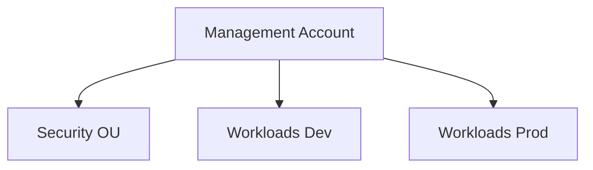
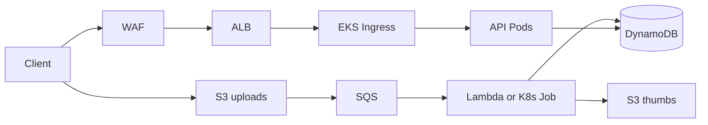

# Architecture (fill in for the final submission)

## Accounts and OUs

## Application flow

## Controls checklist

- [ ] SCP attached to Workloads OU
- [ ] CloudTrail org trail → security account S3
- [ ] Config rule: no public S3
- [ ] GuardDuty enabled
- [ ] KMS CMK for S3
- [ ] IRSA least privilege
- [ ] Budget alert 80%

## DR

| Metric | Target |
|---|---|
| RPO | _hours_ |
| RTO | _hours_ |
| CRR region | _eu-west-1_ |

## Runbooks

- `runbook-guardduty.md` — TBD
- `dr-failover.md` — TBD
