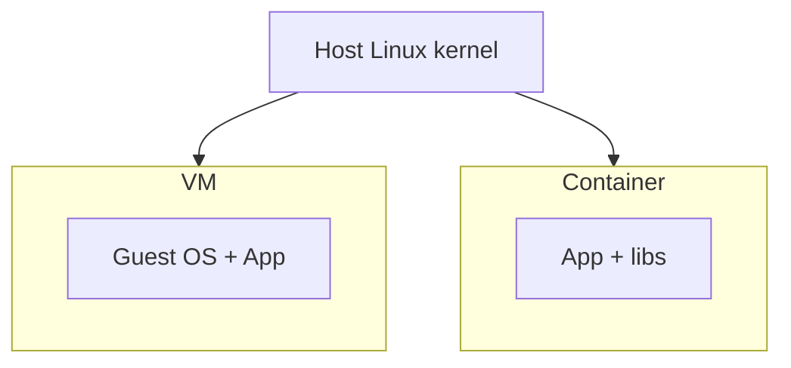

# 01. Why containers: VM, isolation and the path to Kubernetes

## Intro: "spin up another VM"

A team deploys a microservice: for every release — a **new VM**, 20 minutes of provisioning, different glibc versions, "it worked on staging." An SRE proposes a **container**: a single image with dependencies, startup in seconds, identical behavior on a laptop and in CI. Kubernetes comes **after** you know how to **build an image**, **run compose** and **understand the network** — otherwise Pod and Service feel like magic. This chapter is about **why a container before an orchestrator**.

## What you'll learn

- The difference between a **container** and a **virtual machine**.
- What **process isolation** (namespaces, cgroups) gives you without a full OS.
- The role of Docker on a **DevOps workstation** vs the runtime in **K8s**.
- The link to [`linux-basic`](../linux-basic/README.md) and the future [`kuber-basic`](../kuber-basic/README.md).

## Container vs virtual machine

| | VM (hypervisor) | Container (Docker) |
|---|-----------------|---------------------|
| OS kernel | its own per VM | **shared** with the host |
| Startup | minutes | seconds |
| Image size | GB (full OS) | MB–hundreds of MB (application layers) |
| Density | dozens of VMs per host | hundreds of containers |
| Isolation | strong (separate kernel) | process-level (namespaces) |



A container is **not hardware emulation**, but a **packaged process** with its own rootfs, network and CPU/RAM limits. Under the hood — **namespaces** and **cgroups** ([`linux-advanced`](../linux-advanced/01-namespaces.md)).

## Why a DevOps engineer needs Docker

In practice, Docker (or a compatible engine) is the **standard for building and delivery**:

1. **Dockerfile** — a reproducible build in CI ([`gitlab-intermediate/03-docker-registry`](../gitlab-intermediate/03-docker-registry.md)).
2. **Compose** — a local **multi-tier** stack without minikube ([`deploy/containers`](../../deploy/containers/README.md)).
3. **Registry** — storing image tags between environments.
4. **Debugging** — `exec`, `logs`, `inspect` before escalating to K8s.

In a cluster, Kubernetes **does not replace** image knowledge: you still push to a registry, and the kubelet pulls **image:tag** into a Pod.

## The image as a delivery contract

An **image** is an immutable filesystem snapshot + metadata (`CMD`, `EXPOSE`, `ENV`). A **container** is a **running instance** of the image with a writable layer on top of the read-only layers.

| Term | Analogy |
|--------|----------|
| Image | class / template |
| Container | object / process |
| Registry | Maven/npm for OS+app binaries |
| Dockerfile | recipe for building the image |

## Why not "straight to Kubernetes"

| Task | Docker Compose | Kubernetes |
|--------|----------------|--------------|
| Local development of 3 services | fast | overkill |
| Single host, learning stand | sufficient | needs a cluster |
| Self-healing, rolling update, 100+ nodes | weak | strong |
| Networking across dozens of teams | manual compose | Service, Ingress, CNI |

The Basic course covers the **left column**; the transition — [16-docker-vs-kubernetes](16-docker-vs-kubernetes.md) and [`kuber-basic`](../kuber-basic/README.md).

## On the stand: first touch

```bash
cd deploy/containers
docker compose up -d --build
docker compose ps
bash scripts/smoke.sh
```

| URL | Purpose |
|-----|------------|
| [localhost:8088](http://localhost:8088) | nginx + static |
| [localhost:8088/api/health](http://localhost:8088/api/health) | Flask + Redis ping |
| [localhost:8088/api/hits](http://localhost:8088/api/hits) | counter in Redis |

Redis does **not** listen on the host — only inside the compose network (the "minimum published ports" principle).

## Common mistakes

| Mistake | Why it's bad | The right way |
|--------|--------------|---------------|
| Container = mini-VM with ssh | extra weight, anti-pattern | one process / one entrypoint |
| Changing files inside a running container | lost on recreate | edit the Dockerfile / volume |
| "docker compose in prod" without an orchestrator | no rolling/HA | compose for dev; K8s/ECS for prod |
| Confusing image and container | confusion during rollback | version the **image tag** |
| Ignoring `.dockerignore` | slow build, leaks | exclude `.git`, secrets |

## In production

- **Immutable infrastructure**: a new release = a **new image tag**, not `apt upgrade` inside the container.
- **One process per container** (or an explicit supervisor — rarely).
- **12-factor**: config via **env**, secrets — Vault/K8s Secret, not in the image layers.
- **Resource limits** — in K8s `resources`; in Docker — `deploy.resources` (compose v3+) or run flags.
- CI: build → scan → push → deploy ([gitlab-intermediate](../gitlab-intermediate/03-docker-registry.md)).

## Interview notes

- A container shares the **kernel** with the host; a VM does not.
- Docker on a laptop ≠ the runtime in K8s 1.24+ ([containerd](../kuber-basic/02-docker-vs-containerd.md)).
- Image layers are **cached**; the order of instructions in a Dockerfile affects CI speed.
- A container is **ephemeral**; state lives in a volume or an external DB.

## Summary

A container packages an application and its dependencies into a **portable image** with fast startup and dense packing on the host. Docker is a tool for **building, running locally and registry**; Kubernetes is **orchestration** of already-built images. The next chapters cover how to write a Dockerfile and manage the runtime on [`deploy/containers`](../../deploy/containers/README.md).

## Checklist

- In what way is a container lighter than a VM in startup time and size?
- How does an image differ from a container?
- Why is Redis on the stand not on `localhost:6379`?
- When is compose enough, and when do you need K8s?

Next lesson: [02. Image and Dockerfile](02-images-dockerfile.md).
