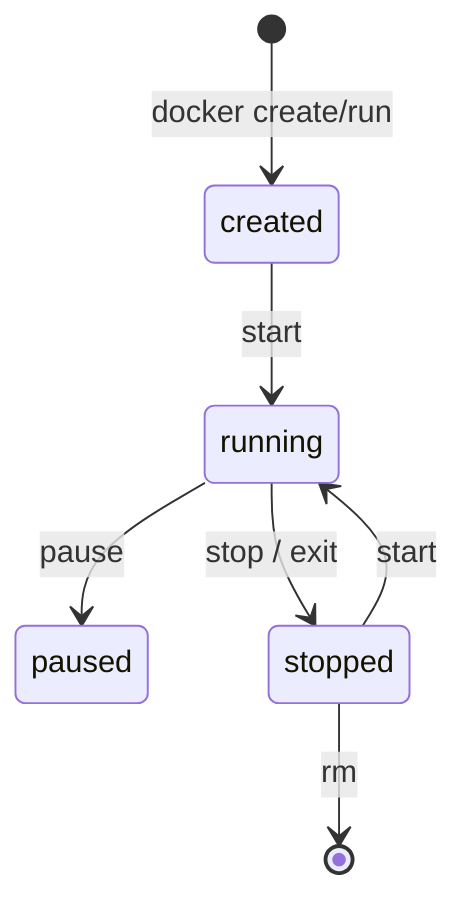

# 04. Container runtime: run, exec, logs, inspect, stop

## Intro: "the container is stuck, what's inside?"

On staging the API stopped responding: in Kubernetes people look at `kubectl logs`, locally — **`docker compose logs`**. You need to get inside, check DNS to Redis, look at the variables — **`docker exec`**. Before a restart you capture **`inspect`** — IP, mounts, health. This chapter is about the **container lifecycle** in the Docker CLI (not to be confused with **containerd** on a K8s node — [kuber-basic/02](../kuber-basic/02-docker-vs-containerd.md)).

## What you'll learn

- The **run**, **stop**, **rm**, **ps** commands.
- **logs**, **exec**, **inspect** for diagnostics.
- The difference between **detach** / **attach**, and **restart policy**.
- The stand's container names `mock-containers-*`.

## Lifecycle



| Command | Action |
|---------|----------|
| `docker run` | create + start |
| `docker stop` | SIGTERM → grace → SIGKILL |
| `docker kill` | immediate SIGKILL |
| `docker rm` | remove a stopped container |
| `docker compose down` | stop + remove the compose containers |

**PID 1** in the container is your `CMD`. If the application doesn't handle SIGTERM, `stop` waits for the timeout (10 s by default).

## docker run (flags you'll encounter)

```bash
docker run -d --name myapp -p 8080:80 \
  -e REDIS_HOST=redis \
  --network deploy-containers_frontend \
  myimage:tag
```

| Flag | Purpose |
|------|------------|
| `-d` | detached (background) |
| `--name` | stable name for exec/logs |
| `-p host:container` | publish a port |
| `-e` | environment variable |
| `--rm` | remove after exit |
| `--network` | attach to a network |

Compose generates the same parameters from `docker-compose.yml`.

## logs

```bash
docker logs mock-containers-api
docker logs -f --tail 50 mock-containers-api
docker compose logs -f api web
```

| Option | Why |
|-------|--------|
| `-f` | follow (like `tail -f`) |
| `--since 10m` | a window during an incident |
| `--tail N` | don't flood the terminal |

Application logs are written to **stdout/stderr** — not to files inside the image without a volume (12-factor).

## exec

An interactive shell (if `sh`/`bash` is present in the image):

```bash
docker exec -it mock-containers-api sh
# inside:
env | grep REDIS
python -c "import urllib.request; print(urllib.request.urlopen('http://127.0.0.1:8080/health').read())"
exit
```

A one-off command without a TTY:

```bash
docker exec mock-containers-api python -c "import redis; r=redis.Redis('redis'); print(r.ping())"
```

**Important:** `exec` runs in the **already running** namespace; this is not SSH into a VM.

## inspect

```bash
docker inspect mock-containers-api --format '{{.State.Status}} {{.State.Health.Status}}'
docker inspect mock-containers-api --format '{{json .NetworkSettings.Networks}}' | head -c 500
docker inspect mock-containers-redis --format '{{range .Mounts}}{{.Type}} {{.Destination}}{{"\n"}}{{end}}'
```

Typical fields when analyzing an incident:

| JSONPath / field | Question |
|-----------------|--------|
| `.State.Status` | running? |
| `.State.ExitCode` | why it crashed |
| `.State.Health` | compose healthcheck |
| `.NetworkSettings.Networks` | which networks it's in |
| `.Mounts` | volumes |

## compose vs docker CLI

| Task | Compose | Docker |
|--------|---------|--------|
| Bring up the stack | `compose up -d` | N × `run` |
| Status | `compose ps` | `ps --filter name=mock-containers` |
| Service logs | `compose logs api` | `logs mock-containers-api` |
| Exec | `compose exec api sh` | `exec mock-containers-api sh` |

The stand's container names are set by `container_name:` in [`docker-compose.yml`](../../deploy/containers/docker-compose.yml).

## On the stand

```bash
cd deploy/containers
docker compose up -d --build
docker compose ps
docker inspect mock-containers-api --format '{{.State.Health.Status}}'
```

You expect `healthy` for the api after the healthcheck warms up.

## Common mistakes

| Mistake | Symptom | Fix |
|--------|---------|-------------|
| `docker exec` into a stopped container | Error | `compose ps`, bring the service up |
| Confusing the **image** and **container** id | edits don't help | rebuild the image, recreate the container |
| Logs only to a file inside | `logs` is empty | write to stdout |
| `kill` instead of `stop` | interrupted transactions | first `stop`, then investigate |
| exec into **alpine** without bash | `bash not found` | `sh` |

## In production

- Centralized log collection (Loki, CloudWatch) — the container still writes to **stdout**.
- **Liveness/readiness** in K8s — the analog of a compose healthcheck.
- **Graceful shutdown**: handling SIGTERM in the application.
- Don't rely on `docker exec` in prod for routine work — only diagnostics.

## Interview notes

- `docker run` creates a new container; **changes inside** don't make it into the image.
- `compose up` on an image change — a **recreate** of the container.
- A healthcheck in compose — a built-in **probe** for dependencies (`depends_on: condition: service_healthy`).

## Summary

The runtime CLI is **start, stop, logs, get inside, metadata**. It's the daily DevOps tool before and alongside Kubernetes. On the stand you practice on `mock-containers-api` and redis.

## Checklist

- How does `stop` differ from `kill`?
- How do you check the api's health with a single `inspect` command?
- Why logs to stdout?
- How do you get into the api and check `REDIS_HOST`?

Next lesson: [05. Lab: run, exec, logs](05-lab-run-exec-logs.md).
