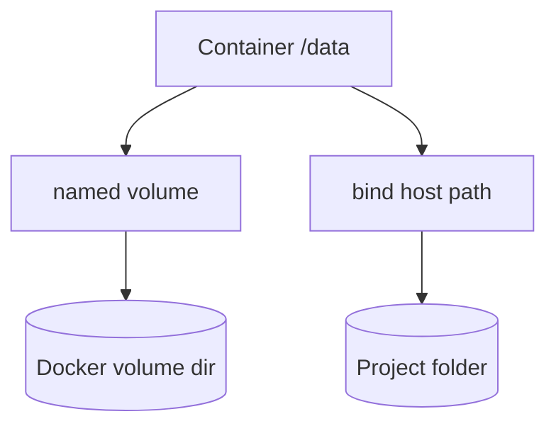

# 08. Volumes: bind mount and named volume

## Intro: "after a restart the orders disappeared"

The Redis container was recreated after `compose up` — the **hits** counter reset to zero: the data lived in the container's **writable layer**. Stateful services need a **volume**: data survives a container replace. This chapter is about **bind mount** vs **named volume**, what suits **Redis** and what suits configs.

## What you'll learn

- The difference between **volume**, **bind mount**, and **tmpfs**.
- Where data is stored on the host disk.
- How to add **persistence** for redis on the stand.
- Why **application code** is not mounted as a bind in prod.

## Three ways to store data

| Type | Example | Survives rm container | Typical use |
|-----|--------|-------------------------|--------------|
| **Named volume** | `redis-data:/data` | yes | DB, redis, uploads |
| **Bind mount** | `./config:/etc/app:ro` | yes (files on the host) | dev hot-reload, configs |
| **tmpfs** | `tmpfs: /tmp` | no | secrets in RAM |



## Named volume

Compose:

```yaml
services:
  redis:
    image: redis:7.2-alpine
    volumes:
      - redis-data:/data

volumes:
  redis-data:
```

Docker creates the volume in `/var/lib/docker/volumes/…`. The **name** is stable between `compose down` and `up` (without `-v`).

## Bind mount

```yaml
volumes:
  - ./stack/web/nginx.conf:/etc/nginx/conf.d/default.conf:ro
```

| Pro | Con |
|------|--------|
| edit from the host without a rebuild | the path depends on the OS/CI |
| convenient in dev | risk of accidentally overwriting prod data |

The `:ro` flag — the container **cannot** write (safer for configs).

## The container's writable layer

Everything the process writes **without a volume** disappears on `docker rm` / recreate. The image stays read-only; the container layer is **ephemeral**.

## Redis and persistence

By default, the official redis image can write **RDB** to `/data`. Without a volume, the `dump.rdb` file disappears with the container.

On the learning stand, redis has **no** volume — deliberately, so you can see hits reset ([lab 09](09-lab-volumes.md)). In prod — **always** a volume or managed Redis.

## Registry volume (preview)

[`docker-compose.registry.yml`](../../deploy/containers/docker-compose.registry.yml):

```yaml
volumes:
  - registry-data:/var/lib/registry
```

Registry images are stored between restarts — a link to [chapter 12](12-registry.md).

## On the stand: current state

```bash
docker inspect mock-containers-redis --format '{{json .Mounts}}'
docker volume ls
```

Most likely `Mounts` is empty or only internal — hits are not persistent.

## Common mistakes

| Mistake | Symptom | Fix |
|--------|---------|-------------|
| `compose down -v` in prod | volumes deleted | backup; no `-v` in routine work |
| Binding the DB data dir in dev on NTFS | slow / permissions | named volume |
| Confusing a **volume** with an **image layer** | "committed" data into the image | only the Dockerfile |
| UID permissions: root-owned files on a volume | the app can't write | `chown` / init container |
| Storing secrets in a volume without encryption | leak from the disk | secret driver / KMS |

## In production

- **StatefulSet + PVC** in K8s — the evolution of a named volume.
- Volume backups / snapshots (EBS, Velero).
- Redis in prod — **managed** (ElastiCache) or an operator with persistence.
- Don't mount the **Docker socket** into a container unless absolutely necessary.

## Interview notes

- `docker volume inspect` — the mountpoint on the host (Linux).
- Bind — a host path; named — managed by Docker.
- `tmpfs` doesn't reach the host disk.

## Summary

Containers are **stateless** by default; state lives in **volumes**. A named volume is the standard for redis/postgres; bind is for configs and dev. The lab will add a redis volume and verify that **hits** persist after recreate.

## Checklist

- What will `docker compose down -v` delete?
- Why `:ro` on a bind?
- Where does the `hits` key currently live on the stand?
- How does a volume differ from an image?

Next lesson: [09. Lab: volumes](09-lab-volumes.md).
