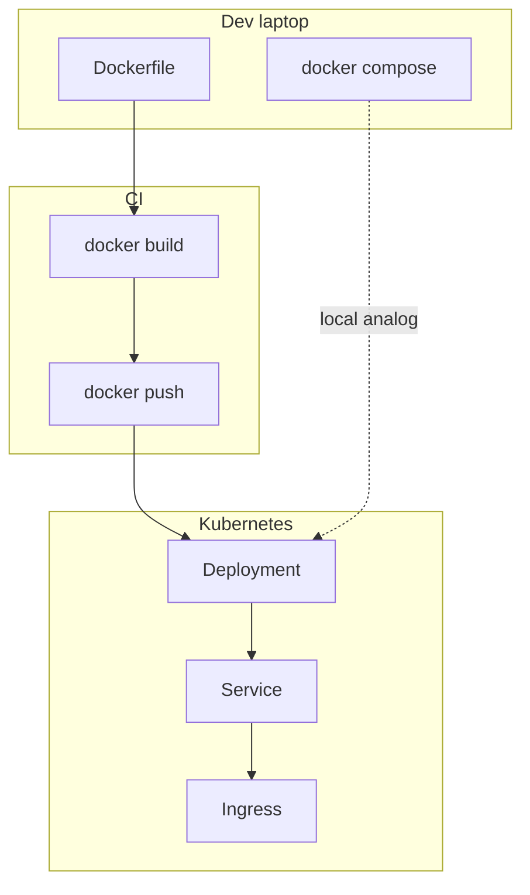

# 16. Docker vs Kubernetes: the boundary of responsibility

## Intro: "we already have Docker, why a cluster"

A team stood up production on **a single server** with `docker compose` — a month later they need **rolling updates with no downtime**, **auto-healing** when a node fails, and **secrets** per namespace. Docker on the laptop **doesn't go away** — it builds the image; **Kubernetes** distributes containers across the cluster. This chapter connects the **containers-basic** material you've covered with [`kuber-basic`](../kuber-basic/README.md).

## What you'll learn

- What Docker does **well** locally and in CI.
- What **Kubernetes** adds.
- **containerd** and the removal of dockershim.
- Mapping compose → K8s resources.

## Two levels of abstraction

| Level | Tool | Question |
|---------|------------|--------|
| Packaging | Dockerfile, image | **What** to run? |
| Single host | Docker Engine, Compose | **How** to run it on a machine? |
| Cluster | Kubernetes | **Where** and **how many** instances? |



## Docker vs containerd

In detail: **[kuber-basic/02-docker-vs-containerd](../kuber-basic/02-docker-vs-containerd.md)**.

| | Docker (CLI + dockerd) | containerd |
|---|------------------------|--------------|
| Where | dev, CI build | K8s worker node |
| Building images | yes | no (usually) |
| CRI for kubelet | removed (1.24+) | yes |

You **build** the image with Docker, and **run** it in the cluster via containerd/CRI-O.

## Mapping the stand to K8s

The [`deploy/containers`](../../deploy/containers/README.md) stand:

| Compose | Kubernetes (simplified) |
|---------|------------------------|
| `service: web` | Deployment + Service |
| `ports: 8088:80` | Service NodePort / Ingress |
| `networks: frontend` | ClusterIP, NetworkPolicy |
| `service: redis` | StatefulSet or Helm redis |
| `environment: REDIS_HOST` | ConfigMap / env |
| `healthcheck` | livenessProbe / readinessProbe |
| `depends_on` | initContainers / probes order |
| `build:` | CI build → image in the registry |
| `volumes` | PersistentVolumeClaim |

**Ingress** replaces "a single nginx on the outside"; **Service** — a stable DNS name `api` inside the cluster (like compose DNS).

## What Compose doesn't solve in prod

| Requirement | Compose | Kubernetes |
|------------|---------|------------|
| Self-healing on another node | no | yes |
| Rolling update 10% | manual | Deployment strategy |
| HPA by CPU | no | HPA |
| RBAC, quotas | no | yes |
| Multi-zone | no | topology |

## What stays with Docker

- Local development of **3-tier** ([chapters 10–11](10-compose-multi-service.md)).
- **CI**: build, scan, push ([registry](12-registry.md), [GitLab](../gitlab-intermediate/03-docker-registry.md)).
- Debugging the image before it reaches the cluster.
- Sometimes **Docker-in-Docker** in a GitLab runner.

## The learning path in the repository

```text
linux-basic (docker compose exec)
    → containers-basic (this course)
        → kuber-basic (Pod, Deployment, Service)
            → kuber-intermediate (Helm, HPA, …)
```

The DevOps route: [`devops-path.md`](../devops-path.md).

## On the stand: a deliberate comparison

| Docker action | kubectl analog (preview) |
|-----------------|--------------------------|
| `docker compose ps` | `kubectl get pods` |
| `docker compose logs api` | `kubectl logs deploy/api` |
| `docker compose restart api` | `kubectl rollout restart` |
| publish `8088:80` | `kubectl port-forward` / Ingress |

After [`mockctl up`](../../INSTALL.md) and [kuber-basic](../kuber-basic/README.md), you'll deploy the **same image** api as a Pod.

## Common mistakes

| Mistake | Why | The right way |
|--------|--------|---------------|
| "K8s replaces the Dockerfile" | no | the image still comes from the Dockerfile |
| Running docker.sock in a Pod | RCE | Kaniko, buildkit, CI outside the cluster |
| Copying compose 1:1 into YAML | unnecessary anti-patterns | Deployment + Service + Ingress |
| Ignoring limits | OOM on the node | resources in the Pod spec |
| latest in a Deployment | drift | image:tag@digest |

## In production

- **GitOps** (Argo CD) — desired state from git, not `kubectl apply` from a laptop.
- **Registry** — a single source of images for all environments.
- **Policy** — Pod Security Standards, network policies.
- Local compose — a **contract** for smoke, not a source of prod truth.

## Interview notes

- A Pod ≠ a container; a Pod can have several containers (sidecar).
- Kubernetes **orchestrates** already-built images.
- A stateless app → Deployment; state → StatefulSet + PVC.

## Summary

**Docker/Compose** — packaging and local runtime. **Kubernetes** — orchestration, scale, cluster networking, self-healing. Basic containers gives the foundation of the image, networking and registry; **kuber-basic** carries the same ideas up to the cluster level.

## Checklist

- Where in the pipeline is `docker build` executed?
- How is a Service in K8s similar to the DNS name `api` in compose?
- Why doesn't the kubelet call dockerd directly?
- Which course should you read after this one?

Next lesson: [17. Final project](17-final-project.md).
