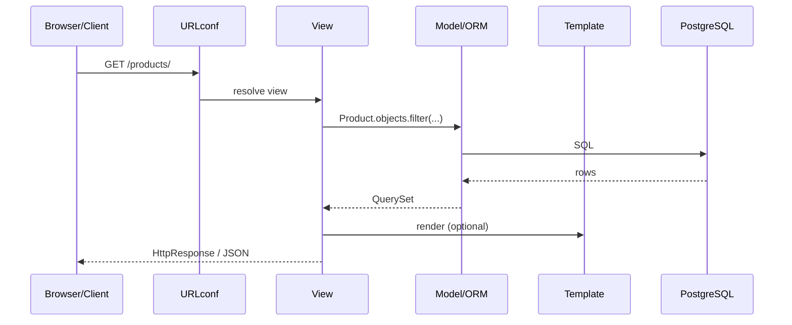

# 01. Django vs FastAPI: when "batteries included" wins, when a thin API wins

## Intro: "do we rewrite the monolith, or bolt on a service?"

A company has been running on a **Django monolith** for eight years: an admin panel for operators, 400 migrations, auth out of the box, Celery queues. Product asks for a **public REST API** for partners plus an **admin panel** for content managers, with no separate frontend. The CTO asks, "what about FastAPI?" The backend lead counters: "admin + ORM + permissions are already in Django — DRF gets us to market faster."

This chapter is **not** "Django beats FastAPI." It's about **decision criteria**, and where Django fits in the mock-exams stack.

## What you'll learn

- The **MTV** model (Model–Template–View) vs an **ASGI API**.
- Django's strengths: ORM, Admin, auth, ecosystem.
- When to pick **DRF** vs a standalone **FastAPI** service.
- How this connects to [`fastapi/01-landscape`](../fastapi/01-landscape.md).

---

## MTV and the request lifecycle

| Layer | Responsibility |
|------|-----------------|
| **Model** | data, DB-level business rules |
| **Template** | HTML (SSR) |
| **View** | HTTP in → logic → HTTP out |
| **URLconf** | routing |

DRF adds a **Serializer** — the equivalent of Pydantic at the API boundary.

---

## Django's "batteries included"

| Component | In Django | In FastAPI (typically) |
|-----------|----------|---------------------|
| ORM | **built in** | SQLAlchemy |
| Migrations | **makemigrations** | Alembic |
| Admin | **yes** | no |
| Auth | User, groups, permissions | JWT by hand |
| Forms | ModelForm | Pydantic |
| API | **DRF** (separate package) | OpenAPI native |

---

## When to reach for Django + DRF

| Scenario | Why Django |
|----------|---------------|
| Admin panel for non-devs | `ModelAdmin` in hours |
| CRUD + relations | ORM + migrations |
| Session auth + API | one user model |
| Team already knows Django | velocity |
| SSR + API in one repo | templates + DRF |

## When to reach for FastAPI

| Scenario | Why FastAPI |
|----------|---------------|
| JSON API only, no admin | less overhead |
| Async I/O heavy | native async |
| OpenAPI-first contract | autogenerated |
| Single-responsibility microservice | minimalism |

**A hybrid in enterprise setups** — Django monolith + FastAPI BFF — is a perfectly normal pattern.

---

## WSGI vs ASGI (Django 5)

Django is historically **WSGI** (sync). Django 4.1+ adds **async views** and **partial** async ORM support. In production, Django typically runs on **Gunicorn sync workers**, or uvicorn for ASGI deployment.

| | Django sync | FastAPI |
|---|-------------|---------|
| Worker model | processes/threads | async event loop |
| CPU-bound | fine | offload |
| I/O-bound scale | workers × connections | async/await |

---

## Course stack

[`deploy/django`](../../deploy/django/README.md) — port **8092**:

- `catalog` app — models + admin
- `api` app — DRF viewsets
- PostgreSQL + Redis

Compare with [`deploy/fastapi`](../../deploy/fastapi/README.md) `:8090`.

---

## Common mistakes

| Mistake | Consequence |
|--------|-------------|
| Using Django for a 2-endpoint microservice | heavy deploy footprint |
| FastAPI with no admin, when ops needs a UI | months of frontend work |
| Mixing prod/dev settings | leaked SECRET_KEY |
| Ignoring migrations in CI | schema drift |

## Interview questions

- Name **3** things Django gives you out of the box.
- What is **MTV**?
- When do you reach for **DRF**, and when for plain FastAPI?

## Summary

Django is a **platform** (ORM, admin, auth). DRF is REST on top of Django. FastAPI is a **typed ASGI API**. Pick based on admin needs, team, contract, async requirements. This course builds a **catalog API** on Django 5 + DRF.

Next: [02-first-project](02-first-project.md).
