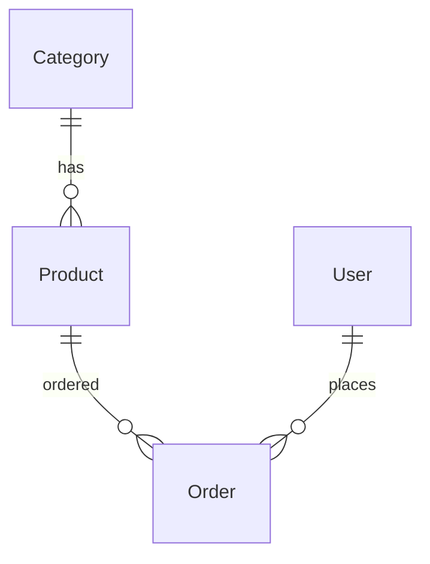

# 11. Relationships: FK, M2M, related_name, PROTECT

## Introduction

Someone deleted a Category — the cascade wiped out **10,000 products**. **`on_delete=PROTECT`** in catalog is a deliberate choice.

## FK on_delete

| Policy | Behavior |
|--------|----------|
| CASCADE | delete children |
| PROTECT | IntegrityError |
| SET_NULL | null FK (needs null=True) |
| SET_DEFAULT | default pk |
| DO_NOTHING | DB constraint only |

```python
category = models.ForeignKey(Category, on_delete=models.PROTECT, related_name="products")
```

---

## related_name

```python
cat = Category.objects.get(slug="books")
cat.products.filter(is_active=True)  # reverse relation
```

Without related_name you get `product_set` — avoid this in large codebases.

---

## M2M (pattern)

```python
class Tag(models.Model):
    name = models.CharField(max_length=50, unique=True)

class Product(models.Model):
    tags = models.ManyToManyField(Tag, blank=True, related_name="products")
```

```python
product.tags.add(tag)
product.tags.filter(name="sale")
```

---

## through model

For extra fields on an M2M relationship, use an intermediate model with FKs to both sides.

---

## OneToOne

User profile extension — `OneToOneField(User, ...)`.

---

## ER diagram (catalog)



---

## Common mistakes

| Mistake | Fix |
|---------|-----|
| CASCADE on critical FK | PROTECT or soft delete |
| related_name clash | unique names per model |
| M2M without blank | admin requires all |

## Summary

Choose on_delete based on business rules. Use related_name for reverse queries. M2M for tags; through model for extra payload.

Next: [12-lab-relationships](12-lab-relationships.md).
