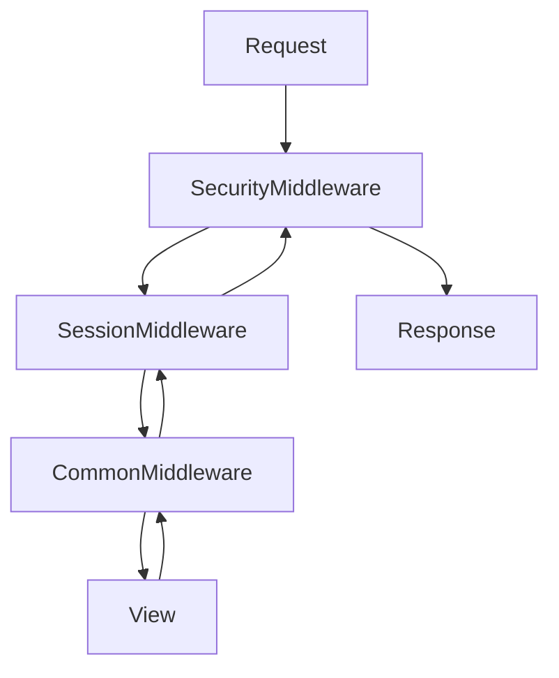

# 31. Middleware and the request lifecycle

## Introduction

Middleware forms an **onion** around the view. Security, sessions, CSRF — all middleware.



Order in `MIDDLEWARE` matters.

---

## Custom middleware

```python
import time
import logging
logger = logging.getLogger(__name__)

class RequestTimingMiddleware:
    def __init__(self, get_response):
        self.get_response = get_response

    def __call__(self, request):
        start = time.perf_counter()
        response = self.get_response(request)
        ms = (time.perf_counter() - start) * 1000
        logger.info("path=%s ms=%.1f status=%s", request.path, ms, response.status_code)
        response["X-Request-Time-Ms"] = f"{ms:.1f}"
        return response
```

Typically registered **after** SecurityMiddleware in settings.

---

## process_view / exception

Class-based middleware can implement `process_view`, `process_exception` (the legacy style) — prefer the `__call__` wrapper instead.

---

## DRF vs Django middleware

Runs **before** the DRF view — the auth header is already available.

---

## Signals preview

Middleware handles request/response cross-cutting concerns. **Signals** handle model save/post_delete — see [33-caching-redis](33-caching-redis.md) next door.

---

## Common mistakes

| Mistake | Fix |
|--------|-----|
| Heavy work in middleware | cache or async task |
| Wrong order | check Django's default stack in the docs |

## Summary

Middleware wraps every view. Write custom middleware for timing, request IDs, security headers. Order is critical.

Next: [32-lab-middleware](32-lab-middleware.md).
