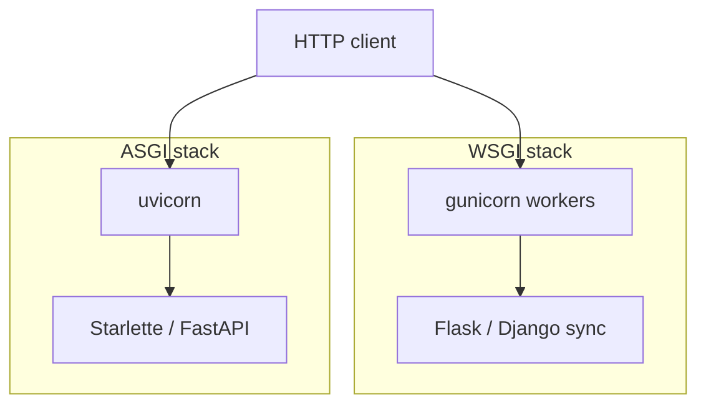
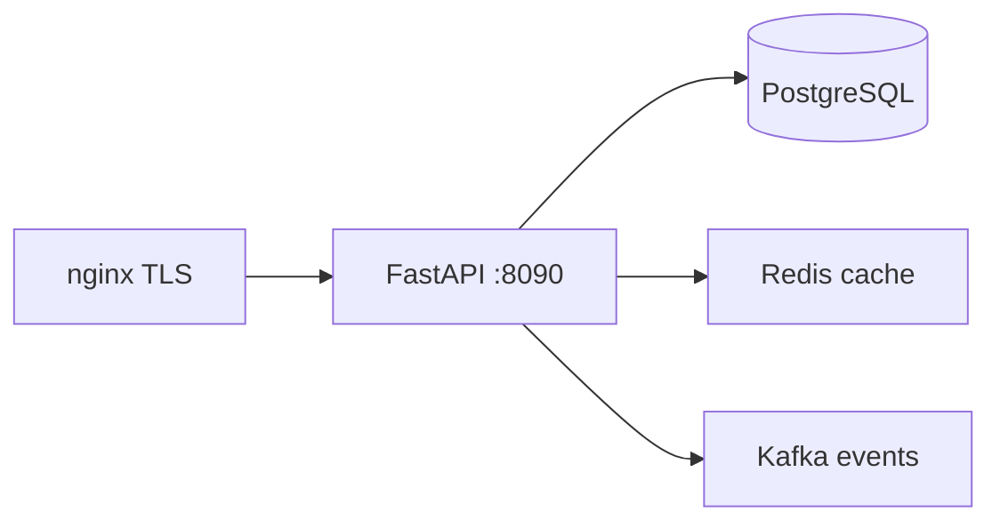

# 01. The landscape: Flask, Django, Starlette, FastAPI, ASGI

## Intro: "rewrite the monolith as microservices in a quarter"

A team of five maintains a **Django monolith** with an admin panel, Celery, and 200 migrations. A new **B2B API** is due in two months: JSON, OpenAPI for partners, 5k RPS on reads. Rewriting the whole monolith is off the table — they're carving out a separate service. The CTO asks: **Flask**, **FastAPI**, or stick with Django REST Framework?

The answer doesn't start with "what's trendier" — it starts with the **execution model** (WSGI vs ASGI), **typing**, and the **API contract**. This chapter is the map before the code.

## What you'll learn

- The difference between **WSGI** and **ASGI**, and why FastAPI is "async-first."
- The strengths of **Flask**, **Django**, **Starlette**, **FastAPI**.
- When to pick what, and common migration anti-patterns.
- How FastAPI fits into the mock-exams stack (Postgres, Redis, nginx, k8s).

## WSGI and ASGI

| | WSGI | ASGI |
|---|------|------|
| Era | sync Python web | async + websockets |
| Model | one request — one worker thread/process | event loop, `await` |
| Servers | gunicorn + sync workers | **uvicorn**, hypercorn, daphne |
| WebSockets | not in the spec | **yes** |
| Typical frameworks | Flask, Django (sync views) | Starlette, FastAPI, Django 4.1+ async |

**WSGI** is the "callable(environ, start_response)" contract for synchronous apps. Under load, you scale it by **adding processes** (gunicorn workers).

**ASGI** is the contract for **async** apps: HTTP, WebSocket, and background tasks in a single event-loop process.



FastAPI does **not replace** uvicorn: the framework builds the app, the **ASGI server** accepts connections. See [02. First app](02-first-app.md).

## Four players

| Framework | Philosophy | Strengths | Weak points for a "pure API" |
|-----------|-----------|-----------------|---------------------------|
| **Flask** | micro-framework, you assemble it yourself | simplicity, huge ecosystem | no built-in validation/OpenAPI; async is bolted on |
| **Django** | "batteries included" | ORM, admin, auth, migrations | heavyweight for a narrow JSON API; DRF is a separate layer |
| **Starlette** | minimal ASGI toolkit | routing, middleware, testing | little "out of the box" for schemas |
| **FastAPI** | Starlette + Pydantic + OpenAPI | types, auto docs, DI, perf | less "all-in-one" than Django |

**FastAPI** = **Starlette** (HTTP layer) + **Pydantic** (validation/serialization) + generated **OpenAPI 3**.

## Why typing isn't "just for mypy fans"

```python
from fastapi import FastAPI
from pydantic import BaseModel

app = FastAPI()

class ItemCreate(BaseModel):
    title: str
    price: float

@app.post("/items")
async def create_item(body: ItemCreate) -> ItemCreate:
    return body
```

One `ItemCreate` class gives you:

- request body validation (422 on error);
- JSON serialization of the response;
- a schema in `/docs` with no hand-written YAML.

The Flask equivalent is marshmallow/cerberus plus a hand-maintained swagger file. In DRF you get serializers, but async and OpenAPI are separate setup steps.

## Interview-ready comparison

| Criterion | Django | Flask | FastAPI |
|----------|--------|-------|---------|
| Admin UI | built in | none | none |
| Async views | yes (4.1+) | limited | **native** |
| OpenAPI | via drf-spectacular | manual | **automatic** |
| ORM | Django ORM | SQLAlchemy, separate | SQLAlchemy, separate ([13](13-sqlalchemy-async.md)) |
| Learning curve for API-only work | medium | low | low–medium |

## Where FastAPI sits in the mock-exams architecture



- **Postgres** — source of truth ([`postgresql-basic`](../postgresql-basic/README.md)).
- **Redis** — cache and rate limiting ([`redis-basic`](../redis-basic/README.md)).
- **nginx** — TLS and edge rate limiting ([`nginx-basic`](../nginx-basic/README.md)).
- **Prometheus** — scrapes `/metrics` ([`observability-basic`](../observability-basic/README.md)).

Lab stand: [`deploy/fastapi`](../../deploy/fastapi/README.md), port **8090**.

## When NOT to use FastAPI

| Situation | Better choice |
|----------|--------------|
| You need an admin panel for 80% of the functionality | Django |
| Team only knows Flask, deadline is 2 weeks | Flask + gradual migration |
| CPU-bound work inside the request (ML inference) | sync workers or a separate worker pool |
| "Async everywhere" with no I/O | false sense of speed — you're blocking the event loop |

**Rule of thumb:** async pays off when you're **waiting on I/O** (DB, HTTP, Redis). Pure CPU work inside `async def` with no `run_in_executor` is an anti-pattern ([27-async-patterns](27-async-patterns.md)).

## On the lab stand: a smoke test with no code

```bash
cd deploy/fastapi
docker compose up -d --build
bash scripts/smoke.sh
```

Open [http://localhost:8090/docs](http://localhost:8090/docs) — the OpenAPI schema for the minimal API is already generated.

## Common mistakes

| Mistake | Why it's bad | The fix |
|--------|--------------|---------------|
| "FastAPI = Django replacement" | loses admin, mature auth patterns | separate API service; keep the monolith |
| `def` endpoint doing heavy CPU work | blocks the event loop | sync endpoint + threadpool, or a worker |
| Picking by hype without an OpenAPI requirement | unnecessary DI/Pydantic complexity | Flask is enough for internal JSON |
| Ignoring WSGI legacy code | mixing sync ORM calls into an async route | `run_sync` / a separate sync layer |
| Single uvicorn process in prod | no fault tolerance | multiple workers / k8s replicas |

## In production

- **Multiple** uvicorn workers or pods behind a load balancer.
- Health checks: `/health` for liveness, a separate deep check for readiness (DB).
- API versioning: `/api/v1` (as on the lab stand).
- A contract for clients — **OpenAPI** + contract tests ([30-testing](30-testing.md)).

## Summary

**FastAPI** is an ASGI framework built on Starlette, with **Pydantic** and automatic **OpenAPI**. It shines wherever you need a **typed HTTP API** and async I/O. **Django** is a full-fledged platform; **Flask** is flexible minimalism. The choice starts with your **concurrency model** and **contract requirements**, not GitHub stars.

## Checklist

- What's the one-sentence difference between ASGI and WSGI?
- What is FastAPI technically "built from"?
- Name two cases where Django is preferable.
- Why doesn't async speed up CPU-bound code?

Next lesson: [02. First app](02-first-app.md).
