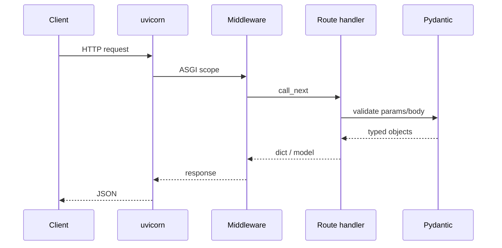

# 02. First app: uvicorn, OpenAPI

## Intro: "the partner wants Swagger by Friday"

A B2B integrator needs **OpenAPI 3** and a sandbox for test requests. A team on Flask spent a week hand-writing YAML. With FastAPI, **the schema comes straight out of the code** on day one of `hello world`. This chapter builds a minimal working API: the app, the server, the docs, and the request lifecycle.

## What you'll learn

- The structure of a **FastAPI app**, **path operations**, HTTP methods.
- Running it with **uvicorn** (dev and prod-like).
- **OpenAPI**, Swagger UI (`/docs`), ReDoc (`/redoc`).
- **lifespan** instead of the deprecated `@app.on_event`.

## Minimal app

```python
# main.py
from contextlib import asynccontextmanager

from fastapi import FastAPI

@asynccontextmanager
async def lifespan(app: FastAPI):
    # startup: db pools, redis clients
    yield
    # shutdown: close connections

app = FastAPI(
    title="Orders API",
    version="1.0.0",
    description="Training orders service",
    lifespan=lifespan,
)

@app.get("/health")
async def health():
    return {"status": "ok"}
```

Reference version on the lab stand: [`deploy/fastapi/stack/api/app/main.py`](../../deploy/fastapi/stack/api/app/main.py).

## Path operation

| Element | Example | Purpose |
|---------|--------|------------|
| Method decorator | `@app.get`, `@app.post` | HTTP verb + path |
| Path | `"/items/{item_id}"` | URL template |
| Function | `async def get_item(...)` | handler |
| `response_model` | `ItemOut` | response schema ([11](11-errors-response-model.md)) |
| `status_code` | `201` | code on success |
| `tags` | `["catalog"]` | grouping in OpenAPI |

```python
from fastapi import FastAPI

app = FastAPI()

@app.get("/api/v1/items/{item_id}", tags=["items"])
async def get_item(item_id: int):
    return {"id": item_id, "title": "Demo"}
```

## Running uvicorn

| Mode | Command | When |
|-------|---------|------|
| Dev, reload | `uvicorn main:app --reload --port 8000` | local development |
| Prod-like | `uvicorn main:app --host 0.0.0.0 --port 8090 --workers 4` | multiple processes |
| Docker | `CMD ["uvicorn", "app.main:app", "--host", "0.0.0.0", "--port", "8080"]` | container |

**`main:app`** means the `main` module, `app` object. On the lab stand the module is `app.main:app` ([`Dockerfile`](../../deploy/fastapi/stack/api/Dockerfile)).

```bash
# locally (venv with fastapi uvicorn)
pip install "fastapi[standard]"
uvicorn main:app --reload
```

The `--reload` flag is **dev-only** — in production, restarts go through the orchestrator.

## HTTP request lifecycle



1. uvicorn accepts the TCP connection and parses HTTP.
2. **Middleware** (CORS, logging) runs — [22-middleware](22-middleware.md).
3. FastAPI matches the path and method.
4. **Pydantic** validates query/path/body.
5. The response is serialized to JSON; a validation error returns **422**.

## OpenAPI out of the box

Once the app is up, you get:

| URL | Tool |
|-----|------------|
| `/openapi.json` | raw schema |
| `/docs` | Swagger UI |
| `/redoc` | ReDoc |

On the lab stand: [http://localhost:8090/docs](http://localhost:8090/docs).

Customizing titles and examples — [31-openapi-custom](31-openapi-custom.md).

```python
app = FastAPI(
    openapi_tags=[
        {"name": "items", "description": "Product catalog"},
        {"name": "health", "description": "Liveness checks"},
    ],
)
```

## APIRouter (preview)

For modularity, pull endpoints out into routers — covered in depth in [08-project-structure](08-project-structure.md):

```python
from fastapi import APIRouter

router = APIRouter(prefix="/items", tags=["items"])

@router.get("")
async def list_items():
    return {"items": []}
```

```python
app.include_router(router, prefix="/api/v1")
```

On the lab stand: `items.router` with the `/api/v1` prefix.

## Comparison with Flask

| | Flask | FastAPI |
|---|-------|---------|
| Route | `@app.route("/x", methods=["GET"])` | `@app.get("/x")` |
| JSON body | `request.get_json()` + manual checks | `body: Model` |
| Documentation | flask-swagger / manual | automatic |
| Async | `async def` with caveats | native |

## On the lab stand

```bash
cd deploy/fastapi
docker compose up -d --build
curl -s http://localhost:8090/health | jq .
curl -s http://localhost:8090/api/v1/items | jq .
curl -s http://localhost:8090/openapi.json | jq '.info.title'
```

**What you'll see:** `{"status":"ok"}`, a list of demo items, `"Mock Exams FastAPI Lab"`.

## Common mistakes

| Symptom | Cause | Fix |
|---------|---------|---------|
| `Error loading ASGI app` | wrong `module:app` path | check PYTHONPATH / working directory |
| `/docs` returns 404 | `docs_url=None` or root_path | don't disable docs in dev; configure `--root-path` behind a proxy |
| 422 on "clearly valid" JSON | Pydantic types are stricter than JSON | check `detail` in the response |
| `--reload` in a Docker prod image | unnecessary restarts | drop reload, use a healthcheck instead |
| Blocking `time.sleep` in `async def` | stalls the event loop | `await asyncio.sleep` or a sync `def` |

## In production

- Disable interactive docs on the public edge, or gate them behind auth ([21-security-owasp](21-security-owasp.md)).
- Forward `X-Forwarded-*` from nginx and pass `--proxy-headers` ([34-nginx-tls](34-nginx-tls.md)).
- Version the API in the URL: `/api/v1`.
- Metrics: the `/metrics` endpoint is already on the lab stand ([36-observability](36-observability.md)).

## Summary

A **FastAPI app** is an ASGI application with declarative routes. **uvicorn** is the server. **OpenAPI** is generated from types and decorators — partners get `/docs` with no separate step. Next up: hands-on work in [03. Lab](03-lab-first-app.md).

## Checklist

- How do you run the app with hot reload?
- Where do you get the API's JSON schema?
- What does `lifespan` do instead of `startup`/`shutdown` events?
- What's the health URL on the course's lab stand?

Next lesson: [03. Lab: first app](03-lab-first-app.md).
