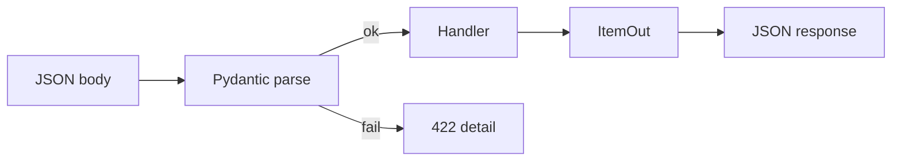

# 04. Pydantic v2: BaseModel, Field, validators

## Intro: "the client sent price: 'free'"

A marketplace accepts a product-creation JSON. An old version of the mobile app sends `price` as a string; the web sends it as a number. Without a single validation layer, the bug reaches the DB and breaks reports. **Pydantic v2** is that single layer: types, constraints, clear **422**s with `detail`. FastAPI uses Pydantic on the way in and out — this chapter is the foundation for the entire API.

## What you'll learn

- **BaseModel**, **Field**, the difference between input/output schemas.
- **model_validator** and **field_validator** (v2 API).
- **ConfigDict**, `model_dump`, JSON compatibility.
- How models relate to OpenAPI and `response_model`.

## BaseModel

```python
from pydantic import BaseModel, Field

class ItemCreate(BaseModel):
    title: str = Field(min_length=1, max_length=200)
    description: str | None = None
    price: float = Field(gt=0, description="Price in rubles")
    tags: list[str] = []
```

| Field | Python type | JSON | Behavior |
|------|------------|------|-----------|
| `title` | `str` | string | required, 1–200 characters |
| `description` | `str \| None` | string/null | optional |
| `price` | `float` | number | strictly > 0 |
| `tags` | `list[str]` | array | defaults to `[]` |

FastAPI:

```python
@app.post("/items", status_code=201)
async def create_item(body: ItemCreate):
    return body
```

Invalid JSON → **422 Unprocessable Entity** with an array of errors.

## Field and metadata

```python
from pydantic import BaseModel, Field

class ItemOut(BaseModel):
    id: int
    title: str = Field(examples=["Mug"])
    price: float = Field(json_schema_extra={"minimum": 0.01})
```

`examples` and `description` end up in **OpenAPI** ([31-openapi-custom](31-openapi-custom.md)).

## Separate Create / Update / Out models

| Model | Purpose | Fields |
|--------|------------|------|
| `ItemCreate` | POST body | no `id`, no `created_at` |
| `ItemUpdate` | PATCH body | all optional |
| `ItemOut` | client response | `id`, dates, no secrets |

```python
class ItemUpdate(BaseModel):
    title: str | None = None
    price: float | None = Field(default=None, gt=0)

class ItemOut(BaseModel):
    id: int
    title: str
    price: float

    model_config = {"from_attributes": True}  # for ORM objects, see lesson 13
```

**Never** return an ORM model directly without `response_model` — an extra field will leak ([11-errors-response-model](11-errors-response-model.md)).

## Validators in v2

```python
from pydantic import BaseModel, field_validator, model_validator

class OrderCreate(BaseModel):
    quantity: int
    unit_price: float

    @field_validator("quantity")
    @classmethod
    def quantity_positive(cls, v: int) -> int:
        if v < 1:
            raise ValueError("quantity must be >= 1")
        return v

    @model_validator(mode="after")
    def total_sane(self) -> "OrderCreate":
        if self.quantity * self.unit_price > 1_000_000:
            raise ValueError("order total too large")
        return self
```

| API v1 (deprecated) | API v2 |
|-------------------|--------|
| `@validator` | `@field_validator` |
| `@root_validator` | `@model_validator` |
| `class Config` | `model_config = ConfigDict(...)` |

## ConfigDict

```python
from pydantic import BaseModel, ConfigDict

class UserOut(BaseModel):
    model_config = ConfigDict(
        str_strip_whitespace=True,
        extra="forbid",  # extra fields in JSON → error
    )
    email: str
```

`extra="forbid"` protects against **mass assignment** when accepting JSON.

## Serialization

```python
item = ItemOut(id=1, title="Tea", price=9.99)
item.model_dump()           # dict for Python
item.model_dump_json()      # JSON str
ItemOut.model_validate({"id": 1, "title": "Tea", "price": 9.99})
```

In FastAPI, a `BaseModel` response is serialized automatically.

## Nested models

```python
class Address(BaseModel):
    city: str
    zip_code: str

class CustomerCreate(BaseModel):
    name: str
    billing_address: Address
    shipping_address: Address | None = None
```

OpenAPI will show the nested objects — convenient for partners.

## Enum and Literal

```python
from enum import Enum
from typing import Literal

class Status(str, Enum):
    draft = "draft"
    published = "published"

class ArticleFilter(BaseModel):
    status: Status | None = None
    sort: Literal["created_at", "title"] = "created_at"
```

`str, Enum` — values are serialized as strings in JSON.

## Validation flow diagram



## Related courses

- Settings from env — the same models via **pydantic-settings** ([10-settings](10-settings.md)).
- DB columns ↔ model fields — [13-sqlalchemy-async](13-sqlalchemy-async.md).
- JSONB in Postgres — [postgresql-developer/08-jsonb](../postgresql-developer/08-jsonb.md).

## Common mistakes

| Mistake | Consequence | Fix |
|--------|-------------|-------------|
| One model for create and DB entity | `hashed_password` leak | split Create / Out |
| `@validator` from v1 tutorials | deprecation / wrong behavior | `@field_validator` |
| `float` for money | `0.1 + 0.2` artifacts | `Decimal` or integer kopecks |
| `extra="ignore"` on a public API | silently accepting junk | `forbid` on input |
| Mutating `body.tags.append` without a copy | side effect on shared state | treat body as immutable |

## In production

- Version the **contract** (v1/v2 schemas), don't break fields without a deprecation header.
- Log 422s in aggregate (a `validation_errors_total` metric).
- For large payloads — `model_validate_json` stream ([28-file-uploads](28-file-uploads.md)).

## Summary

**Pydantic v2** is strict data typing at the API boundary. **Field** sets constraints and documentation. **Validators** encode business rules. Split your **Create / Update / Out** models. FastAPI turns this into **automatic OpenAPI** and predictable **422**s.

## Checklist

- How does `ItemCreate` differ from `ItemOut`?
- How do you forbid unknown fields in JSON?
- What does FastAPI return for `price: -1`?
- Which decorator replaced `@root_validator`?

Next lesson: [05. Parameters](05-parameters.md).
