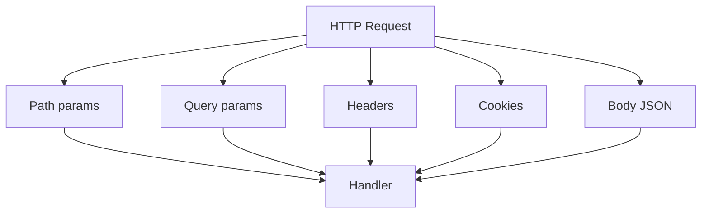

# 05. Parameters: Path, Query, Body, Header, Cookie

## Intro: "the date filter breaks prod"

Analysts call `GET /orders?from=2024-13-40`. Without query validation, the SQL fails with a 500. A proper API responds **422** before it ever reaches the DB. Path params, query, headers, and cookies are different **data sources** with different rules. FastAPI + Pydantic distinguish them explicitly.

## What you'll learn

- **Path**, **Query**, **Body**, **Header**, **Cookie** in FastAPI.
- Single parameters vs a **model** for a group of query params.
- `Annotated` + `Depends` (DI preview — [07](07-dependency-injection.md)).
- Impact on OpenAPI and caching.

## Parameter sources

| Source | Where in HTTP | FastAPI | Example |
|----------|------------|---------|--------|
| Path | `/items/{id}` | `Path()` | `item_id: int` |
| Query | `?skip=0&limit=10` | `Query()` | `limit: int = 10` |
| Body | JSON POST/PUT | Pydantic model | `body: ItemCreate` |
| Header | `X-Request-Id` | `Header()` | `x_request_id: str \| None` |
| Cookie | `session_id=...` | `Cookie()` | `session_id: str \| None` |



## Path

```python
from fastapi import FastAPI, Path

app = FastAPI()

@app.get("/items/{item_id}")
async def get_item(
    item_id: int = Path(ge=1, description="Item ID"),
):
    return {"item_id": item_id}
```

Order in the URL matters: declare static segments **above** dynamic ones:

```python
@app.get("/items/special")   # first
async def special(): ...

@app.get("/items/{item_id}") # then
async def by_id(item_id: int): ...
```

## Query

```python
from fastapi import Query

@app.get("/items")
async def list_items(
    skip: int = Query(0, ge=0),
    limit: int = Query(20, ge=1, le=100),
    q: str | None = Query(None, min_length=2),
):
    return {"skip": skip, "limit": limit, "q": q}
```

### A model for query params (many filters)

```python
from fastapi import Depends
from pydantic import BaseModel, Field

class ItemFilter(BaseModel):
    min_price: float | None = Field(None, ge=0)
    tag: str | None = None

async def filter_params(
    min_price: float | None = Query(None, ge=0),
    tag: str | None = None,
) -> ItemFilter:
    return ItemFilter(min_price=min_price, tag=tag)

@app.get("/search")
async def search(f: ItemFilter = Depends(filter_params)):
    return f
```

Pagination in depth — [27-pagination-filtering](27-pagination-filtering.md).

## Body

One body per operation (by default). Multiple bodies are a rare case (`Body(embed=True)`).

```python
@app.post("/items")
async def create(body: ItemCreate):
    return body
```

For PUT/PATCH partial updates — all fields optional in `ItemUpdate` ([04-pydantic-v2](04-pydantic-v2.md)).

## Header and Cookie

Header names are case-insensitive; Python parameters use **snake_case**:

```python
from fastapi import Header, Cookie

@app.get("/me")
async def me(
    authorization: str | None = Header(None),
    session_id: str | None = Cookie(None),
):
    return {"authorization_set": authorization is not None, "session_id": session_id}
```

`Authorization` → the `authorization` parameter. For non-standard names: `Header(alias="X-Trace-Id")`.

## Annotated (the recommended style)

```python
from typing import Annotated
from fastapi import FastAPI, Query

Limit = Annotated[int, Query(ge=1, le=100)]

@app.get("/items")
async def list_items(limit: Limit = 20):
    return {"limit": limit}
```

Reuse types like `Limit`, `ItemId` across several endpoints — consistent constraints in OpenAPI.

## Response codes table

| Situation | Code |
|----------|-----|
| Path `item_id=abc` | 422 |
| Query `limit=1000` with `le=100` | 422 |
| Resource not found | 404 ([11-errors-response-model](11-errors-response-model.md)) |
| GET success | 200 |
| POST create success | 201 |

## Form and File (preview)

`application/x-www-form-urlencoded` and multipart — [28-file-uploads](28-file-uploads.md):

```python
from fastapi import Form, File, UploadFile

@app.post("/upload")
async def upload(file: UploadFile = File(...), note: str = Form("")):
    return {"filename": file.filename, "note": note}
```

## On the lab stand

```bash
curl -s "http://localhost:8090/api/v1/items" | jq .
curl -s "http://localhost:8090/api/v1/items/not-int"
# expect 422 for a non-int path
```

## Common mistakes

| Mistake | Symptom | Fix |
|--------|---------|---------|
| Optional query without `None` | client didn't pass the field → 422 | `q: str \| None = None` |
| Body where query was expected | empty body breaks POST | split methods/models |
| Duplicate path `/{a}/{a}` | ambiguous routing | unique templates |
| Secret in the query string | nginx/proxy logs | Header / POST body only |
| `list` query without an explicit style | `?tag=a&tag=b` vs `?tag=a,b` | `Query()` / document it |

## In production

- Idempotency and trace id — the `Idempotency-Key`, `X-Request-Id` headers ([39-versioning-idempotency](39-versioning-idempotency.md)).
- Don't log cookies containing session/JWT.
- Behind nginx — trust `X-Forwarded-For` only from a trusted proxy ([34-nginx-tls](34-nginx-tls.md)).

## Summary

FastAPI **explicitly** separates path, query, body, headers, and cookies. **Path/Query** accept constraints just like **Field**. Group complex filters into **Pydantic models** via Depends. Validation errors are always **422** with details for the client.

## Checklist

- How do you declare a query param with default `limit=20` and max 100?
- Why shouldn't `GET` change state?
- Where do you pass a JWT — query or header?
- What breaks if `items/{item_id}` comes before `items/special`?

Next lesson: [06. Lab: CRUD](06-lab-crud.md).
