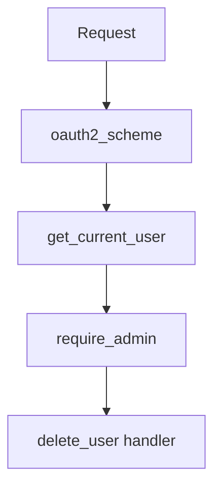

# 07. Dependency Injection: Depends, scopes, yield

## Intro: "we opened 500 connections to Postgres"

After deploying a new service, the DBA sees **500 idle connections** — one per concurrent request. Every handler called `asyncpg.connect()` directly. The right pattern is **one pool per process**, a session per request via **dependency injection**. FastAPI has DI built in through `Depends` — no separate container needed.

## What you'll learn

- **`Depends`**: reusing auth, DB, and settings logic.
- Dependency chains and **caching** within a request.
- **`yield` dependencies** for cleanup (sessions, transactions).
- How FastAPI's DI differs from "global singletons".

## Basic Depends

```python
from fastapi import Depends, FastAPI, Header, HTTPException

app = FastAPI()

async def verify_api_key(x_api_key: str = Header(..., alias="X-API-Key")):
    if x_api_key != "secret-dev-key":
        raise HTTPException(status_code=401, detail="Invalid API key")
    return x_api_key

@app.get("/internal/stats")
async def stats(api_key: str = Depends(verify_api_key)):
    return {"ok": True}
```

`verify_api_key` runs **before** `stats`. If the dependency errors, the request never reaches the handler.

## Chains

```python
async def get_current_user(token: str = Depends(oauth2_scheme)):
    ...

async def require_admin(user: User = Depends(get_current_user)):
    if not user.is_admin:
        raise HTTPException(403)
    return user

@app.delete("/users/{uid}")
async def delete_user(_: User = Depends(require_admin)):
    ...
```

Full auth — [19-oauth2-jwt](19-oauth2-jwt.md).



## Caching within a single request

FastAPI **caches** a dependency's result by default (for a single request scope):

```python
async def get_db():
    ...

@app.get("/a")
async def a(db=Depends(get_db)): ...

@app.get("/b")
async def b(db=Depends(get_db)): ...
```

Within a **single** request to `/a`, `get_db` is called once. In different requests — again.

Disable the cache: `Depends(get_db, use_cache=False)`.

## Yield dependencies (cleanup)

Ideal for **DB sessions** and **transactions**:

```python
from collections.abc import AsyncGenerator
from fastapi import Depends

async def get_session() -> AsyncGenerator[AsyncSession, None]:
    async with async_session_factory() as session:
        try:
            yield session
            await session.commit()
        except Exception:
            await session.rollback()
            raise
        finally:
            await session.close()

@app.get("/items")
async def list_items(session: AsyncSession = Depends(get_session)):
    result = await session.execute(select(Item))
    return result.scalars().all()
```

Code after `yield` runs **after** the response (or on an exception). More — [14-sessions-repos](14-sessions-repos.md).

## A class as a dependency

```python
class Pagination:
    def __init__(self, skip: int = 0, limit: int = 20):
        self.skip = skip
        self.limit = limit

@app.get("/items")
async def list_items(page: Pagination = Depends()):
    ...
```

FastAPI will call `Pagination(skip=..., limit=...)` from the query.

## Annotated + Depends (the 2024+ style)

```python
from typing import Annotated
from fastapi import Depends

DbSession = Annotated[AsyncSession, Depends(get_session)]

@app.get("/items")
async def list_items(session: DbSession):
    ...
```

Reuse `DbSession` across all routers.

## Scopes: what's NOT built in

| Scope | FastAPI | Where to implement |
|-------|---------|-----------------|
| Request | `Depends` default | built in |
| Application | one pool per process | `lifespan` ([02-first-app](02-first-app.md)) |
| Global "singleton" | be careful | module-level + lifespan init |

There's no full-fledged scope like in Spring — use **lifespan** + explicit factories.

```python
@asynccontextmanager
async def lifespan(app: FastAPI):
    app.state.pool = await create_pool()
    yield
    await app.state.pool.close()
```

```python
async def get_pool(request: Request):
    return request.app.state.pool
```

## Testing with override

```python
from fastapi.testclient import TestClient

def fake_session():
    yield FakeSession()

app.dependency_overrides[get_session] = fake_session
client = TestClient(app)
```

More — [30-testing](30-testing.md).

## Comparison with the manual approach

| Approach | Pros | Cons |
|--------|-------|--------|
| Global `db` variable | fast in a prototype | tests, races, no cleanup |
| Explicit argument passing | explicitness | duplication in every handler |
| **Depends** | DRY, testability, OpenAPI stays intact | requires structural discipline |

## Related courses

- Postgres pools — [`postgresql-basic`](../postgresql-basic/README.md).
- Redis client as a dependency — [28-redis-cache](28-redis-cache.md).
- routers/services layers — [08-project-structure](08-project-structure.md).

## Common mistakes

| Mistake | Symptom | Fix |
|--------|---------|---------|
| `commit` in every handler | partial commits, tricky rollbacks | commit in a yield dep or the service layer |
| Heavy work in a dependency | latency on every endpoint | cache at the app state level |
| Cyclic Depends A→B→A | ImportError / runtime loop | a third module or a lazy import |
| Forgot `finally close` | connection leak | `async with` / yield pattern |
| `use_cache=False` everywhere | extra DB queries | cache by default, disable deliberately |

## In production

- Put auth dependencies at the **router level** (`dependencies=[Depends(...)]`) for entire groups.
- Timeouts on external clients inside dependencies.
- Don't store **request-scoped** data in global dicts.

## Summary

**Depends** is a mechanism for reuse and composition: auth, DB, pagination. **Yield** gives guaranteed cleanup and transactions. **Lifespan** manages application-level resources (pools). FastAPI's DI is lightweight, but it requires disciplined layering.

## Checklist

- When does the code after `yield` run?
- How many times does `get_db` run in a single request with three `Depends(get_db)`?
- Where do you create the connection pool?
- How do you override a dependency in a test?

Next lesson: [08. Project structure](08-project-structure.md).
