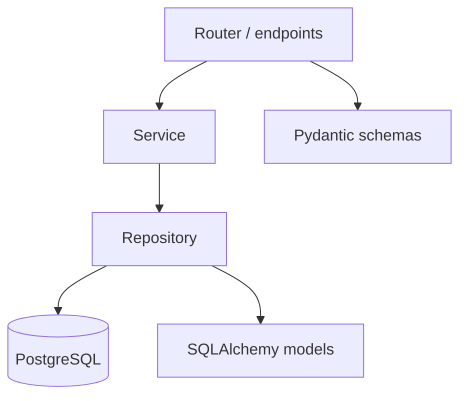

# 08. Project structure: APIRouter, layers

## Intro: "a 3000-line main.py"

The startup grew: one file holds auth, catalog, billing, webhooks. Merge conflicts every day, circular imports, no way to extract a module into a separate service. Refactoring starts with the **directory structure** and **APIRouter**, not with "let's rewrite it in Go".

## What you'll learn

- The typical **layout** of a FastAPI project.
- **APIRouter**, `include_router`, tags and prefixes.
- The **router → service → repository** layers.
- How the reference in `deploy/fastapi/stack/api` is organized.

## Recommended structure

```text
app/
  main.py              # FastAPI(), lifespan, include_router
  core/
    config.py          # Settings (pydantic-settings)
    deps.py            # shared Depends
  api/
    v1/
      router.py        # assembles the v1 routers
      endpoints/
        items.py
        users.py
  schemas/
    item.py            # Pydantic Create/Out
  services/
    item_service.py    # business logic
  repositories/
    item_repo.py       # SQL / Redis
  models/
    item.py            # SQLAlchemy ORM
  db/
    session.py         # engine, session factory
```

You don't need all of it from day one — grow it as the second module appears.

## main.py — assembly only

```python
from contextlib import asynccontextmanager
from fastapi import FastAPI
from app.api.v1.router import api_router
from app.core.config import settings

@asynccontextmanager
async def lifespan(app: FastAPI):
    # init pools, redis
    yield

app = FastAPI(title=settings.APP_NAME, lifespan=lifespan)
app.include_router(api_router, prefix="/api/v1")
```

The stand's reference is flatter, but the same principle:

```text
app/main.py
app/routers/health.py
app/routers/items.py
```

See [`deploy/fastapi/stack/api`](../../deploy/fastapi/stack/api).

## APIRouter

```python
# app/api/v1/endpoints/items.py
from fastapi import APIRouter, Depends
from app.schemas.item import ItemOut
from app.services.item_service import ItemService
from app.core.deps import get_item_service

router = APIRouter(prefix="/items", tags=["items"])

@router.get("", response_model=list[ItemOut])
async def list_items(svc: ItemService = Depends(get_item_service)):
    return await svc.list_items()
```

```python
# app/api/v1/router.py
from fastapi import APIRouter
from app.api.v1.endpoints import items, users

api_router = APIRouter()
api_router.include_router(items.router)
api_router.include_router(users.router, prefix="/users")
```

| Parameter | Level | Example final path |
|----------|---------|------------------------|
| `include_router(..., prefix="/api/v1")` | app | `/api/v1` |
| `APIRouter(prefix="/items")` | router | `/api/v1/items` |
| `@router.get("/{id}")` | endpoint | `/api/v1/items/{id}` |

## Layers of responsibility



| Layer | Knows about | Doesn't know about |
|------|---------|------------|
| **Router** | HTTP, status codes, Depends | SQL details |
| **Service** | business rules, orchestration | HTTP headers |
| **Repository** | queries, transactions | OpenAPI |
| **Schemas** | IO validation | ORM |

```python
# services/item_service.py
class ItemService:
    def __init__(self, repo: ItemRepository):
        self.repo = repo

    async def list_items(self) -> list[ItemOut]:
        rows = await self.repo.list_all()
        return [ItemOut.model_validate(r) for r in rows]
```

## core/deps.py

```python
from app.db.session import get_session
from app.repositories.item_repo import ItemRepository
from app.services.item_service import ItemService

async def get_item_repo(session=Depends(get_session)):
    return ItemRepository(session)

async def get_item_service(repo=Depends(get_item_repo)):
    return ItemService(repo)
```

One file for the **wiring** — routers stay thin.

## API versioning

```python
app.include_router(api_v1_router, prefix="/api/v1")
app.include_router(api_v2_router, prefix="/api/v2")
```

Parallel versions — separate `api/v1`, `api/v2` directories. Don't break v1 when adding v2.

## Testability

| Layer | Test |
|------|------|
| Repository | integration with a test DB |
| Service | unit with a mock repo |
| Router | httpx + override deps |

[30-testing](30-testing.md), [31-lab-testing](31-lab-testing.md).

## Related courses

- Docker COPY layers — [`containers-basic/02-images-dockerfile`](../containers-basic/02-images-dockerfile.md).
- Schema migrations — [15-alembic](15-alembic.md), [`postgresql-developer`](../postgresql-developer/README.md).
- Monorepo / multiple services — [42-capstone](42-capstone.md).

## Common mistakes

| Mistake | Symptom | Fix |
|--------|---------|---------|
| SQL in the router | fat endpoints, no tests | move to the repository |
| Circular import models↔schemas | ImportError | `TYPE_CHECKING`, forward refs |
| One router across 50 files | tricky merges | endpoints/ by domain |
| Business logic in a Pydantic validator | mixing layers | service layer |
| `from app.main import app` everywhere | cycles | dependencies only flow down the layers |

## In production

- A **bounded context** → a separate router or microservice.
- A shared lib for schemas between services — version it as a package.
- An import-order linter (ruff/isort) in CI ([`gitlab-basic`](../gitlab-basic/README.md)).

## Summary

**main.py** assembles the app; **APIRouter** groups endpoints modularly. **Router → Service → Repository** isolates HTTP, business logic, and data. The course reference in `deploy/fastapi` is the starting point for [09. Lab](09-lab-modular-app.md).

## Checklist

- Where do you declare `prefix="/api/v1"`?
- Who should call `session.execute`?
- Why put `tags` on a router?
- How do you add v2 without copying all of v1?

Next lesson: [09. Lab: a modular app](09-lab-modular-app.md).
