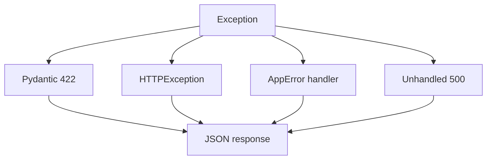

# 11. Errors and response_model

## Intro: "hashed_password leaked in the response"

A pen test found a `hashed_password` field in the user JSON. The developer had returned the entire ORM `User` object — "it's faster that way." **response_model** and explicit exceptions are part of the API contract and security, not cosmetics.

## What you'll learn

- **HTTPException** and custom handlers.
- **response_model**, `response_model_exclude`, status codes.
- A single error format for clients.
- Validation 422 vs business errors 400/409.

## HTTPException

```python
from fastapi import HTTPException, status

@app.get("/items/{item_id}")
async def get_item(item_id: int):
    item = await repo.get(item_id)
    if not item:
        raise HTTPException(
            status_code=status.HTTP_404_NOT_FOUND,
            detail="Item not found",
        )
    return item
```

Response:

```json
{"detail": "Item not found"}
```

| Code | When |
|------|------|
| 400 | invalid business operation |
| 401 | not authenticated |
| 403 | no permission |
| 404 | resource not found |
| 409 | conflict (duplicate email) |
| 422 | invalid types/fields (Pydantic) |
| 500 | unexpected error (don't expose details) |

## response_model

```python
class UserOut(BaseModel):
    id: int
    email: str
    is_active: bool

@app.get("/users/{uid}", response_model=UserOut)
async def get_user(uid: int):
    user = await session.get(User, uid)
    if not user:
        raise HTTPException(404)
    return user  # ORM → UserOut via from_attributes
```

`response_model` **filters out** extra ORM fields even if the developer made a mistake.

```python
class UserOut(BaseModel):
    model_config = ConfigDict(from_attributes=True)
    id: int
    email: str
```

### Excluding fields

```python
@app.get("/users/me", response_model=UserOut, response_model_exclude={"email"})
async def me(): ...
```

A separate `UserPublicOut` schema is preferable.

## Multiple response types (OpenAPI)

```python
from typing import Union

@app.get(
    "/items/{id}",
    response_model=ItemOut,
    responses={
        404: {"description": "Not found", "model": ErrorBody},
    },
)
async def get_item(id: int): ...
```

## Custom exception handlers

```python
from fastapi import Request
from fastapi.responses import JSONResponse

class AppError(Exception):
    def __init__(self, code: str, message: str, status: int = 400):
        self.code = code
        self.message = message
        self.status = status

@app.exception_handler(AppError)
async def app_error_handler(request: Request, exc: AppError):
    return JSONResponse(
        status_code=exc.status,
        content={"error": {"code": exc.code, "message": exc.message}},
    )
```

A uniform format makes life easier for mobile clients and BFFs. Lab — [12-lab-error-handling](12-lab-error-handling.md).



## 422 vs 400

| | 422 | 400 |
|---|-----|-----|
| Source | FastAPI/Pydantic | your code |
| Example | `price: "abc"` | "can't cancel an already-delivered order" |
| `detail` | array of loc/type/msg | string or object |

Don't use 422 for business rules — clients tell "syntax" apart from "semantics."

## ORM and lazy loading

```python
# dangerous: lazy load in async after the session is closed
@app.get("/orders/{id}", response_model=OrderOut)
async def get_order(id: int, session: DbSession):
    order = await session.get(Order, id)
    return order  # OrderOut needs items — requires eager loading
```

See [postgresql-developer/06-n-plus-one](../postgresql-developer/06-n-plus-one.md), [postgresql-developer/06-n-plus-one](../postgresql-developer/06-n-plus-one.md).

## Connection to observability

Log 5xx errors with a `request_id`; don't log the stack trace to the client. Metrics by `status` — [36-observability](36-observability.md).

## On the course stand

```bash
curl -s http://localhost:8090/api/v1/items/999 | jq .
```

Note the actual status and body — the training stand may return a `detail` JSON without a proper 404 (tech debt to fix in lab 12).

## Common mistakes

| Mistake | Risk | Fix |
|---------|------|-----|
| `return {"detail": "..."}` instead of raising | wrong HTTP code 200 | use `HTTPException` |
| Blanket `except Exception: return None` | 200 with an empty body | re-raise or add a 500 handler |
| `response_model=None` "temporarily" | field leaks in prod | always use a schema on public APIs |
| SQL details in a 500 | information disclosure | generic message + log server-side |
| Different error JSON per endpoint | pain for clients | `AppError` + handler |

## In production

- **Problem Details** (RFC 9457) for enterprise APIs — an optional way to unify things.
- Localizing `detail` — via `Accept-Language` (rare on internal APIs).
- Rate limiting 429 — [39-versioning-idempotency](39-versioning-idempotency.md).

## Summary

**HTTPException** gives you controlled HTTP errors. **response_model** filters the response and documents it in OpenAPI. **Exception handlers** produce a single JSON shape for domain errors. Keep **422** (validation) separate from **400/409** (business logic).

## Checklist

- How do you hide an ORM field from the client?
- When do you use 409 instead of 400?
- What does FastAPI return for an uncaught Exception?
- Why `from_attributes=True`?

Next lesson: [12. Lab: error handling](12-lab-error-handling.md).
