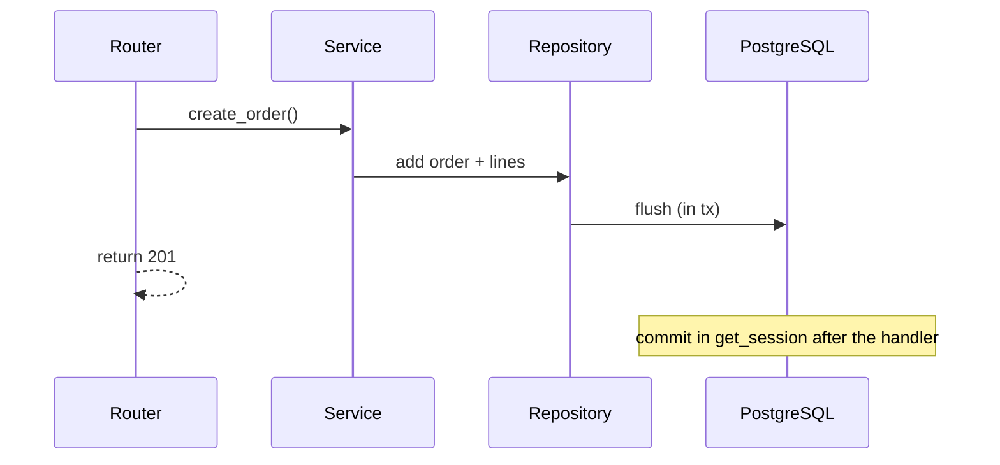

# 14. Sessions, repositories, transactions

## Intro: "half the order got written"

If something fails between `INSERT order` and `INSERT order_lines`, the client sees an order with no line items. Money is charged, stock isn't reserved. A **transaction** is an atomic boundary; a **session** is the unit of work per request; a **repository** isolates SQL from business logic. This chapter ties together [07 DI](07-dependency-injection.md) and [13 ORM](13-sqlalchemy-async.md).

## What you'll learn

- The **Repository** pattern for async SQLAlchemy.
- **Transaction** boundaries: commit/rollback in a yield-dep.
- **Unit of Work** at the service level.
- Isolation and common races (preview).

## Repository

```python
# app/repositories/item_repo.py
from sqlalchemy import select
from sqlalchemy.ext.asyncio import AsyncSession
from app.models.item import Item

class ItemRepository:
    def __init__(self, session: AsyncSession):
        self.session = session

    async def list_by_owner(self, owner_id: int, *, skip: int = 0, limit: int = 20) -> list[Item]:
        stmt = (
            select(Item)
            .where(Item.owner_id == owner_id)
            .order_by(Item.id)
            .offset(skip)
            .limit(limit)
        )
        result = await self.session.execute(stmt)
        return list(result.scalars().all())

    async def get(self, item_id: int) -> Item | None:
        return await self.session.get(Item, item_id)

    async def add(self, item: Item) -> Item:
        self.session.add(item)
        await self.session.flush()
        return item

    async def delete(self, item: Item) -> None:
        await self.session.delete(item)
```

The router does **not** import `select` — only the service/repo does.

## Service + transaction

```python
# app/services/order_service.py
class OrderService:
    def __init__(self, orders: OrderRepository, lines: OrderLineRepository):
        self.orders = orders
        self.lines = lines

    async def create_order(self, user_id: int, items: list[LineCreate]) -> Order:
        order = Order(user_id=user_id, status="pending")
        await self.orders.add(order)
        for line in items:
            await self.lines.add(OrderLine(order_id=order.id, **line.model_dump()))
        # commit outside — in get_session
        return order
```

One **commit** per successful HTTP request — in the dependency.

## Yield dependency with commit/rollback

```python
async def get_session() -> AsyncGenerator[AsyncSession, None]:
    async with async_session_factory() as session:
        try:
            yield session
            await session.commit()
        except Exception:
            await session.rollback()
            raise
```

| Event | Action |
|---------|----------|
| Handler finished without an exception | **commit** |
| HTTPException / AppError | rollback (unless caught) |
| Unhandled exception | rollback |

**HTTPException** inherits from `Exception` — it rolls back the transaction. If you need a commit in a partial scenario, design it differently (rare).



## Wiring Depends

```python
async def get_item_repo(session: DbSession) -> ItemRepository:
    return ItemRepository(session)

async def get_item_service(repo: ItemRepository = Depends(get_item_repo)) -> ItemService:
    return ItemService(repo)
```

## Explicit transaction (nested logic)

```python
async with session.begin():
    await repo_a.add(...)
    await repo_b.add(...)
# auto commit on exit, rollback on exception
```

For background tasks — a separate session ([23-background-tasks](23-background-tasks.md)).

## Read-only queries

For pure GETs you can skip the commit:

```python
async def get_read_session() -> AsyncGenerator[AsyncSession, None]:
    async with async_session_factory() as session:
        yield session
        # no commit — read only
```

Or a single `get_session` with commit (an empty transaction is cheap on Postgres).

## Isolation (briefly)

| Level | Phenomenon |
|---------|---------|
| READ COMMITTED | Postgres default, non-repeatable read |
| REPEATABLE READ | snapshot |
| SERIALIZABLE | rare serialization failures |

Details — [`postgresql-basic`](../postgresql-basic/README.md). Queues — `SELECT FOR UPDATE SKIP LOCKED` ([postgresql-developer/12](../postgresql-developer/12-advisory-locks.md)).

## Testing the repository

```python
@pytest.fixture
async def session():
    async with async_session_factory() as s:
        yield s
        await s.rollback()

async def test_add_item(session):
    repo = ItemRepository(session)
    item = Item(title="t", owner_id=1)
    await repo.add(item)
    assert item.id is not None
```

Integration with testcontainers or the `deploy/postgres` stand.

## On the course stand

```bash
docker exec mock-fastapi-postgres psql -U course -d course -c \
  "INSERT INTO items (title, description, owner_id) VALUES ('Lab item', 'tx demo', 1) RETURNING id;"
```

Check the FK on `users` — the demo user from the init SQL.

## Common mistakes

| Mistake | Symptom | Fix |
|--------|---------|---------|
| `commit` in the repository | double commit / unclear boundaries | commit in the dep or `session.begin()` |
| Long transaction in a request | locks, pool exhaustion | short tx; heavy work → a worker |
| Session in a background task | closed session | a new session in the task |
| Repo returns an ORM dict outward | coupling | ORM inside; Out — in the service |
| N+1 in list | hundreds of queries | joinedload/selectinload ([postgresql-developer/06-n-plus-one](../postgresql-developer/06-n-plus-one.md)) |

## In production

- **Outbox pattern** for events to Kafka ([messaging-deep/10-outbox-saga](../messaging-deep/10-outbox-saga.md)).
- Monitor `idle in transaction` — [`postgresql-ops`](../postgresql-ops/README.md).
- Retry on `SerializationFailure` — a bounded exponential backoff.

## Summary

The **repository** encapsulates SQL; the **service** orchestrates the use case. **One session per request** via Depends; **commit/rollback** in a yield-dependency. Keep transactions **short**. Next block — **Alembic migrations** ([15-alembic](15-alembic.md)).

## Checklist

- Where should the single `commit` for a REST request be?
- What happens to the transaction on `HTTPException(404)`?
- Why `flush` in the repository?
- Who calls `select()` — the router or the repository?

Next lesson: [15. Alembic](15-alembic.md).
