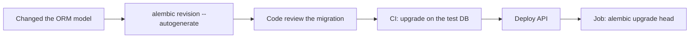

# 15. Alembic: DB schema migrations

## Intro: "works on my machine, not in prod"

A developer added an `owner_id` column to the SQLAlchemy model and deployed the code. The staging PostgreSQL **didn't know** about the column — a `500` on every `INSERT`. Manual `ALTER TABLE`s in the "urgently run this on prod" chat are a path to drift and incidents. **Alembic** versions the schema the same way git does — as code, with `upgrade`/`downgrade` and history in the `alembic_version` table.

Relation to [`postgresql-developer`](../postgresql-developer/README.md): migrations are part of the application lifecycle, not a one-off DBA task.

## What you'll learn

- Initializing Alembic in a FastAPI + SQLAlchemy 2.0 async project.
- **Autogenerate**: comparing models and the DB schema.
- The `upgrade`, `downgrade`, `revision` commands.
- CI/CD: when to run migrations relative to the API deploy.

---

## Installation and structure

```bash
pip install alembic
alembic init alembic
```

| File / directory | Purpose |
|----------------|------------|
| `alembic.ini` | DB URL, path to scripts |
| `alembic/env.py` | connecting metadata, target_metadata |
| `alembic/versions/` | revision files `xxxx_description.py` |
| `alembic_version` (in the DB) | current revision |

**Don't store** the production password in `alembic.ini` — inject the URL from `DATABASE_URL` in `env.py`:

```python
# alembic/env.py (fragment)
import os
from app.db.base import Base  # all models imported into base

config.set_main_option("sqlalchemy.url", os.environ["DATABASE_URL"].replace("+asyncpg", ""))
target_metadata = Base.metadata
```

For autogenerate, SQLAlchemy must see **all** models — import them into `app/db/base.py` before `Base.metadata`.

---

## First revision and autogenerate

```bash
# models are already defined, the DB is empty or matches the starting schema
alembic revision --autogenerate -m "add users and items"
alembic upgrade head
```

Autogenerate is **not perfect**: it won't detect a renamed column (it will suggest drop + add), and it won't create complex partial indexes without a manual edit. Always **read** the generated `upgrade()` before applying it.

An example revision:

```python
"""add users and items

Revision ID: a1b2c3d4
"""
from alembic import op
import sqlalchemy as sa

revision = "a1b2c3d4"
down_revision = None

def upgrade() -> None:
    op.create_table(
        "users",
        sa.Column("id", sa.Integer(), primary_key=True),
        sa.Column("email", sa.String(255), nullable=False, unique=True),
        sa.Column("hashed_password", sa.String(255), nullable=False),
        sa.Column("is_active", sa.Boolean(), server_default=sa.text("true")),
        sa.Column("created_at", sa.DateTime(timezone=True), server_default=sa.text("now()")),
    )
    op.create_table(
        "items",
        sa.Column("id", sa.Integer(), primary_key=True),
        sa.Column("title", sa.String(200), nullable=False),
        sa.Column("owner_id", sa.Integer(), sa.ForeignKey("users.id", ondelete="CASCADE")),
    )

def downgrade() -> None:
    op.drop_table("items")
    op.drop_table("users")
```

---

## upgrade / downgrade

| Command | Action |
|---------|----------|
| `alembic upgrade head` | apply all revisions up to the latest |
| `alembic upgrade +1` | one revision forward |
| `alembic downgrade -1` | roll back one revision |
| `alembic downgrade base` | roll back everything (careful in prod) |
| `alembic current` | current revision in the DB |
| `alembic history` | the revision chain |

```bash
alembic upgrade head
docker exec mock-fastapi-postgres psql -U course -d course -c '\dt'
```

On the [`deploy/fastapi`](../../deploy/fastapi/README.md) stand, the initial schema lives in `init/01-schema.sql`. In the [16-lab-postgres](16-lab-postgres.md) lab you'll move to Alembic as the single source of truth.

---

## Async and Alembic

Alembic works **synchronously** by default. For `postgresql+asyncpg://` in the application runtime, migrations are usually run with a `postgresql://` URL (psycopg2) or via `run_sync` in an async env — for the course, a **synchronous driver for the CLI** and asyncpg in the API is enough.

```python
# env.py — async template (simplified)
from sqlalchemy.ext.asyncio import async_engine_from_config

async def run_async_migrations():
    connectable = async_engine_from_config(...)
    async with connectable.connect() as connection:
        await connection.run_sync(do_run_migrations)
```

Don't mix them: one revision — one `op` style in `upgrade`.

---

## Team workflow



| Rule | Why |
|---------|-------|
| Migration in the same PR as the model | no drift |
| Destructive change — data migration as a separate step | don't lose data |
| Verify downgrade on a DB copy | rollback on a failed deploy |

---

## On the stand

```bash
cd deploy/fastapi
docker compose exec api sh -c "cd /app && alembic current"
# after setting up Alembic in the image:
docker compose exec api alembic upgrade head
```

The API is available at [http://localhost:8090/health](http://localhost:8090/health).

---

## Common mistakes

| Mistake | Consequence | Fix |
|--------|-------------|---------|
| Edited the DB by hand, autogenerate is empty | schema drift | only via revisions |
| `down_revision` conflict on merge | two heads | `alembic merge` |
| Long `ALTER` without `CONCURRENTLY` | table lock | a separate revision, off-peak |
| Secrets in `alembic.ini` in git | leak | an env var in `env.py` |

---

## Summary

**Alembic** versions DDL alongside the code. **Autogenerate** speeds up the start, but the revision is always reviewed. **`upgrade head`** before or together with the API deploy is a mandatory pipeline step. More on transactions and indexes — [`postgresql-developer`](../postgresql-developer/README.md).

## Checklist

- How does `revision` differ from `upgrade`?
- Why is autogenerate dangerous without review?
- Where is the current schema version stored in PostgreSQL?

Next: [16-lab-postgres](16-lab-postgres.md).
