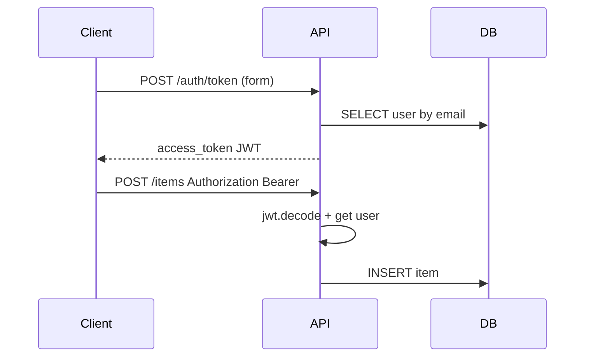

# 19. OAuth2 Password Flow, JWT, and Password Hashing

## Intro: "a password in the query string, and a token that never expires"

A security audit found: login accepted `?password=` in the URL (right there in nginx logs), JWTs were signed with algorithm `none`, and passwords sat in the database as plain text. FastAPI gives you **ready-made building blocks** — `OAuth2PasswordBearer`, integration with the OpenAPI "Authorize" button — but you're still on the hook for the cryptography and token lifetime. Base threat modeling lives in [`appsec-fundamentals`](../appsec-fundamentals/README.md).

## What you'll learn

- **OAuth2 Password Bearer** (Resource Owner Password) for first-party APIs.
- Issuing and verifying **JWTs** (`python-jose`).
- **passlib + bcrypt** for `hashed_password`.
- Protecting endpoints with `Depends(get_current_user)`.

---

## OAuth2PasswordBearer in FastAPI

```python
from fastapi import Depends, FastAPI, HTTPException, status
from fastapi.security import OAuth2PasswordBearer, OAuth2PasswordRequestForm

oauth2_scheme = OAuth2PasswordBearer(tokenUrl="/api/v1/auth/token")

app = FastAPI()

@app.get("/api/v1/me")
async def read_me(token: str = Depends(oauth2_scheme)):
    return {"token_prefix": token[:20]}
```

| Element | Purpose |
|---------|------------|
| `tokenUrl` | the **form login** path (`username`, `password`) |
| `OAuth2PasswordBearer` | extracts `Authorization: Bearer ...` |
| Swagger **Authorize** | plugs the Bearer token into requests |

**Important:** the Password flow is fine for **your own** SPA/mobile clients with a trusted backend. For third-party clients use Authorization Code + PKCE ([`appsec-fundamentals`](../appsec-fundamentals/README.md)).

---

## Hashing: passlib + bcrypt

```python
from passlib.context import CryptContext

pwd_context = CryptContext(schemes=["bcrypt"], deprecated="auto")

def hash_password(plain: str) -> str:
    return pwd_context.hash(plain)

def verify_password(plain: str, hashed: str) -> bool:
    return pwd_context.verify(plain, hashed)
```

| Rule | Why |
|---------|-------|
| Never log the password | compliance, incident response |
| bcrypt cost 12+ | balance between CPU cost and strength |
| Don't store plaintext or reversible encryption | one-way hashing only |

On Windows, hashing in the labs happens **inside the container** (see the [sandbox README](../../deploy/fastapi/README.md) for bcrypt quirks).

---

## JWT: creating and verifying

The sandbox sets `JWT_SECRET` in compose. In code:

```python
from datetime import datetime, timedelta, timezone
from jose import JWTError, jwt

ALGORITHM = "HS256"
ACCESS_TOKEN_EXPIRE_MINUTES = 30

def create_access_token(subject: str, secret: str) -> str:
    expire = datetime.now(timezone.utc) + timedelta(minutes=ACCESS_TOKEN_EXPIRE_MINUTES)
    payload = {"sub": subject, "exp": expire, "type": "access"}
    return jwt.encode(payload, secret, algorithm=ALGORITHM)

def decode_token(token: str, secret: str) -> dict:
    return jwt.decode(token, secret, algorithms=[ALGORITHM])
```

Login endpoint:

```python
@router.post("/auth/token")
async def login(
    form: OAuth2PasswordRequestForm = Depends(),
    db: AsyncSession = Depends(get_db),
):
    user = await get_user_by_email(db, form.username)
    if not user or not verify_password(form.password, user.hashed_password):
        raise HTTPException(
            status_code=status.HTTP_401_UNAUTHORIZED,
            detail="Incorrect username or password",
            headers={"WWW-Authenticate": "Bearer"},
        )
    token = create_access_token(subject=str(user.id), secret=settings.JWT_SECRET)
    return {"access_token": token, "token_type": "bearer"}
```

---

## Current user dependency

```python
async def get_current_user(
    token: str = Depends(oauth2_scheme),
    db: AsyncSession = Depends(get_db),
) -> User:
    credentials_exc = HTTPException(
        status_code=status.HTTP_401_UNAUTHORIZED,
        detail="Could not validate credentials",
        headers={"WWW-Authenticate": "Bearer"},
    )
    try:
        payload = decode_token(token, settings.JWT_SECRET)
        user_id = int(payload.get("sub"))
    except (JWTError, ValueError, TypeError):
        raise credentials_exc
    user = await db.get(User, user_id)
    if not user or not user.is_active:
        raise credentials_exc
    return user
```

Usage:

```python
@router.post("/items", response_model=ItemOut)
async def create_item(
    body: ItemCreate,
    user: User = Depends(get_current_user),
    db: AsyncSession = Depends(get_db),
):
    item = Item(**body.model_dump(), owner_id=user.id)
    ...
```

---

## Request flow



Test it on the sandbox (after the [21-lab-auth](21-lab-auth.md) lab):

```bash
curl -s -X POST http://localhost:8090/api/v1/auth/token \
  -d "username=demo@course.local&password=secret" \
  -H "Content-Type: application/x-www-form-urlencoded"
```

---

## Common mistakes

| Mistake | Consequence | Fix |
|--------|-------------|---------|
| `JWT_SECRET` committed to git | tokens can be forged | env / Vault |
| `algorithms=["HS256","none"]` | algorithm confusion attack | one explicit algorithm |
| Long access-token TTL | a stolen token stays valid a long time | 15–60 min + refresh |
| 401 without `WWW-Authenticate` | breaks OAuth2 clients | include the header in HTTPException |
| Comparing passwords with `==` | timing side channel | use `verify_password` |

---

## Summary

**OAuth2PasswordBearer** ties OpenAPI to Bearer tokens. Passwords go through **bcrypt** via passlib, and nothing else. **JWTs** carry `sub` and `exp`; the secret comes from the environment (`JWT_SECRET` on the sandbox). RBAC and refresh tokens are covered in [20-rbac-scopes](20-rbac-scopes.md).

## Checklist

- Why is login `application/x-www-form-urlencoded`?
- What does `jwt.decode` check beyond the signature?
- Where does a client enter a Bearer token in Swagger?

Next: [20-rbac-scopes](20-rbac-scopes.md).
