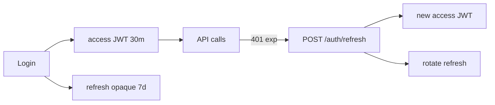

# 20. RBAC, Scopes, and Refresh Tokens (Overview)

## Intro: "anyone with a valid JWT is an admin"

After JWT was rolled out, any logged-in user could call `DELETE /users/{id}` — the token carried no **role**, only proof of login. Separating **authentication** (who you are) from **authorization** (what you can do) means RBAC through claims, scopes, or a permissions table. Refresh tokens extend a session without needing a JWT that lives forever.

See threat modeling in [`appsec-fundamentals`](../appsec-fundamentals/02-threat-modeling.md).

## What you'll learn

- **RBAC**: `admin`/`user` roles and checking them on an endpoint.
- **Scopes** in a JWT and FastAPI's `SecurityScopes`.
- An overview of **refresh token** rotation (not a full implementation — that's the [21-lab-auth](21-lab-auth.md) lab).
- The principle of least privilege for APIs.

---

## RBAC: roles in the model and the token

```python
# models/user.py
class User(Base):
    __tablename__ = "users"
    id: Mapped[int] = mapped_column(primary_key=True)
    email: Mapped[str] = mapped_column(String(255), unique=True)
    role: Mapped[str] = mapped_column(String(32), default="user")  # user | admin
```

Add the claim when issuing the access token:

```python
payload = {
    "sub": str(user.id),
    "role": user.role,
    "exp": expire,
}
```

Checking the role:

```python
from fastapi import Depends, HTTPException, status

def require_role(*allowed: str):
    async def checker(user: User = Depends(get_current_user)):
        if user.role not in allowed:
            raise HTTPException(status_code=status.HTTP_403_FORBIDDEN, detail="Forbidden")
        return user
    return checker

@router.delete("/users/{user_id}")
async def delete_user(
    user_id: int,
    admin: User = Depends(require_role("admin")),
    db: AsyncSession = Depends(get_db),
):
    ...
```

| Code | Meaning |
|-----|--------|
| **401** | not authenticated (missing/invalid token) |
| **403** | authenticated, but lacks permission |

Don't confuse them: 401 means "log in," 403 means "you're not allowed."

---

## Scopes (OAuth2-style)

For microservices and machine-to-machine calls, **scopes** in the JWT work well: `items:read`, `items:write`.

```python
from fastapi import Security
from fastapi.security import SecurityScopes

oauth2_scheme = OAuth2PasswordBearer(
    tokenUrl="/api/v1/auth/token",
    scopes={"items:read": "Read items", "items:write": "Create/update items"},
)

async def get_current_user(
    security_scopes: SecurityScopes,
    token: str = Depends(oauth2_scheme),
) -> User:
    payload = decode_token(token, settings.JWT_SECRET)
    token_scopes = payload.get("scopes", [])
    for scope in security_scopes.scopes:
        if scope not in token_scopes:
            raise HTTPException(status_code=403, detail=f"Missing scope: {scope}")
    ...
```

Endpoint:

```python
@router.get("/items", dependencies=[Security(oauth2_scheme, scopes=["items:read"])])
async def list_items(...):
    ...
```

OpenAPI will show the required scopes per operation — useful for contracts and audits.

---

## RBAC vs. scopes

| Approach | When to use |
|--------|-------------|
| **RBAC (roles)** | admin panels, a handful of fixed roles |
| **Scopes** | API products, M2M, granular permissions |
| **ABAC** (attributes) | "owner of the record" — `owner_id == user.id` |

These are often combined: a `user` role, an `items:write` scope, plus an `owner_id` check on update.

```python
async def ensure_owner(item: Item, user: User):
    if item.owner_id != user.id and user.role != "admin":
        raise HTTPException(403, detail="Not owner")
```

---

## Refresh tokens (overview)

Access tokens are short-lived (15–60 min). The **refresh** token is long-lived, stored in an HttpOnly cookie or secure storage, and used **only** for `POST /auth/refresh`.



| Practice | Why |
|----------|-------|
| Store refresh tokens in DB/Redis keyed by `jti` | lets you revoke on logout |
| **Rotation** | each refresh issues a new RT and invalidates the old one |
| Never put refresh tokens in localStorage | XSS → session hijack |
| A separate `type: refresh` claim | prevents a refresh token being accepted as an access token |

Full implementation is an extension of [21-lab-auth](21-lab-auth.md); Redis for a blacklist is covered in [28-redis-cache](28-redis-cache.md).

---

## A permissions table (optional)

For more complex systems:

```sql
CREATE TABLE role_permissions (
    role VARCHAR(32),
    permission VARCHAR(64),
    PRIMARY KEY (role, permission)
);
```

Load it into a dependency once at startup, or cache it in Redis. For this course, a `role` column on `users` is enough.

---

## On the sandbox

After the auth lab, verify the 403 case:

```bash
TOKEN_USER=$(curl -s -X POST http://localhost:8090/api/v1/auth/token -d "username=user@x&password=p" -H "Content-Type: application/x-www-form-urlencoded" | jq -r .access_token)
curl -s -o /dev/null -w "%{http_code}\n" -H "Authorization: Bearer $TOKEN_USER" \
  -X DELETE http://localhost:8090/api/v1/users/1
```

You should get **403** for the `user` role.

---

## Common mistakes

| Mistake | Consequence | Fix |
|--------|-------------|---------|
| Role only in the DB, not in the token | extra SELECT; stale role until token expires | short TTL, or a version claim |
| A single `admin` scope for everything | large blast radius | granular scopes |
| Refresh without rotation | a stolen RT gives weeks of access | rotate + reuse detection |
| 403 instead of 401 | client doesn't know to refresh the token | use the right status codes |

---

## Summary

**RBAC** means roles on the user, checked in dependencies. **Scopes** give fine-grained permissions in the JWT and OpenAPI. **Refresh tokens** are a separate long-lived token with rotation, stored in Redis/DB. A secure API baseline is covered next in [22-security-checklist](22-security-checklist.md).

## Checklist

- What's the difference between 401 and 403?
- When is a scope a better fit than a role?
- Why does refresh token rotation matter?

Next: [21-lab-auth](21-lab-auth.md).
