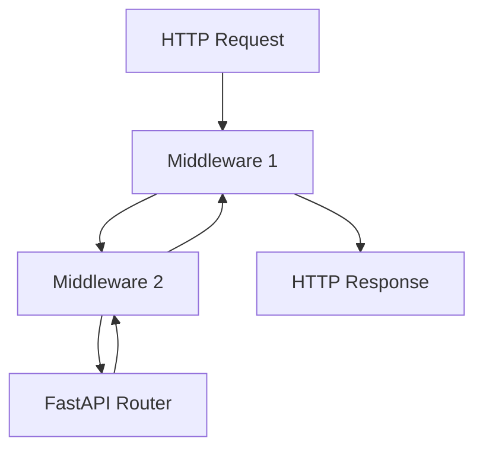

# 23. Middleware, CORSMiddleware, and custom layers

## Intro: "the request id is in the logs but not in the client response"

Support couldn't correlate the API logs with a user's complaint: the **request id** was generated in one place and lost in another. **Middleware** in ASGI wraps every request uniformly — before and after the router. CORS, GZip, timing, security headers — all here, not in every endpoint.

Relation to [`nginx-basic`](../nginx-basic/README.md): edge middleware (rate limit, TLS) + app middleware are different levels.

## What you'll learn

- The **middleware stack** order in Starlette/FastAPI.
- **CORSMiddleware** — configuration and common traps.
- **BaseHTTPMiddleware** and pure ASGI middleware.
- When not to put logic in middleware.

---

## How the stack works



**Rule:** the first `add_middleware` is the **outer** layer (closer to the client on the response).

```python
app.add_middleware(CORSMiddleware, ...)      # outer
app.add_middleware(GZipMiddleware, minimum_size=500)
```

| Type | Examples |
|-----|---------|
| Built-in Starlette | CORS, GZip, TrustedHost |
| Custom | request id, audit log, timing |
| Not middleware | business auth — **dependencies** |

---

## CORSMiddleware

```python
from fastapi import FastAPI
from fastapi.middleware.cors import CORSMiddleware

app = FastAPI()

app.add_middleware(
    CORSMiddleware,
    allow_origins=[
        "http://localhost:3000",
        "https://app.example.com",
    ],
    allow_credentials=True,
    allow_methods=["*"],
    allow_headers=["*"],
    expose_headers=["X-Request-ID"],
)
```

| Parameter | Note |
|----------|---------|
| `allow_origins` | whitelist; `["*"]` is incompatible with `credentials=True` |
| `allow_credentials` | cookies / Authorization in the browser |
| `expose_headers` | which response headers JS can see |
| preflight `OPTIONS` | CORSMiddleware answers automatically |

Verify with curl (without a browser, CORS isn't visible):

```bash
curl -sI -X OPTIONS http://localhost:8090/api/v1/items \
  -H "Origin: http://localhost:3000" \
  -H "Access-Control-Request-Method: GET"
```

You expect `access-control-allow-origin` when the whitelist matches.

The CORS security baseline — [22-security-checklist](22-security-checklist.md).

---

## GZip and TrustedHost

```python
from starlette.middleware.gzip import GZipMiddleware
from starlette.middleware.trustedhost import TrustedHostMiddleware

app.add_middleware(GZipMiddleware, minimum_size=1000)
app.add_middleware(
    TrustedHostMiddleware,
    allowed_hosts=["api.example.com", "localhost"],
)
```

**TrustedHost** protects against Host header attacks when the proxy is misconfigured.

---

## Custom middleware: Request ID

```python
import uuid
from starlette.middleware.base import BaseHTTPMiddleware
from starlette.requests import Request

class RequestIdMiddleware(BaseHTTPMiddleware):
    async def dispatch(self, request: Request, call_next):
        request_id = request.headers.get("X-Request-ID") or str(uuid.uuid4())
        request.state.request_id = request_id
        response = await call_next(request)
        response.headers["X-Request-ID"] = request_id
        return response

app.add_middleware(RequestIdMiddleware)
```

In the endpoint:

```python
@router.get("/health")
async def health(request: Request):
    return {"status": "ok", "request_id": request.state.request_id}
```

| Practice | Why |
|----------|-------|
| Accept `X-Request-ID` from nginx | end-to-end tracing |
| Otherwise generate a UUID | log correlation |
| Log `request_id` in structured JSON | observability ([36-observability](36-observability.md)) |

---

## Pure ASGI middleware (performance)

`BaseHTTPMiddleware` is convenient but adds overhead. For a hot path:

```python
class TimingMiddleware:
    def __init__(self, app):
        self.app = app

    async def __call__(self, scope, receive, send):
        if scope["type"] != "http":
            await self.app(scope, receive, send)
            return
        import time
        start = time.perf_counter()

        async def send_wrapper(message):
            if message["type"] == "http.response.start":
                elapsed = time.perf_counter() - start
                headers = list(message.get("headers", []))
                headers.append((b"x-process-time", f"{elapsed:.4f}".encode()))
                message = {**message, "headers": headers}
            await send(message)

        await self.app(scope, receive, send_wrapper)
```

---

## What not to do in middleware

| Task | Best place |
|--------|--------------|
| JWT validation per route | `Depends(get_current_user)` |
| DB session | `Depends(get_db)` |
| Heavy business logic | service layer |
| Blocking `time.sleep` | blocks the whole loop |

---

## On the stand

Add `RequestIdMiddleware` to `stack/api/app/main.py`, rebuild:

```bash
cd deploy/fastapi
docker compose up -d --build
curl -sI http://localhost:8090/health | grep -i x-request-id
```

---

## Common mistakes

| Mistake | Consequence | Fix |
|--------|-------------|---------|
| Middleware after `include_router` | won't apply | `add_middleware` before mount |
| CORS on only some paths | preflight fail | global CORSMiddleware |
| Exceptions swallowed in middleware | 500 without logs | re-raise or log |
| DB in middleware on every request | session leaks | dependency yield |

---

## Summary

**Middleware** handles cross-cutting concerns: CORS, compression, request id, security headers. The order of addition determines the nesting. **Auth and DB** are dependencies, not middleware. On the **8090** stand, configure CORS for your frontend's origin.

## Checklist

- Which middleware runs first for an incoming request?
- Why is `allow_origins=["*"]` with cookies dangerous?
- Where do you store `request_id` for the access log?

Next: [24-lifespan-background](24-lifespan-background.md).
