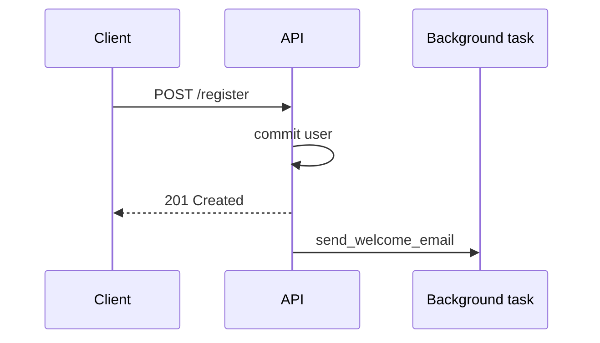

# 24. Lifespan and BackgroundTasks

## Intro: "after a restart the DB pool didn't open, but /health was already green"

Kubernetes restarted the pod; `/health` answered `ok`, but the **first** DB request failed — the `engine` was created lazily in a dependency without an explicit **startup**. **Lifespan** (ASGI) replaces the deprecated `@app.on_event("startup")` and gives a single context for init/shutdown: pools, Redis, graceful close.

**BackgroundTasks** — "answer the client now, send the email later" without a separate queue.

## What you'll learn

- The `lifespan` context manager in FastAPI 0.93+.
- Initializing the **engine**, Redis, shared clients.
- **BackgroundTasks** vs Celery/RQ.
- Graceful shutdown with uvicorn.

---

## Lifespan: startup and shutdown

```python
from contextlib import asynccontextmanager
from fastapi import FastAPI
from sqlalchemy.ext.asyncio import create_async_engine

@asynccontextmanager
async def lifespan(app: FastAPI):
    # startup
    app.state.engine = create_async_engine(
        settings.DATABASE_URL,
        pool_pre_ping=True,
        pool_size=10,
    )
    app.state.redis = await redis.from_url(settings.REDIS_URL)
    yield
    # shutdown
    await app.state.redis.aclose()
    await app.state.engine.dispose()

app = FastAPI(lifespan=lifespan)
```

| Phase | Actions |
|------|----------|
| Before `yield` | open pools, warmup, migrations (carefully) |
| After `yield` | `dispose()`, close connections, flush metrics |

Access in a dependency:

```python
async def get_db(request: Request):
    factory = async_sessionmaker(request.app.state.engine, expire_on_commit=False)
    async with factory() as session:
        yield session
```

On the [`deploy/fastapi`](../../deploy/fastapi/README.md) stand, `main.py` already contains a `lifespan` scaffold — extend it in the labs.

---

## Comparison with on_event

| | `@app.on_event` | `lifespan` |
|---|-----------------|------------|
| Status | deprecated | recommended |
| Single startup+shutdown context | no | yes |
| Testability | weaker | `async with lifespan(app)` |
| Multiple resources | scattered handlers | one block |

---

## BackgroundTasks

```python
from fastapi import BackgroundTasks

def send_welcome_email(email: str):
    # sync: SMTP, HTTP — better a short operation
    ...

@router.post("/auth/register", status_code=201)
async def register(
    body: UserCreate,
    background_tasks: BackgroundTasks,
    db: AsyncSession = Depends(get_db),
):
    user = await create_user(db, body)
    background_tasks.add_task(send_welcome_email, user.email)
    return {"id": user.id}
```



| Criterion | BackgroundTasks | Queue (Celery) |
|----------|-----------------|------------------|
| Duration | seconds | minutes/hours |
| Retry | no | yes |
| After a crash | task lost | persistent |
| Complexity | low | broker + workers |

**Rule:** don't put heavy CPU or long I/O in BackgroundTasks without `run_in_executor` — see [27-async-patterns](27-async-patterns.md).

---

## Async background task

```python
async def notify_webhook(url: str, payload: dict):
    async with httpx.AsyncClient(timeout=5.0) as client:
        await client.post(url, json=payload)

background_tasks.add_task(notify_webhook, settings.WEBHOOK_URL, {"event": "user.created"})
```

FastAPI runs the coroutine after sending the response, in the same event loop.

---

## Health vs readiness

```python
@router.get("/health")
async def health():
    return {"status": "ok"}

@router.get("/ready")
async def ready(request: Request):
    try:
        async with request.app.state.engine.connect() as conn:
            await conn.execute(text("SELECT 1"))
        return {"status": "ready"}
    except Exception:
        raise HTTPException(503, detail="not ready")
```

| Probe | Check |
|-------|----------|
| **Liveness** `/health` | the process is alive |
| **Readiness** `/ready` | DB/Redis are reachable |

K8s should not send traffic until lifespan startup completes and `/ready` is OK.

---

## Graceful shutdown

Uvicorn on SIGTERM:

1. Stops accepting new connections.
2. Waits for active requests (timeout).
3. Calls the lifespan **shutdown** — `engine.dispose()`.

```bash
docker compose stop api   # SIGTERM
docker compose logs api | tail -5
```

Configuration: `uvicorn app.main:app --timeout-graceful-shutdown 30` ([33-docker-production](33-docker-production.md)).

---

## On the stand

```bash
curl -s http://localhost:8090/health
# after adding /ready:
curl -s http://localhost:8090/ready
```

Port **8090** on the host → uvicorn **8000** in the container.

---

## Common mistakes

| Mistake | Consequence | Fix |
|--------|-------------|---------|
| Engine at module level without dispose | leaked connections | lifespan shutdown |
| Background task fails silently | the user didn't get the email | try/log in the task |
| Long migration in startup | K8s kills the probe | a Job separate from the Deployment |
| `yield` without finally | no cleanup on exception | try/finally in lifespan |

---

## Summary

**Lifespan** is the single point to open/close the DB and Redis pools. **BackgroundTasks** are lightweight post-response tasks, not a replacement for a queue. **Readiness** checks dependencies; **liveness** checks only the process.

## Checklist

- What runs first: lifespan startup or the first request?
- When is BackgroundTasks not enough?
- Why `engine.dispose()` on shutdown?

Next: [25-websockets-sse](25-websockets-sse.md).
