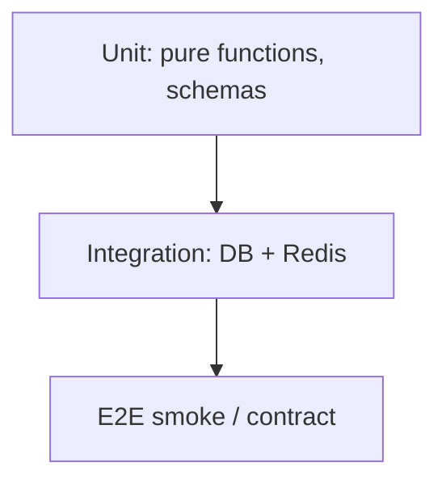

# 30. Testing FastAPI: pytest, TestClient, AsyncClient

## Intro: "green CI — red prod"

The release passed the pipeline, smoke was green — but in prod it was a 500 on every `POST`, because the tests hit an in-memory dict while prod talks to PostgreSQL. Testing an API isn't "check that it's 200" — it's about **isolating layers**, reproducing the contract, and catching regressions before merge.

## What you'll learn

- The test pyramid for an API: unit → integration → e2e.
- **TestClient** (Starlette) vs **httpx.AsyncClient** + `ASGITransport`.
- **Fixtures**: app, db, redis, auth headers.
- `pytest-asyncio`, `anyio`, override dependencies.
- Patterns: factory, freeze time, testcontainers (preview).

---

## The pyramid for FastAPI



| Level | What we test | Speed |
|---------|---------------|----------|
| Unit | Pydantic validators, business functions | ms |
| Integration | routers + real/test DB | seconds |
| E2E | docker compose, smoke.sh | minutes |

Most of the value is in **integration** with external services stubbed out.

---

## TestClient (synchronous)

Convenient for simple CRUD without an async DB:

```python
from fastapi.testclient import TestClient
from app.main import app

client = TestClient(app)

def test_health():
    r = client.get("/health")
    assert r.status_code == 200
    assert r.json()["status"] == "ok"
```

**Limitation:** `TestClient` spins up an event loop internally — for pure async code with `asyncpg`, httpx is preferable.

---

## httpx.AsyncClient + ASGITransport

The recommended approach for async FastAPI:

```python
import pytest
from httpx import ASGITransport, AsyncClient
from app.main import app

@pytest.fixture
async def client():
    transport = ASGITransport(app=app)
    async with AsyncClient(transport=transport, base_url="http://test") as ac:
        yield ac

@pytest.mark.asyncio
async def test_list_items(client):
    r = await client.get("/api/v1/items")
    assert r.status_code == 200
    assert "items" in r.json()
```

`pytest.ini`:

```ini
[pytest]
asyncio_mode = auto
testpaths = tests
```

---

## Override dependencies

Stubbing out the DB and Redis without real services:

```python
from app.deps import get_db, get_redis

@pytest.fixture
def app_with_fakes():
    app.dependency_overrides[get_db] = lambda: FakeSession()
    app.dependency_overrides[get_redis] = lambda: FakeRedis()
    yield app
    app.dependency_overrides.clear()
```

| Approach | When |
|--------|-------|
| Fake in-memory | unit + fast integration |
| SQLite async (aiosqlite) | ORM schema without Postgres |
| Testcontainers Postgres | maximum fidelity |
| The `deploy/fastapi` stand | e2e in nightly CI |

---

## Fixtures: directory structure

See [examples/project-layout.md](examples/project-layout.md):

```text
tests/
  conftest.py      # client, db, settings
  unit/
  integration/
  e2e/
```

`conftest.py` — shared fixtures; do **not** duplicate `create_app()` in every file.

---

## Testing auth

```python
@pytest.fixture
def auth_headers():
    token = create_test_token(sub="user-1")
    return {"Authorization": f"Bearer {token}"}

async def test_protected(client, auth_headers):
    r = await client.get("/api/v1/me", headers=auth_headers)
    assert r.status_code == 200
```

For the OAuth2 password flow — an `authenticated_client` fixture that logs in once.

---

## What to check in the response

| Check | Example |
|----------|--------|
| Status code | `assert r.status_code == 201` |
| JSON schema | keys, types |
| Headers | `X-Request-Id`, `Cache-Control` |
| Side effects | a DB write after POST |
| OpenAPI contract | [32-contract-tests](32-contract-tests.md) |

```python
def test_create_item_returns_location(client):
    r = client.post("/api/v1/items", json={"title": "t"})
    assert r.status_code == 201
    body = r.json()
    assert body["title"] == "t"
    assert "id" in body
```

---

## Markers and isolation

```python
@pytest.mark.integration
@pytest.mark.redis
```

In CI:

```bash
pytest -m "not integration"   # fast PR gate
pytest -m integration         # nightly
```

Relation to GitLab: [gitlab-basic/04-lab-first-pipeline](../gitlab-basic/04-lab-first-pipeline.md) — the `test` job in `.gitlab-ci.yml`.

---

## Common mistakes

| Mistake | Consequence | Fix |
|--------|-------------|---------|
| Shared mutable state between tests | flaky order-dependent | fixture scope + rollback |
| No `dependency_overrides.clear()` | leaked mocks | a `yield` fixture |
| Tests only on the happy path | regressions on 422/401 | table-driven cases |
| E2E on every commit | slow pipeline | the pyramid |

---

## Summary

**TestClient** is a fast start; **AsyncClient** is the right path for an async stack. **Fixtures** and **dependency overrides** isolate the DB/Redis. Most regressions are caught by integration tests; e2e runs on the [`deploy/fastapi`](../../deploy/fastapi/README.md) stand.

## Checklist

- When TestClient, when AsyncClient?
- How do you override `get_db` in a test?
- Why the `integration` markers?
- What do you check besides the status code?

Next lesson: [31-lab-testing](31-lab-testing.md).
