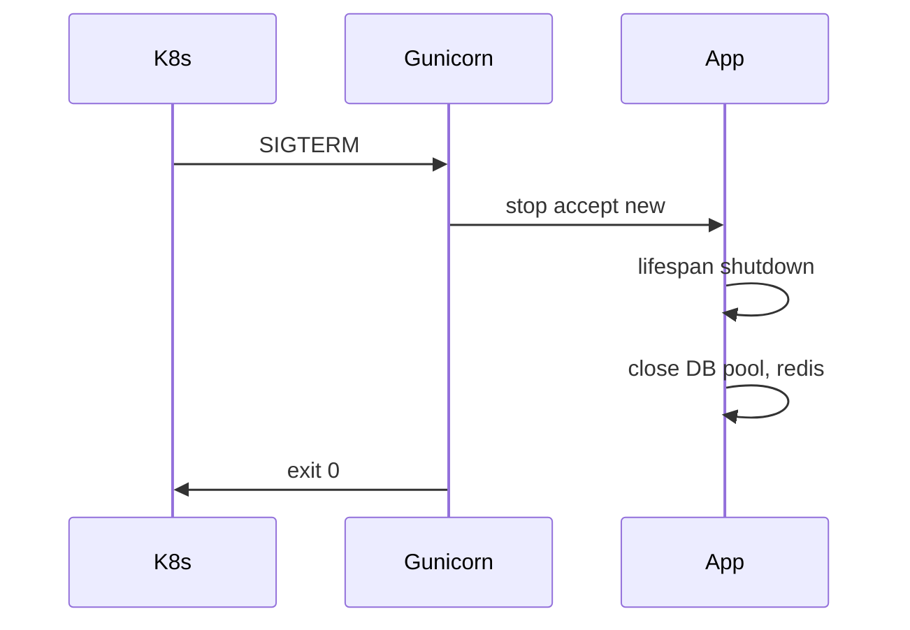

# 33. Docker production: multi-stage, gunicorn, graceful shutdown

## Intro: "a 1.2 GB image and a single uvicorn for everything"

A dev image built on `python:3.12` with gcc and a pip cache gets pushed to the registry — a 40-second pull, CVEs in the build tools, one uvicorn process on 4 CPUs. A production Dockerfile is about **size**, **security**, and **scaling workers** with a proper shutdown.

Stand: [`deploy/fastapi/stack/api/Dockerfile`](../../deploy/fastapi/stack/api/Dockerfile). Containers: [containers-basic](../containers-basic/README.md).

---

## What you'll learn

- **Multi-stage** build: builder → runtime.
- Non-root user, minimal base (`slim`, distroless preview).
- **gunicorn + uvicorn workers** vs plain uvicorn.
- Graceful shutdown: SIGTERM, lifespan, drain.
- Healthcheck in compose and Kubernetes.

---

## Multi-stage Dockerfile

```dockerfile
# --- builder ---
FROM python:3.12-slim AS builder
WORKDIR /build
RUN pip install --no-cache-dir pip wheel
COPY requirements.txt .
RUN pip wheel --no-cache-dir -r requirements.txt -w /wheels

# --- runtime ---
FROM python:3.12-slim AS runtime
WORKDIR /app
RUN useradd -m -u 10001 appuser
COPY --from=builder /wheels /wheels
COPY requirements.txt .
RUN pip install --no-cache-dir --no-index -f /wheels -r requirements.txt \
    && rm -rf /wheels
COPY app/ ./app/
USER appuser
EXPOSE 8000
```

| Stage | Why |
|------|-------|
| builder | compiles wheels; heavy dev deps never reach runtime |
| runtime | only wheels + code |

`.dockerignore`:

```text
__pycache__
.pytest_cache
.git
tests/
*.md
```

---

## gunicorn + UvicornWorker

One uvicorn means one event loop per container. For CPU-bound sync code or mixed workloads, use **multiple workers**:

```dockerfile
CMD ["gunicorn", "app.main:app", \
     "-k", "uvicorn.workers.UvicornWorker", \
     "-w", "4", \
     "-b", "0.0.0.0:8000", \
     "--graceful-timeout", "30", \
     "--timeout", "60", \
     "--access-logfile", "-"]
```

| Parameter | Recommendation |
|----------|--------------|
| `-w` | `2 * CPU + 1` as a starting point, tune by metrics |
| `--graceful-timeout` | ≥ max request time |
| `--timeout` | kill stuck workers |

**Async-only I/O APIs:** a single **uvicorn** plus horizontal scaling of replicas in K8s is often enough ([kuber-intermediate](../kuber-intermediate/README.md)).

```bash
# dev (as on the stand)
uvicorn app.main:app --host 0.0.0.0 --port 8000 --reload

# prod
gunicorn app.main:app -k uvicorn.workers.UvicornWorker -w 2
```

---

## Graceful shutdown



FastAPI `lifespan`:

```python
@asynccontextmanager
async def lifespan(app: FastAPI):
    await init_db_pool()
    yield
    await close_db_pool()  # wait for active requests to finish
```

In Kubernetes: `terminationGracePeriodSeconds: 45` should exceed the graceful-timeout. Probes: [kuber-intermediate/13-probes-advanced](../kuber-intermediate/13-probes-advanced.md).

| Mistake | Symptom |
|--------|---------|
| No shutdown hook | transactions get cut off |
| `preStop` too short | 502s during a rolling update |
| Shared state between workers | race condition on an in-memory dict |

**Don't store** sessions in process memory — use Redis/DB.

---

## Environment variables

```yaml
environment:
  WEB_CONCURRENCY: "2"
  LOG_LEVEL: info
  DATABASE_URL: postgresql+asyncpg://...
```

Entrypoint script (optional):

```bash
#!/bin/sh
exec gunicorn app.main:app -k uvicorn.workers.UvicornWorker \
  -w "${WEB_CONCURRENCY:-2}" -b 0.0.0.0:8000
```

Secrets don't belong in the image; use Vault or GitLab masked vars: [gitlab-basic/07-variables-secrets](../gitlab-basic/07-variables-secrets.md).

---

## Healthcheck

As in [`deploy/fastapi/docker-compose.yml`](../../deploy/fastapi/docker-compose.yml):

```yaml
healthcheck:
  test: ["CMD", "python", "-c", "import urllib.request; urllib.request.urlopen('http://127.0.0.1:8000/health')"]
  interval: 5s
  timeout: 3s
  retries: 10
  start_period: 15s
```

`/health` should check **critical** dependencies (optionally `?deep=1` for postgres/redis).

---

## Image security

| Practice | Detail |
|----------|--------|
| Non-root | `USER appuser` |
| Read-only FS | K8s `readOnlyRootFilesystem` + emptyDir for `/tmp` |
| Pin digest | `python:3.12-slim@sha256:...` |
| Scan | `trivy image`, GitLab container scanning |

---

## Comparing deployment strategies

| Strategy | Pros | Cons |
|-----------|-------|--------|
| 1 container × N gunicorn workers | simple compose setup | blast radius |
| N replicas × 1 uvicorn | K8s-native scaling | more pods |
| Sidecar nginx | TLS, rate limiting | added complexity — [34-nginx-tls](34-nginx-tls.md) |

---

## Summary

**Multi-stage** builds shrink the image and its attack surface. **gunicorn + UvicornWorker** scales processes; in K8s, **more replicas** is often the better choice. **Graceful shutdown** via lifespan and `terminationGracePeriodSeconds` prevents 502s during a rollout.

## Checklist

- Why use a builder stage?
- When do you reach for gunicorn, and when for a single uvicorn?
- What should happen in the `lifespan` shutdown?
- How are graceful-timeout and preStop related?

Next lesson: [34-nginx-tls](34-nginx-tls.md).
