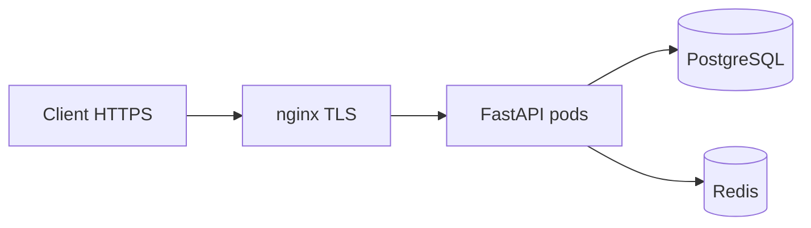

# 34. nginx: reverse proxy, TLS, and health probes

## Intro: "the API is exposed to the internet on :8090"

Direct access to uvicorn means no TLS, no rate limit at the edge, no single access log. **nginx** (or an Ingress in K8s) is the standard **edge**: TLS termination, routing, limits, security headers.

Stand: [`deploy/nginx`](../../deploy/nginx/README.md). TLS theory: [linux-intermediate/09-tls-openssl](../linux-intermediate/09-tls-openssl.md).

---

## What you'll learn

- A reverse proxy to FastAPI (`proxy_pass`).
- TLS termination and HSTS (lab).
- The `X-Forwarded-*` headers, trusted proxies.
- Health endpoints for **liveness/readiness** in K8s.
- Rate limiting at the edge vs in the application ([29-lab-redis](29-lab-redis.md)).

---

## Minimal proxy_pass

```nginx
upstream fastapi_backend {
    server api:8000;
    keepalive 32;
}

server {
    listen 80;
    server_name api.lab.local;

    location / {
        proxy_pass http://fastapi_backend;
        proxy_http_version 1.1;
        proxy_set_header Host $host;
        proxy_set_header X-Real-IP $remote_addr;
        proxy_set_header X-Forwarded-For $proxy_add_x_forwarded_for;
        proxy_set_header X-Forwarded-Proto $scheme;
        proxy_set_header Connection "";
    }
}
```

| Directive | Why |
|-----------|-------|
| `keepalive` | fewer TCP handshakes to the upstream |
| `proxy_http_version 1.1` | keepalive to the backend |
| `X-Forwarded-Proto` | FastAPI knows it's HTTPS behind the proxy |

In FastAPI:

```python
from uvicorn.middleware.proxy_headers import ProxyHeadersMiddleware
app.add_middleware(ProxyHeadersMiddleware, trusted_hosts=["*"])  # narrow in prod
```

---

## TLS termination

On the `deploy/nginx` stand:

```bash
cd deploy/nginx
bash scripts/gen-certs.sh
docker compose exec edge nginx -t
docker compose exec edge nginx -s reload
curl -sk https://localhost:8443/api/health
```

A `10-tls.conf` fragment:

```nginx
server {
    listen 443 ssl;
    ssl_certificate     /etc/nginx/certs/server.crt;
    ssl_certificate_key /etc/nginx/certs/server.key;
    ssl_protocols TLSv1.2 TLSv1.3;
    add_header Strict-Transport-Security "max-age=86400" always;
    # ... proxy_pass ...
}
```

**Prod:** Let's Encrypt / cert-manager in K8s ([kuber-basic/20-ingress](../kuber-basic/20-ingress.md)).

---

## Paths and trailing slash

| Client | nginx | Backend |
|--------|-------|---------|
| `/api/v1/items` | `location /api/` → `proxy_pass http://api:8000/;` | `/v1/items` or the full path |

A **502** error is often caused by a wrong slash in `proxy_pass`. Check: `nginx -t`, `docker compose logs edge`.

---

## Rate limiting at the edge

From `deploy/nginx/config/conf.d/20-rate-limit.conf`:

```nginx
limit_req_zone $binary_remote_addr zone=login:10m rate=5r/s;

location /login {
    limit_req zone=login burst=10 nodelay;
    proxy_pass http://api_backend/slow;
}
```

| Level | Pros |
|---------|-------|
| nginx | before the application, cheap |
| Redis in the app | per-user, flexible logic |
| API Gateway | centralized in the mesh |

Combine them: a coarse limit at the edge + a fine one in the app.

---

## Health probes for Kubernetes

```yaml
livenessProbe:
  httpGet:
    path: /health
    port: 8000
  initialDelaySeconds: 10
  periodSeconds: 10

readinessProbe:
  httpGet:
    path: /health/ready
    port: 8000
  periodSeconds: 5
```

| Probe | Checks | Fail action |
|-------|-----------|-------------|
| **Liveness** | the process is alive | restart pod |
| **Readiness** | ready to accept traffic | remove from the Service |
| **Startup** | slow start | delay liveness |

`/health` is lightweight (200 OK). `/health/ready` — postgres + redis ping.

Through nginx for external monitoring:

```nginx
location /health {
    proxy_pass http://fastapi_backend/health;
    access_log off;
}
```

More: [kuber-intermediate/13-probes-advanced](../kuber-intermediate/13-probes-advanced.md).

---

## Timeouts and buffers

```nginx
proxy_connect_timeout 5s;
proxy_send_timeout    60s;
proxy_read_timeout    60s;
client_max_body_size  10m;
```

Align them with gunicorn `--timeout` ([33-docker-production](33-docker-production.md)).

---

## WebSocket and HTTP/2 (preview)

FastAPI WebSocket behind nginx:

```nginx
location /ws {
    proxy_pass http://fastapi_backend;
    proxy_http_version 1.1;
    proxy_set_header Upgrade $http_upgrade;
    proxy_set_header Connection "upgrade";
    proxy_read_timeout 3600s;
}
```

---

## Production edge diagram



In K8s, nginx → an **Ingress Controller**; the patterns are the same.

---

## Summary

**nginx** terminates TLS and provides a single point for limits and logs. Configure **forwarded headers** and health paths for K8s probes. Practice — [35-lab-nginx](35-lab-nginx.md) on [`deploy/nginx`](../../deploy/nginx/README.md).

## Checklist

- Why `X-Forwarded-Proto`?
- The difference between liveness and readiness?
- Where should the rate limit be — nginx or Redis?
- What do you check on a 502?

Next lesson: [35-lab-nginx](35-lab-nginx.md).
