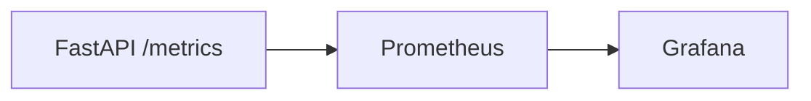

# 36. Observability: Prometheus, structured logging, RED

## Intro: "users are complaining — and there are no metrics"

Latency has tripled, and the logs show nothing but `INFO: started` — no way to tell if the DB or Redis is at fault. **Observability** for an API means metrics (Prometheus), structured logs, and tracing (preview in [38-opentelemetry](38-opentelemetry.md)). The **RED** method is the minimal metric set for HTTP services.

Courses: [observability-basic](../observability-basic/README.md). Stand: [`deploy/observability`](../../deploy/observability/README.md). The FastAPI stand already exposes `/metrics`.

---

## What you'll learn

- The **RED** method (Rate, Errors, Duration).
- `prometheus_client` / `prometheus-fastapi-instrumentator`.
- Structured logging (JSON) and correlation IDs.
- Alerts and SLOs (preview).
- How this ties into Grafana from observability-basic.

---

## RED for an HTTP API

| Letter | Metric | PromQL (example) |
|-------|---------|-----------------|
| **R**ate | requests/sec | `sum(rate(http_requests_total[5m]))` |
| **E**rrors | share of 5xx (and 4xx?) | `sum(rate(http_requests_total{status=~"5.."}[5m])) / sum(rate(...))` |
| **D**uration | latency p95/p99 | `histogram_quantile(0.95, sum by (le)(rate(http_request_duration_seconds_bucket[5m])))` |

PromQL lab: [observability-basic/03-lab-promql](../observability-basic/03-lab-promql.md).



---

## Instrumentator (the recommended path)

```bash
pip install prometheus-fastapi-instrumentator
```

```python
from prometheus_fastapi_instrumentator import Instrumentator

instrumentator = Instrumentator(
    should_group_status_codes=True,
    excluded_handlers=["/metrics", "/health"],
)
instrumentator.instrument(app).expose(app, endpoint="/metrics")
```

This gives you an `http_request_duration_seconds` histogram and counters broken down by method/handler/status.

The [`deploy/fastapi`](../../deploy/fastapi/README.md) stand uses a manual Counter — migrate it in the lab [37-lab-observability](37-lab-observability.md).

---

## Custom business metrics

```python
from prometheus_client import Counter, Histogram

CACHE_OPS = Counter("cache_operations_total", "cache", ["op", "result"])
DB_QUERY_TIME = Histogram("db_query_seconds", "DB latency", ["query"])

# in the handler
with DB_QUERY_TIME.labels("select_item").time():
    row = await session.execute(...)
CACHE_OPS.labels("get", "hit" if cached else "miss").inc()
```

| Type | When |
|-----|-------|
| Counter | always increasing (requests, errors) |
| Gauge | current value (in-flight, pool size) |
| Histogram | latency, sizes |

---

## Structured logging

```python
import structlog

log = structlog.get_logger()

@app.middleware("http")
async def logging_middleware(request, call_next):
    request_id = request.headers.get("X-Request-Id", str(uuid4()))
    structlog.contextvars.bind_contextvars(request_id=request_id)
    response = await call_next(request)
    log.info("request_done", method=request.method, path=request.url.path,
             status=response.status_code, request_id=request_id)
    response.headers["X-Request-Id"] = request_id
    return response
```

| Field | Purpose |
|------|-------|
| `request_id` | links logs to traces |
| `user_id` | audit trail (no PII in logs) |
| `duration_ms` | quick way to find slow requests |

Emit JSON output in prod; human-readable in dev. Loki: [observability-basic/11-logs-preview](../observability-basic/11-logs-preview.md).

---

## Log levels

| Level | Example |
|---------|--------|
| DEBUG | SQL echo (dev only) |
| INFO | startup, request_done |
| WARNING | retry, redis degrade |
| ERROR | unhandled exception + stack trace |

```python
@app.exception_handler(Exception)
async def unhandled(request, exc):
    log.exception("unhandled_error", path=request.url.path)
    return JSONResponse(500, {"detail": "Internal error"})
```

**Don't log** full request bodies containing passwords or JWTs.

---

## Health vs metrics

| Endpoint | Purpose | In Prometheus? |
|----------|------------|-----------------|
| `/health` | K8s probes | no |
| `/metrics` | scrape | yes |
| `/debug/pprof` | profiling | never expose publicly |

Scrape config (add to `deploy/observability`):

```yaml
- job_name: fastapi-course
  static_configs:
    - targets: ["host.docker.internal:8090"]  # or the service name in the compose overlay
  metrics_path: /metrics
```

---

## Alerts (preview)

```yaml
# prometheus rules
- alert: FastAPIHighErrorRate
  expr: |
    sum(rate(http_requests_total{job="fastapi-course",status=~"5.."}[5m]))
    / sum(rate(http_requests_total{job="fastapi-course"}[5m])) > 0.05
  for: 5m
```

SLOs and error budgets: [sre/04-error-budgets](../sre/04-error-budgets.md).

---

## USE vs RED

| Method | Applies to |
|-------|--------|
| RED | services (API) |
| USE | resources (CPU, disk, pool) |

For FastAPI, add a pool gauge: `db_pool_connections_in_use`.

---

## Summary

**RED** is the starting metric set for HTTP services. **Instrumentator** speeds up adoption; **structlog** plus `request_id` ties logs together. Hands-on Grafana practice — [37-lab-observability](37-lab-observability.md). Tracing — [38-opentelemetry](38-opentelemetry.md).

## Checklist

- Spell out what RED stands for.
- Why exclude `/health` from the histogram?
- Which fields are mandatory in a structured log?
- Counter vs Histogram?

Next lesson: [37-lab-observability](37-lab-observability.md).
