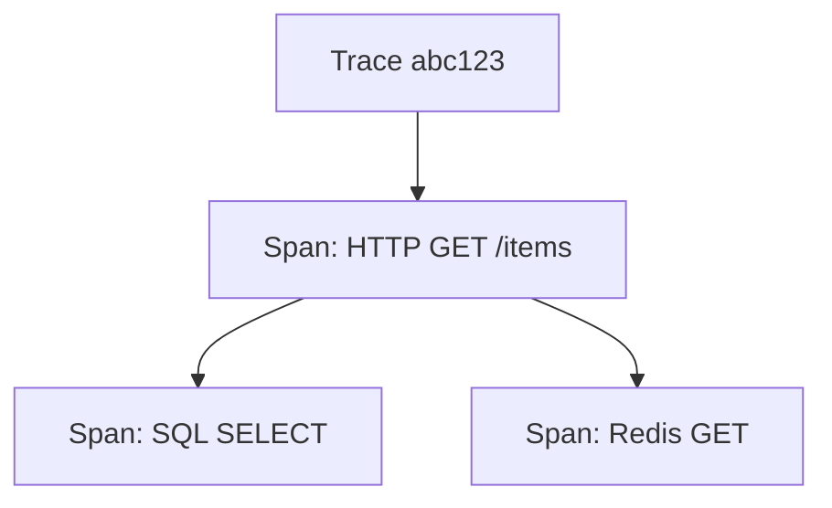

# 38. OpenTelemetry traces in FastAPI

## Intro: "p95 is high — the bottleneck is unknown"

Metrics show latency rising, logs are separate lines with no link. **Distributed tracing** ties spans together: nginx → FastAPI → PostgreSQL → Redis into a single **trace_id**. OpenTelemetry (OTel) is the standard for instrumentation and export.

The OTel stand: [`deploy/observability`](../../deploy/observability/README.md) overlay `docker-compose.otel.yml`. The collector lab: [observability-intermediate/14-lab-otel-collector](../observability-intermediate/14-lab-otel-collector.md).

---

## What you'll learn

- Traces, spans, context propagation.
- `opentelemetry-instrumentation-fastapi`.
- Export OTLP → Collector → Jaeger.
- Linking trace_id with logs ([36-observability](36-observability.md)).
- Sampling in production.

---

## The data model



| Term | Meaning |
|--------|----------|
| Trace | the full request path |
| Span | a single operation with start/end, attributes |
| Baggage | cross-service metadata (careful with PII) |
| Context | trace_id, span_id in headers |

Propagation headers: `traceparent` (W3C), `baggage`.

---

## Installation

```text
opentelemetry-api
opentelemetry-sdk
opentelemetry-exporter-otlp
opentelemetry-instrumentation-fastapi
opentelemetry-instrumentation-httpx
opentelemetry-instrumentation-sqlalchemy
opentelemetry-instrumentation-redis
```

---

## Bootstrap in the application

```python
# app/core/telemetry.py
from opentelemetry import trace
from opentelemetry.sdk.trace import TracerProvider
from opentelemetry.sdk.trace.export import BatchSpanProcessor
from opentelemetry.exporter.otlp.proto.grpc.trace_exporter import OTLPSpanExporter
from opentelemetry.sdk.resources import Resource
from opentelemetry.instrumentation.fastapi import FastAPIInstrumentor

def setup_telemetry(service_name: str, otlp_endpoint: str):
    resource = Resource.create({"service.name": service_name})
    provider = TracerProvider(resource=resource)
    exporter = OTLPSpanExporter(endpoint=otlp_endpoint, insecure=True)
    provider.add_span_processor(BatchSpanProcessor(exporter))
    trace.set_tracer_provider(provider)

def instrument_app(app):
    FastAPIInstrumentor.instrument_app(app)
```

In `lifespan` / startup:

```python
setup_telemetry("fastapi-course", os.environ.get("OTEL_EXPORTER_OTLP_ENDPOINT", "http://otel-collector:4317"))
instrument_app(app)
```

Variables (the OTel standard):

```bash
OTEL_SERVICE_NAME=fastapi-course
OTEL_EXPORTER_OTLP_ENDPOINT=http://localhost:4317
OTEL_TRACES_SAMPLER=parentbased_traceidratio
OTEL_TRACES_SAMPLER_ARG=0.1
```

---

## Manual spans

```python
tracer = trace.get_tracer(__name__)

async def get_item(item_id: int):
    with tracer.start_as_current_span("get_item") as span:
        span.set_attribute("item.id", item_id)
        cached = await redis_get(item_id)
        if cached:
            span.add_event("cache_hit")
            return cached
        span.add_event("cache_miss")
        return await db_get(item_id)
```

Name spans consistently — for searching in Jaeger.

---

## Linking with logs

```python
from opentelemetry import trace

span = trace.get_current_span()
ctx = span.get_span_context()
log.info("item_loaded", trace_id=format(ctx.trace_id, "032x"), item_id=item_id)
```

In Grafana (Loki + Tempo) — derived fields by `trace_id`. Preview: observability-intermediate.

---

## Running the stand with Jaeger

```bash
cd deploy/observability
docker compose -f docker-compose.yml -f docker-compose.otel.yml up -d
```

| URL | Purpose |
|-----|------------|
| http://localhost:16686 | Jaeger UI |
| localhost:4317 | OTLP gRPC |
| localhost:4318 | OTLP HTTP |

Pass `OTEL_EXPORTER_OTLP_ENDPOINT` into the `deploy/fastapi` compose:

```yaml
environment:
  OTEL_EXPORTER_OTLP_ENDPOINT: http://host.docker.internal:4317
```

Generate traffic → Jaeger → Service `fastapi-course` → a trace with HTTP + DB spans.

---

## Sampling

| Strategy | When |
|-----------|-------|
| AlwaysOn | dev |
| TraceIdRatioBased 0.1 | prod 10% |
| ParentBased | a microservices chain |

100% traces at 10k RPS is expensive on storage. Start with 1–10%, raise it during an incident (tail sampling — advanced).

---

## nginx and edge spans

The Ingress/nginx can pass `traceparent` upstream. Without propagation, the trace breaks at the edge — configure opentelemetry in the proxy (envoy/ingress) in the advanced track.

---

## Errors in a span

```python
from opentelemetry.trace import Status, StatusCode

with tracer.start_as_current_span("risky") as span:
    try:
        ...
    except Exception as e:
        span.record_exception(e)
        span.set_status(Status(StatusCode.ERROR))
        raise
```

In Jaeger you can see the stack and the failed span — faster than grepping logs.

---

## OTel vs "metrics only"

| Signal | Question |
|--------|--------|
| Metrics | "How many? How fast on average?" |
| Logs | "What happened on this instance?" |
| Traces | "Where did the time go in the chain?" |

The three pillars: [observability-basic](../observability-basic/README.md).

---

## Summary

**OTel** instruments FastAPI automatically; manual spans are for the DB/cache. Export **OTLP** to the observability stand's collector. **Sampling** is mandatory in prod. Link **trace_id** with structured logs.

## Checklist

- Trace vs span?
- Where does OTEL_EXPORTER_OTLP_ENDPOINT point?
- Why a ParentBased sampler?
- How do you find slow SQL in Jaeger?

Next lesson: [39-versioning-idempotency](39-versioning-idempotency.md).
