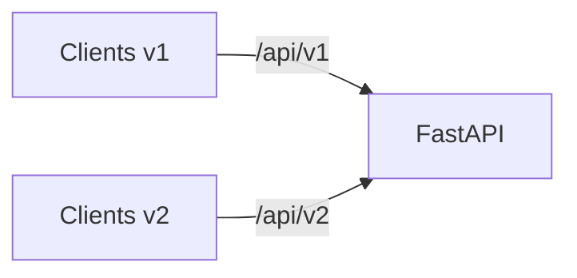
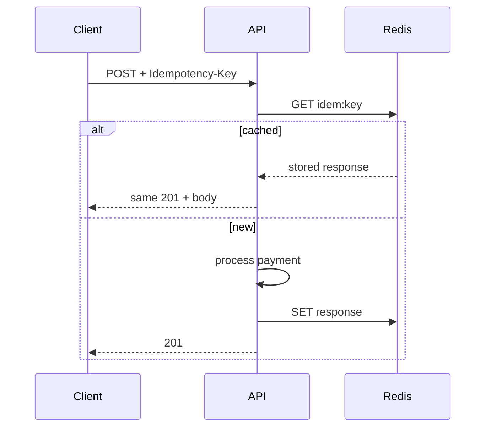

# 39. API versioning and idempotency keys

## Intro: "we shipped v2 and old clients broke"

A field got renamed, a path changed without warning — mobile apps on v1 get 404s. **Versioning** and **idempotency** are contracts that survive releases and network retries.

Related: [32-contract-tests](32-contract-tests.md), [40-system-design](40-system-design.md).

---

## What you'll learn

- Versioning strategies: URL, header, Accept.
- Deprecation policy and sunset headers.
- **Idempotency-Key** for POST/PUT.
- Storing keys in Redis/DB.
- FastAPI patterns: `APIRouter(prefix="/api/v1")`.

---

## Versioning strategies

| Strategy | Example | Pros | Cons |
|-----------|--------|-------|--------|
| URL path | `/api/v1/items` | explicit, cacheable | route duplication |
| Header | `Api-Version: 2024-01` | clean URL | worse for CDN/cache |
| Accept | `Accept: application/vnd.app.v2+json` | REST-purist | harder for clients |
| Query | `?version=2` | quick hack | not for prod |

**Recommendation for this course:** URL prefix `/api/v1`, `/api/v2` — as in [`deploy/fastapi`](../../deploy/fastapi/README.md).

```python
v1 = APIRouter(prefix="/api/v1")
v2 = APIRouter(prefix="/api/v2")

@v1.get("/items/{id}", response_model=ItemV1)
async def get_v1(id: int): ...

@v2.get("/items/{id}", response_model=ItemV2)
async def get_v2(id: int): ...
```

---

## Parallel run and sunset



| Phase | Action |
|------|----------|
| Introduce v2 | v1 frozen, v2 new fields |
| Deprecate v1 | header `Deprecation: true`, `Sunset: Sat, 01 Jan 2027 00:00:00 GMT` |
| Remove v1 | after usage metrics < 1% |

Monitor RPS per prefix in Prometheus ([36-observability](36-observability.md)):

```promql
sum by (handler) (rate(http_requests_total[1d]))
```

---

## Breaking vs compatible (recap)

| Change | v1 | v2 |
|-----------|----|----|
| Add optional field | OK | OK |
| Rename field | breaking | new name in v2 only |
| Change type | breaking | migration guide |

OpenAPI diff in CI: [32-contract-tests](32-contract-tests.md).

---

## Idempotency

**Problem:** the client sent `POST /payments`, timed out, and retried the POST → double charge.

**Solution:** the `Idempotency-Key: <uuid>` header — the server returns **the same** result on a retry.

```http
POST /api/v1/payments HTTP/1.1
Idempotency-Key: 7c9e6679-7425-40de-944b-e07fc1f90ae7
Content-Type: application/json

{"amount": 100, "currency": "RUB"}
```

| Method | Idempotent per HTTP? | Key needed? |
|-------|----------------------|-------------|
| GET | yes | no |
| PUT | yes (per resource) | rarely |
| POST | **no** | **yes** for money/order |
| DELETE | yes | no |

---

## Implementation with Redis

```python
IDEM_TTL = 86400  # 24h

async def idempotency_guard(redis, key: str, request_hash: str):
    cache_key = f"idem:{key}"
    existing = await redis.get(cache_key)
    if existing:
        if existing.startswith("processing:"):
            raise HTTPException(409, "Request in progress")
        return json.loads(existing)  # cached response body + status
    await redis.set(cache_key, f"processing:{request_hash}", nx=True, ex=60)

async def idempotency_store(redis, key: str, status: int, body: dict):
    await redis.set(f"idem:{key}", json.dumps({"status": status, "body": body}), ex=IDEM_TTL)
```

Dependency:

```python
async def require_idempotency_key(
    idempotency_key: str | None = Header(None, alias="Idempotency-Key"),
):
    if not idempotency_key:
        raise HTTPException(400, "Idempotency-Key required")
    if len(idempotency_key) > 128:
        raise HTTPException(400, "Key too long")
    return idempotency_key
```

**409 Conflict** — parallel duplicates with the same key; **422** — a different body with the same key (contract violation).

---

## Storing in PostgreSQL

For audit and long TTL:

```sql
CREATE TABLE idempotency_keys (
    key TEXT PRIMARY KEY,
    request_hash TEXT NOT NULL,
    response_status INT NOT NULL,
    response_body JSONB NOT NULL,
    created_at TIMESTAMPTZ DEFAULT now()
);
```

A unique constraint on `key` — atomicity via INSERT ON CONFLICT.

---

## Stripe-style flow



---

## Versions + idempotency together

The key must include the **API version** or scope:

```text
idem:v1:7c9e6679-7425-40de-944b-e07fc1f90ae7
```

Otherwise v1 and v2 with the same UUID would return incompatible bodies.

---

## Summary

**URL versioning** is a practical default for FastAPI. **Deprecation/Sunset** is a polite way to retire v1. **Idempotency-Key** is required for create operations with side effects; Redis is a fast store, Postgres is for audit.

## Checklist

- Three ways to version?
- When is POST idempotent without a key?
- What to return on a retry with the same key?
- Why 409?

Next lesson: [40-system-design](40-system-design.md).
