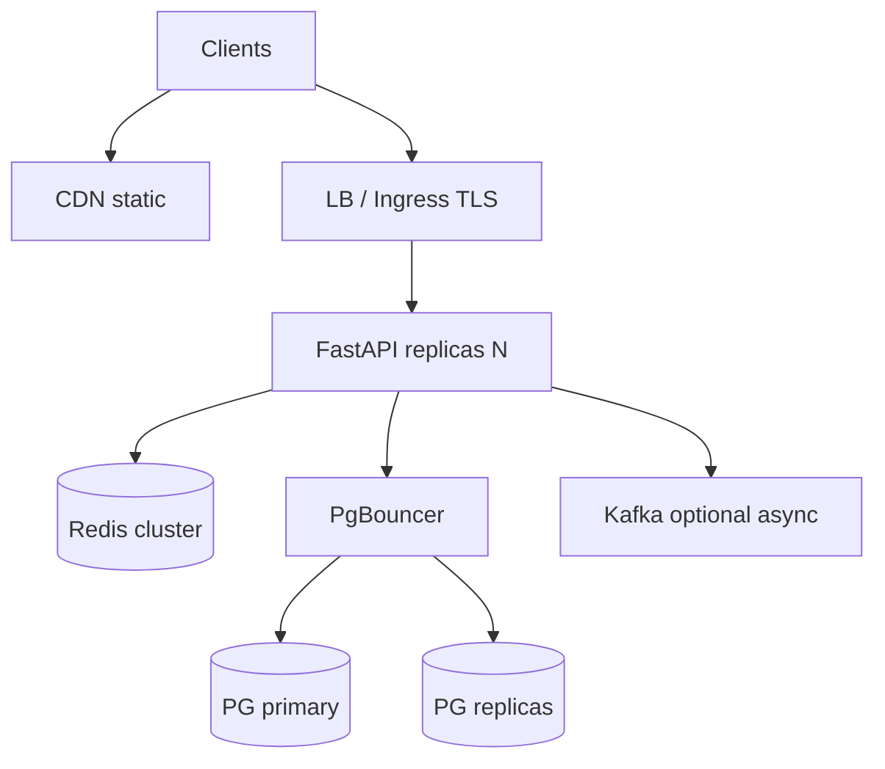

# 40. System design: a REST API at 10k RPS

## Intro: "sketch the orders architecture for 10,000 RPS"

A classic senior-interview question: design an API that can handle **10k requests/sec** with p99 < 200ms. The answer "just add more FastAPI" is not enough — you need **estimates**, bottlenecks, caching, DB scaling, and observability.

Builds on: [29-lab-redis](29-lab-redis.md), [36-observability](36-observability.md), [39-versioning-idempotency](39-versioning-idempotency.md).

---

## What you'll learn

- Back-of-envelope calculations (QPS, bandwidth, connections).
- Layers: edge, app, cache, DB, queue.
- Read vs write path.
- PostgreSQL scaling (replica, pool, partition).
- What to say in an interview in 35 minutes.

---

## Clarifying questions (always ask)

| Question | Why |
|--------|-------|
| Read/write ratio? | 90/10 → a different cache |
| Consistency? | strong vs eventual |
| Payload size? | bandwidth |
| Auth model? | stateless JWT vs session |
| Multi-region? | replication lag |

**Example:** a product catalog — 95% read, eventual OK, 2 KB JSON, JWT.

---

## Back-of-envelope

```text
10k RPS × 2 KB response ≈ 20 MB/s egress ≈ 160 Mbps (+ headers)
10k RPS × 50 ms DB time = 500 concurrent DB ops without a pool → death
```

| Resource | Rough estimate |
|--------|---------------|
| App pods | 10k / 2k RPS per pod ≈ 5–10 pods (I/O bound) |
| DB connections | pool 20/pod × 10 = 200 → PgBouncer |
| Redis | 10k GET ~ 10k ops/s — a single shard on the edge ([redis-basic](../redis-basic/README.md)) |

---

## Reference architecture



Edge: [34-nginx-tls](34-nginx-tls.md) or a cloud LB. K8s HPA: [kuber-intermediate](../kuber-intermediate/README.md).

---

## Read path (hot)

1. CDN for static/OpenAPI docs.
2. **Cache-aside** Redis — 80%+ hit rate on the catalog.
3. PostgreSQL replica for heavy list/query.
4. Pagination + field filter — don't return 1 MB JSON.

```python
@router.get("/items")
async def list_items(cursor: str | None = None, limit: int = 20):
    limit = min(limit, 100)
```

**Stampede:** jitter, singleflight ([redis-basic/06](../redis-basic/06-patterns-cache.md)).

---

## Write path

1. Primary PG only.
2. **Idempotency-Key** on create ([39-versioning-idempotency](39-versioning-idempotency.md)).
3. Cache invalidation: `DEL cache:item:{id}` + fan-out pub/sub for multi-region.
4. Heavy work goes async — Kafka/RabbitMQ ([messaging-deep](../messaging-deep/README.md) preview).

| Sync write | Async |
|------------|-------|
| creating an order | email, analytics, search index |

---

## Connection pooling

```python
# SQLAlchemy async
engine = create_async_engine(DATABASE_URL, pool_size=10, max_overflow=5)
```

**PgBouncer** transaction mode — thousands of app connections → dozens of DB connections. See [postgresql-developer](../postgresql-developer/README.md).

---

## Scaling PostgreSQL

| Technique | When |
|---------|-------|
| Read replicas | read-heavy |
| Partitioning | tables > 100M rows |
| CQRS | extreme read/write split |
| Sharding | last resort |

Indexes and EXPLAIN — [postgresql-performance](../postgresql-performance/README.md).

---

## Rate limiting and protection

| Layer | Mechanism |
|------|----------|
| Edge | nginx limit_req, WAF |
| App | Redis token bucket per user |
| DB | query timeout, statement_timeout |

10k RPS DDoS — cloud shield + autoscale limits.

---

## Observability and SLO

| SLO | Example |
|-----|--------|
| Availability | 99.9% monthly |
| Latency p99 | < 200ms read |
| Error rate | < 0.1% 5xx |

RED metrics + traces ([37-lab-observability](37-lab-observability.md), [38-opentelemetry](38-opentelemetry.md)). On-call runbook: [sre/14-production-readiness](../sre/14-production-readiness.md).

---

## Deploy and release

- Blue/green or canary — [gitlab-intermediate](../gitlab-intermediate/README.md).
- DB migrations as a separate Job ([kuber-intermediate/05-jobs](../kuber-intermediate/05-jobs.md)).
- Feature flags for the v2 API.

---

## Failure modes

| Failure | Behavior |
|-------|-----------|
| Redis down | bypass cache, higher DB load — alert |
| Replica lag | stale read or route to primary |
| Primary PG | failover — RTO/RPO in the runbook |
| Single pod OOM | HPA + memory limits |

---

## Interview: answer structure (35 min)

1. **Requirements** (5 min) — RPS, read/write, consistency.
2. **API design** (5 min) — resources, versioning, pagination.
3. **High-level diagram** (10 min) — edge, app, cache, DB.
4. **Deep dive** (10 min) — cache, pool, one bottleneck.
5. **Trade-offs** (5 min) — eventual cache, cost vs latency.

---

## Summary

**10k RPS** is achievable with horizontal scaling of FastAPI, an **aggressive cache** on the read path, **pool + replica** for PG, and **observability** from day one. The numbers are estimates; validate them with a load test (k6/Locust) in [42-capstone](42-capstone.md).

## Checklist

- How to estimate bandwidth at 10k RPS?
- Where does idempotency go on the write path?
- Why PgBouncer?
- What to ask before designing?

Next lesson: [41-interview-qa](41-interview-qa.md).
