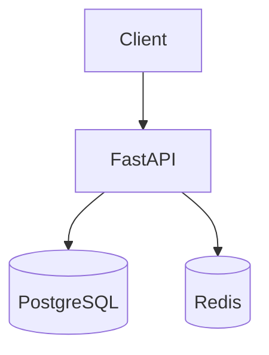

# 42. Capstone: Task Manager API (6–8 hours)

## Task

Design and implement a **full Task Manager API** with FastAPI: authentication, task CRUD with tags, PostgreSQL, Redis (cache + rate limit), tests, a production-ready Docker setup, and optionally nginx and observability. The project ties together lessons **29–41** and produces a portfolio repository.

**Time estimate:** 6–8 hours of focused work (can be split into 2–3 sessions).

---

## Functional requirements

### Users and auth

| Endpoint | Description |
|----------|----------|
| `POST /api/v1/auth/register` | email + password → user |
| `POST /api/v1/auth/login` | JWT access (+ refresh optionally) |
| `GET /api/v1/users/me` | current profile |

- Password hashing: **bcrypt** or argon2.
- JWT in `Authorization: Bearer`.
- Protect all task endpoints.

### Tasks

| Endpoint | Description |
|----------|----------|
| `GET /api/v1/tasks` | list with filter `status`, `tag`, pagination `cursor`/`limit` |
| `POST /api/v1/tasks` | create; **Idempotency-Key** optional (+bonus) |
| `GET /api/v1/tasks/{id}` | a single task |
| `PATCH /api/v1/tasks/{id}` | partial update |
| `DELETE /api/v1/tasks/{id}` | soft delete optionally |

Task fields: `title`, `description`, `status` (`todo`/`doing`/`done`), `due_at`, `tags: list[str]`, `owner_id`.

### Non-functional

- OpenAPI is up to date; `response_model` on all routes.
- `/health`, `/health/ready`, `/metrics`.
- Structured JSON logs + `X-Request-Id`.

---

## Technical stack (required)

| Component | Technology |
|-----------|------------|
| Framework | FastAPI 0.110+ |
| DB | PostgreSQL 16 + SQLAlchemy 2 async / asyncpg |
| Migrations | Alembic |
| Cache | Redis cache-aside on `GET /tasks/{id}` |
| Rate limit | Redis on `POST /auth/login` |
| Tests | pytest + httpx AsyncClient, ≥ 15 tests |
| Container | multi-stage Dockerfile, non-root |
| Compose | api + postgres + redis |

Base environment: [`deploy/fastapi`](../../deploy/fastapi/README.md) — fork `stack/api` into your own project or extend it in-place for submission.

---

## Architecture (target)

Directory structure: [examples/project-layout.md](examples/project-layout.md). Dependencies: [examples/pyproject.toml](examples/pyproject.toml).

---

## Step-by-step plan

### Phase 1 — Skeleton (1.5 h)

1. Create the `app/` structure with `main.py`, `core/config.py`, `routers/`.
2. Connect PostgreSQL via `lifespan` + pool.
3. Alembic: migrations for `users`, `tasks`, `task_tags`.
4. `/health`, `/health/ready` (postgres ping).

**Criterion:** `docker compose up`, migrations applied, health 200.

### Phase 2 — Auth (1.5 h)

1. User models, password hashing.
2. Register/login, JWT create/decode dependency `get_current_user`.
3. Tests: register, login, 401 without token.

See [30-testing](30-testing.md), [31-lab-testing](31-lab-testing.md).

### Phase 3 — Tasks CRUD (2 h)

1. Pydantic v2 schemas, service layer.
2. Filters and pagination (limit max 100).
3. Owner isolation — a user sees only their own tasks.
4. Integration tests on CRUD + 403 for another user's task.

### Phase 4 — Redis (1 h)

1. Cache-aside `GET /tasks/{id}` ([29-lab-redis](29-lab-redis.md)).
2. Invalidate on PATCH/DELETE.
3. Rate limit login 5/min per IP.
4. Degrade if Redis is down.

### Phase 5 — Production hardening (1.5 h)

1. Multi-stage Dockerfile ([33-docker-production](33-docker-production.md)).
2. gunicorn + UvicornWorker or a documented choice of uvicorn + replicas.
3. `prometheus-fastapi-instrumentator` ([36-observability](36-observability.md)).
4. structlog middleware.

### Phase 6 — CI and docs (0.5–1 h)

1. `pytest` in GitLab CI ([gitlab-basic/04](../gitlab-basic/04-lab-first-pipeline.md)).
2. Project `README` (locally): how to run, env vars, curl API examples.
3. Optionally: Schemathesis smoke ([32-contract-tests](32-contract-tests.md)).

---

## Optional bonuses (+rating)

| Bonus | Link |
|-------|--------|
| FastAPI behind nginx | [35-lab-nginx](35-lab-nginx.md), [`deploy/nginx`](../../deploy/nginx/README.md) |
| Grafana dashboard | [37-lab-observability](37-lab-observability.md) |
| OTel traces | [38-opentelemetry](38-opentelemetry.md) |
| Idempotency-Key on POST /tasks | [39-versioning-idempotency](39-versioning-idempotency.md) |
| `POST /api/v2/tasks` with a different schema | versioning |
| k6 load test 100 VU | [40-system-design](40-system-design.md) |

---

## Grading criteria

| Criterion | Weight |
|----------|-----|
| Auth JWT + data isolation | 20% |
| CRUD + validation + OpenAPI | 20% |
| PostgreSQL + migrations | 15% |
| Redis cache + rate limit | 15% |
| Tests ≥ 15, CI green | 15% |
| Docker prod practices | 10% |
| Observability (metrics/logs) | 5% |

**Minimum to pass:** all required table rows without critical security bugs.

---

## What not to do

- Passwords in plaintext in the DB or logs.
- `SECRET_KEY` in git.
- `trusted_hosts=["*"]` in prod without justification.
- In-memory tasks "for speed" — the SoT is PostgreSQL only.
- Missing tests on auth boundaries.

---

## Submission

1. A repository (GitLab/GitHub) with `stack/` or a root-level `app/`.
2. `docker compose up --build` brings everything up from scratch.
3. A `CAPSTONE.md` file with:
   - an architecture diagram (ascii/mermaid);
   - a list of env vars;
   - 5 curl examples;
   - what you would improve at 10k RPS ([40-system-design](40-system-design.md)).

---

## Reflection after the capstone

Answer in writing:

1. Where is the bottleneck at 10× traffic?
2. Which RED metrics did you set up?
3. How do you roll back a bad migration release?
4. What did you add to [interview-cheatsheet](interview-cheatsheet.md) for yourself?

---

## The path forward

| Course | Topic |
|------|------|
| [kuber-intermediate](../kuber-intermediate/README.md) | deploy the API to K8s |
| [gitlab-intermediate](../gitlab-intermediate/README.md) | full CD |
| [observability-intermediate](../observability-intermediate/README.md) | Loki, OTel collector |
| [postgresql-performance](../postgresql-performance/README.md) | indexes for your queries |

Congratulations on completing the **FastAPI** track (lessons 29–42).
