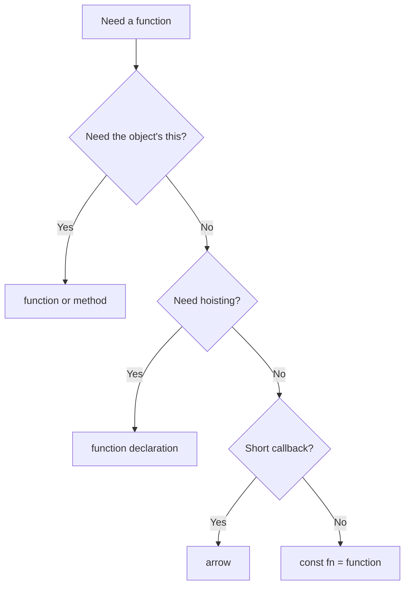

# 10. Functions: declaration, expression, arrow

## Intro: "why is `this` undefined in the callback?"

You're writing an auth module for an internal admin panel. A colleague extracted the repeated logic into a `validateToken` function and wrote the click handler as an arrow "for brevity." After deploy, the "Log out" button stopped working: the logs show `TypeError: Cannot read properties of undefined`. In code review it turns out the arrow "inherited" `this` from the module (which is `undefined` in strict mode), not from the `authService` object. In parallel, in a legacy file a `var`-function is called **before** its declaration and "magically" works — while `const handler = function(){}` fails with a ReferenceError. **Functions in JavaScript are not just "a piece of code"**: they are first-class objects with hoisting rules, their own `this`, and three different declaration syntaxes. This chapter is the foundation for closures ([12](12-closures.md)), `this` ([14](14-this.md)), and all asynchronous code ([25](25-callbacks.md)–[27](27-async-await.md)).

## What you'll learn

- Three ways to declare a function and **when** to choose each.
- The difference between a **function declaration** and a **function expression** in terms of hoisting.
- The specifics of **arrow functions**: lexical `this`, no `arguments`, no `new`.
- **Default parameters**, **rest** (`...args`), and the replacement for the outdated `arguments`.
- **Callbacks**, pure functions, and the role of functions in application architecture.
- Typical production bugs and their root causes.

## A function is a first-class value

In JavaScript a function is a **full-fledged value**, like a number or an object. You can:

1. Assign it to a variable.
2. Pass it as an argument to another function.
3. Return it from a function.
4. Store it in an object or array.

```javascript
function greet(name) {
  return `Hello, ${name}`;
}

const greet2 = function (name) {
  return `Hello, ${name}`;
};

const greet3 = (name) => `Hello, ${name}`;

const fns = [greet, greet2, greet3];
fns.forEach((fn) => console.log(fn("World")));
```

**Why it matters:** all of Node.js and the browser APIs are built on callbacks and higher-order functions (`map`, `filter`, Express middleware). Once you understand that a function is a value, the "pass behavior as an argument" pattern becomes natural.

## Three syntaxes: overview

| Syntax | Example | Hoisting | Name in the error stack |
|-----------|--------|----------|-------------------|
| Declaration | `function foo() {}` | Yes, in full | `foo` |
| Expression | `const foo = function() {}` | No (TDZ for `const`) | `foo` or anonymous |
| Arrow | `const foo = () => {}` | No | `foo` or anonymous |

Next we'll go through each and explain **why** the difference in hoisting leads to different behavior.

## Function declaration: fully hoisted

```javascript
sayHi(); // "hi" — a call BEFORE the declaration line works

function sayHi() {
  console.log("hi");
}
```

### Step by step: what the engine does

1. In the **creation** phase of the execution context, the engine registers the name `sayHi` and binds it to the function body.
2. In the **execution** phase the line `sayHi()` already finds a ready function.
3. So the order of lines in the file isn't critical for a declaration (within the same scope).

**When to use:** top-level module utilities, mutually recursive functions, when you need hoisting inside a function:

```javascript
function walk(node) {
  if (!node) return;
  visit(node);
  walk(node.left);  // the declaration walk is already known
  walk(node.right);
}
```

More on the hoisting mechanism — in [11](11-scope-hoisting.md).

## Function expression: only the variable in the TDZ

```javascript
// sayBye(); // ReferenceError: Cannot access 'sayBye' before initialization

const sayBye = function () {
  console.log("bye");
};
```

Here the **binding** `sayBye` is hoisted (in the TDZ), but not the function value. Before the assignment line, accessing `sayBye` is an error.

**Why it's done this way:** protection against using a function before the module is fully initialized; a predictable execution order when reading the file top to bottom.

### Named function expression (NFE)

```javascript
const factorial = function fact(n) {
  if (n <= 1) return 1;
  return n * fact(n - 1); // recursion via the internal name fact
};
// fact is not accessible outside
```

The internal name `fact` is visible only inside the function — handy for recursion without polluting the outer scope.

## Arrow functions

A concise syntax for **functional** callbacks:

```javascript
const double = (x) => x * 2;
const sum = (a, b) => a + b;

// Returning an object — parentheses around the literal
const makePoint = (x, y) => ({ x, y });

// Multiple lines — braces and an explicit return
const logAndReturn = (msg) => {
  console.log(msg);
  return msg;
};
```

### Comparison with a regular `function`

| Property | `function` | Arrow `=>` |
|----------|------------|------------|
| `this` | Determined by the **call** | **Lexical** (from the surroundings) |
| `arguments` | Present (array-like) | None — use rest |
| `new` | Allowed (constructor) | **Not allowed** — SyntaxError |
| `prototype` | Present | None |
| `super` | Present in class methods | None |

**Why an arrow has no own `this`:** it's designed for callbacks where a "spurious" dynamic `this` gets in the way (for example, `setInterval` inside a method). Details — [14](14-this.md).

**Rule for production code:**

- Object and class methods that need the object's `this` — a **regular** `function` or the short method syntax `method() {}`.
- Callbacks where outer variables matter and no own `this` is needed — an **arrow**.

```javascript
// Bad: arrow as a method
const auth = {
  token: "abc",
  getHeader: () => `Bearer ${this.token}`, // this is not auth!
};

// Good
const auth2 = {
  token: "abc",
  getHeader() {
    return `Bearer ${this.token}`;
  },
};
```

## Default parameters

ES6 lets you set values for `undefined`:

```javascript
function connect(host = "localhost", port = 3000, tls = false) {
  return { host, port, tls };
}

connect();                    // localhost:3000
connect("api.example.com");     // api.example.com:3000
connect(undefined, 8080);       // localhost:8080 — default only for undefined
connect(null, 8080);            // null:8080 — null is NOT replaced by the default
```

**Why only `undefined`:** explicitly passing `null` often means "the value is intentionally absent" in an API; `undefined` means "the argument wasn't passed."

Default expressions are evaluated **at call time**:

```javascript
function createId(prefix = crypto.randomUUID()) {
  return prefix;
}
```

For object options, destructuring is handy ([17](17-destructuring-spread.md)):

```javascript
function init({ host = "localhost", port = 3000 } = {}) {
  return `${host}:${port}`;
}
```

## Rest parameters: a replacement for `arguments`

```javascript
function sum(...nums) {
  return nums.reduce((acc, n) => acc + n, 0);
}

sum(1, 2, 3); // 6
```

| | `arguments` | Rest `...nums` |
|---|-------------|----------------|
| Type | Array-like | A real array |
| In an arrow | Not available | Rest in the parameters |
| Explicitness | Hidden arguments | Visible in the signature |

**Why rest is better:** a readable signature, works with spread at the call site, plays well with TypeScript.

```javascript
const nums = [1, 5, 3];
Math.max(...nums); // spread at the call site
```

## Callbacks: the foundation of the ecosystem

```javascript
function repeat(times, action) {
  for (let i = 0; i < times; i++) {
    action(i);
  }
}

repeat(3, (i) => console.log(`tick ${i}`));
```

A callback is a function passed as "call me when you're ready." That's how these work:

- `array.map` / `filter` / `forEach` ([08](08-arrays.md));
- DOM event handlers;
- `fs.readFile(path, callback)` and later Promises ([26](26-promises.md));
- middleware in Express/Fastify (in the nodejs course).

### The "callback hell" mistake

Deep nesting of callbacks without named functions:

```javascript
loadUser(id, (err, user) => {
  loadOrders(user.id, (err, orders) => {
    loadItems(orders[0].id, (err, items) => {
      // ...
    });
  });
});
```

**Why it hurts:** reading right-to-left, complex error handling, a shared `err` at each level. The fix — named functions, Promises, async/await — but callbacks haven't gone anywhere (event listeners, `setTimeout`).

## Pure functions and side effects

**A pure function:**

- Always returns the same result for the same arguments.
- Doesn't change external state and doesn't mutate its arguments (for objects).

```javascript
function addTax(price, rate) {
  return price * (1 + rate);
}

function addTaxMutating(cart, rate) {
  cart.total *= 1 + rate; // side effect — mutating the argument
  return cart;
}
```

| Side effect | Example |
|-----------------|--------|
| Writing to a global | `window.config = …` |
| Network / DB | `fetch`, `fs.writeFile` |
| Logging | `console.log` (for strict FP — also an effect) |
| Mutating an argument | `arr.push(x)` inside a function |

**Why we aim for purity:** easier to test, easier to reason about in React (predictable render), easier to parallelize. In real code, pure functions are mixed with a thin layer of I/O at the application boundary.

## IIFE: isolation before modules

```javascript
(function () {
  const apiKey = "secret";
  // apiKey doesn't leak into the global
})();

(() => {
  console.log("arrow IIFE");
})();
```

**Why it was needed:** before ES modules ([30](30-es-modules.md)) it was the only way not to pollute `window`. Now `export` / `import` is preferable — the same file scope without an "in-place" call.

## Diagram: choosing a syntax



## How this connects to the course

| Lesson | Connection |
|------|-------|
| [02. Variables](02-variables-strict.md) | `const fn = …` and the TDZ |
| [11. Scope and hoisting](11-scope-hoisting.md) | Why a declaration is "visible" earlier |
| [12. Closures](12-closures.md) | A function returning a function |
| [14. `this`](14-this.md) | Arrow vs regular function |
| [17. Destructuring](17-destructuring-spread.md) | Object parameters, rest/spread |
| [25–27. Async](25-callbacks.md) | Callbacks → Promises → await |
| [30. ES modules](30-es-modules.md) | `export function` instead of an IIFE |

In the TypeScript course, function signatures get explicit types; in React, callbacks become handlers and hooks.

## Common mistakes

| Mistake | Root cause | Fix |
|--------|------------------|-------------|
| Arrow as a method with `this.data` | An arrow has no own `this` | `method() {}` or a regular function |
| `() => { key: 1 }` parsed as a block with a label | `{}` is the function body, not an object | `() => ({ key: 1 })` |
| `const fn = () => fn()` before assignment | `fn` is in the TDZ at creation time | A named function declaration |
| Default `port = 3000` didn't work for `null` | Default only for `undefined` | An explicit check or `??` ([19](19-optional-nullish.md)) |
| Mutating the argument object "for convenience" | Objects are by reference ([07](07-objects.md)) | Return a new object |
| Recursion via the outer name before `const` | Expression isn't hoisted | NFE or declaration |

## In production

- **Name** callbacks in long chains: `users.filter(isActive).map(toDto)` — the functions `isActive`, `toDto` are in the same file.
- **Don't** pass an object method as a callback without `bind` — see [15-lab-this](15-lab-this.md).
- In **strict mode** and ES modules, a "bare" function call gives `this === undefined` — keep this in mind for utilities.
- The linter (ESLint `prefer-arrow-callback`, `no-invalid-this`) catches some mistakes before runtime.

## Summary

Functions in JavaScript are **first-class values** with three syntaxes. A **declaration** is fully hoisted; an **expression** and an **arrow** are not. **Arrows** take `this` from the surroundings and aren't suitable as object methods. **Rest** replaces `arguments`; a **default** kicks in only for `undefined`. Callbacks are the glue of the whole runtime; pure functions simplify tests and the UI. The choice of syntax isn't a matter of taste but a question of `this`, hoisting, and readability.

## Checklist

- Name the three ways to declare a function and the difference in hoisting.
- Why does `const g = obj.method; g()` break `this`? (a hint at [14](14-this.md))
- When can an arrow **not** be used as a constructor?
- Why is rest `...args` better than `arguments`?
- What will `connect(null, 8080)` return when `host = "localhost"`?
- Why the parentheses in `() => ({ x: 1 })`?

Next lesson: [11. Scope and hoisting](11-scope-hoisting.md).
