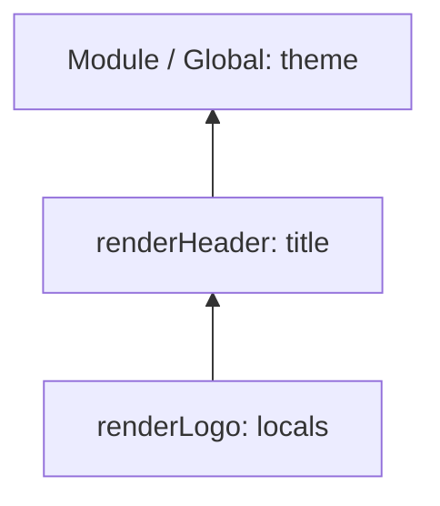

# 11. Scope, hoisting, TDZ

## Intro: "why does the console print 3 three times?"

A junior added "Add to cart" buttons to the catalog page in a loop `for (var i = 0; i < products.length; i++)` and attached `onClick` via `function() { addToCart(products[i]) }`. In production all the buttons add the **last** product. In parallel, in another PR the reviewer complains about `console.log(config); const config = loadConfig();` — "ReferenceError in staging, but it worked locally for me" (no, it didn't — they just never reached that line). Both bugs are about **scope** and the **temporal dead zone**. JavaScript doesn't "search for a variable across the whole file at random": every identifier has a scope, an environment chain, and hoisting rules. Without this chapter, closures ([12](12-closures.md)) and `this` ([14](14-this.md)) will remain magic.

## What you'll learn

- Three levels of scope: **global**, **function**, **block**.
- The **lexical environment** and the scope chain — how the engine finds a variable.
- **Hoisting** for `var`, `function`, `let`, `const` — the same word, different behavior.
- The **Temporal Dead Zone (TDZ)** — why `let` is safer than `var`.
- **Shadowing** and the difference from mutating an object.
- The classic `var` bug in a loop with asynchronous callbacks.
- How to read the Scope panel in DevTools.

## Global, function, and block scope

```javascript
const globalApiUrl = "https://api.shop.local"; // module scope (not truly global in ESM)

function registerHandlers() {
  var legacyFlag = true;       // function scope
  const maxRetries = 3;      // function scope (const isn't "block" here — the block is the whole function)

  if (legacyFlag) {
    let attempt = 0;           // block scope — only inside the if
    while (attempt < maxRetries) {
      const delay = attempt * 100; // block scope — the while body
      attempt++;
    }
    // console.log(delay); // ReferenceError
  }
  // console.log(attempt); // ReferenceError
}
```

| Declaration | Scope | Reassignment |
|------------|---------|----------------|
| `var` | function or global | yes |
| `let` | block `{ }` | yes |
| `const` | block `{ }` | no (binding) |
| `function` declaration | function (or block, differently in strict/sloppy for nested ones) | — |
| Parameters | function scope | yes |

**Why `let`/`const` by default:** predictability. A variable lives exactly where you visually declared it.

More on `var` vs `let` — [02. Variables](02-variables-strict.md).

## Lexical environment and the scope chain

A **lexical** scope is determined by the **place in the code**, not the place of the call.

```javascript
const theme = "dark";

function renderHeader() {
  const title = "Shop";
  function renderLogo() {
    console.log(theme, title); // searches: renderLogo → renderHeader → module
  }
  renderLogo();
}
```

### Step by step: looking up the variable `title`

1. Is `title` in the local environment of `renderLogo`? No.
2. Go up to the environment of `renderHeader` — there's `title = "Shop"`.
3. Use it. We never reach global.

An inner function **closes over** the outer bindings — the basis of [12. Closures](12-closures.md).



## Hoisting: one word — three mechanisms

**Hoisting** is a formal phase in which the engine registers declarations before executing the lines.

### `function` declaration — the body is hoisted

```javascript
ping(); // "pong"

function ping() {
  console.log("pong");
}
```

An equivalent mental model (simplified):

```javascript
function ping() { console.log("pong"); }
ping();
```

### `var` — the name is hoisted as `undefined`

```javascript
console.log(score); // undefined (not ReferenceError!)
var score = 100;
console.log(score); // 100
```

Mental model:

```javascript
var score;
console.log(score); // undefined
score = 100;
```

**Why it's dangerous:** the code "between" the declaration and the assignment sees an "empty" variable, not an error.

### `let` / `const` — hoisted, but in the TDZ

```javascript
{
  // console.log(items); // ReferenceError — TDZ
  let items = [];
}
```

From the start of the block to `let items = …`, the variable is **reserved** but can't be read/written.

```javascript
let tmp = tmp + 1; // ReferenceError on the right side — tmp is still in the TDZ
```

**Why the TDZ:** to forbid use before initialization, including in the expression to the right of `=`.

## Temporal Dead Zone — step by step

```javascript
function demo() {
  console.log("step 1");
  // const id = getId();
  // console.log(cache); // if uncommented — ReferenceError
  const cache = new Map();
  console.log("step 2");
}
```

| Moment | `var x` | `let x` |
|--------|---------|---------|
| Before the declaration line | `undefined` | ReferenceError (TDZ) |
| After `let x = 1` | any value | `1` |
| A repeated `let x` in the same block | allowed (bad) | SyntaxError |

## Shadowing: hiding names

```javascript
const port = 443;

function listen() {
  const port = 3000; // a new binding, the outer port is untouched
  console.log(port); // 3000
}

listen();
console.log(port); // 443
```

**Shadowing ≠ mutation:**

```javascript
const config = { port: 443 };
function patch() {
  const config = { port: 3000 }; // a different object, a different binding
}
```

```javascript
const config2 = { port: 443 };
function mutate() {
  config2.port = 3000; // mutating the same object — the outer config2 changes
}
```

Confusing shadowing with a shared object is a frequent source of bugs in shared state.

## `var` in a loop and async

```javascript
const funcs = [];
for (var i = 0; i < 3; i++) {
  funcs.push(() => console.log(i));
}
funcs[0](); // 3
funcs[1](); // 3
funcs[2](); // 3
```

### Step by step: why three times 3

1. `var i` — **one** variable for the whole enclosing function (or global).
2. The loop drives `i` up to `3` (the condition `i < 3` is false at `i === 3`).
3. Three arrows close over the **same** `i`.
4. A later call reads the final value `3`.

### The fix with `let`

```javascript
for (let j = 0; j < 3; j++) {
  funcs.push(() => console.log(j));
}
// 0, 1, 2
```

**Why it works:** on **each** iteration a new binding `j` is created in the block scope of the loop body.

### The fix with a factory (if you need `var`)

```javascript
for (var k = 0; k < 3; k++) {
  funcs.push(((n) => () => console.log(n))(k));
}
```

An IIFE / factory captures the value of `k` in the parameter `n` of the closure.

Practice — [13-lab-closures](13-lab-closures.md).

## Nested functions and memory

```javascript
function outer() {
  const big = new Array(1_000_000).fill("x");
  function inner() {
    return big.length;
  }
  return inner;
}
```

`inner` holds a reference to the environment of `outer` → `big` won't be GC'd while `inner` is alive. Deliberately don't close over extra data ([12](12-closures.md)).

## ES modules and scope isolation

Every `.js` file with `import`/`export` is a **separate module scope**:

```javascript
// config.js
const secret = process.env.API_KEY;
export const apiUrl = "/api";
```

`secret` doesn't leak into the global. Previously an IIFE was used for this ([10](10-functions.md)); now — [30. ES modules](30-es-modules.md).

## Debugging: the Scope panel in DevTools

1. Set a breakpoint inside a nested function.
2. Open **Scope** → you'll see Local, Closure, Module/Global.
3. `ReferenceError: x is not defined` — a typo or a variable outside the chain.
4. `Cannot access 'x' before initialization` — TDZ.

## `typeof` and an undeclared variable

```javascript
console.log(typeof notDeclared); // "undefined" — no error
console.log(notDeclared);        // ReferenceError
```

**Why:** a historical exception for `typeof`; you can't rely on undeclared names — enable strict mode ([02](02-variables-strict.md)).

## How this connects to the course

| Topic | Lesson |
|------|------|
| `let` / `const` / `var` | [02](02-variables-strict.md) |
| Functions and declaration hoisting | [10](10-functions.md) |
| Closures and private state | [12](12-closures.md) |
| `this` isn't from variable scope | [14](14-this.md) |
| Block scope in `switch` / `for` | [16](16-control-flow.md) |
| Module scope | [30](30-es-modules.md) |

In **typescript-basic**, scope is augmented with types; unnecessary shadowing is flagged by the linter as confusing.

## Common mistakes

| Mistake | Root cause | Fix |
|--------|------------------|-------------|
| All callbacks in a loop with one `i` | `var` — function scope | `let` or a factory |
| `console.log(a); let a = 1` | TDZ | Declare before use |
| Thinking `if (true) var x = 1` isolates | `var` isn't block-scoped | `let` / `const` |
| Shadowing `error` in catch and the outer `error` | Same names in a nested scope | Rename the inner one |
| Import and immediately use before the const declaration | TDZ in a module | Order declarations top to bottom |
| `for (const x of arr) { const x = 1 }` | A repeated declaration in the same block | A different name |

## In production

- In new code, **forbid `var`** via ESLint `no-var`.
- In React, a `let` in the component body is recreated on every render — for stable references use `useRef` (the react course).
- Don't rely on function hoisting inside an `if` for cross-browser tricks — explicit declarations are more readable.
- Code review: any `var` in a loop with a callback is a red flag.

## Summary

**Scope** determines where a name lives; the **lexical** chain — how an inner function finds outer variables. **Hoisting** registers declarations early, but for `let`/`const` the **TDZ** applies until initialization. **`var`** in loops with callbacks gives one shared counter — a classic bug; **`let`** creates a per-iteration binding. ES modules give file scope without polluting the global. Understanding scope is a mandatory foundation for closures and debugging.

## Checklist

- What will `console.log(a); var a = 1` print and why isn't it a ReferenceError?
- What is the TDZ and how does it differ from "the variable doesn't exist"?
- Why does `let` in `for` fix the `setTimeout` bug?
- How does shadowing differ from mutating an object?
- Which three levels of scope would you name for code inside a `function` with an `if` and `let`?
- Where in DevTools do you look at Closure?

Next lesson: [12. Closures](12-closures.md).
