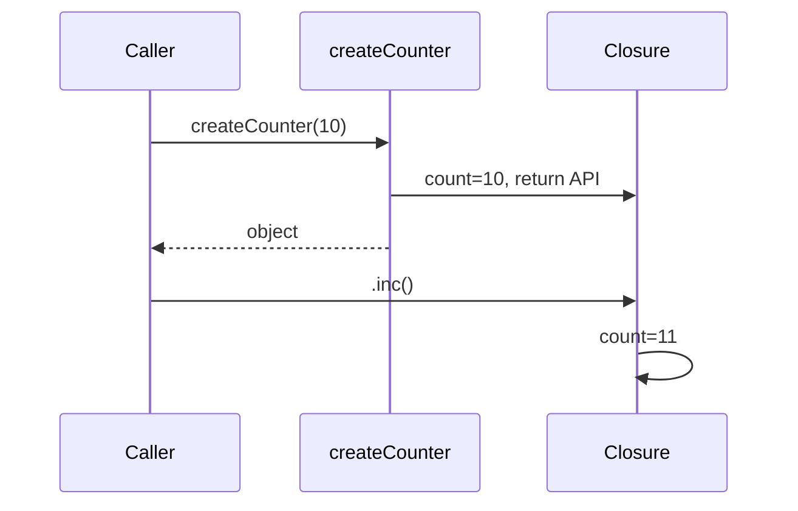

# 12. Closures

## Intro: "the likes counter resets on every click"

On a landing page each product card must show its own number of likes. A developer wrote `let likes = 0` in the component and does `likes++` in the handler — but when the list re-renders, the counter resets to zero. Another developer moved the logic into `function createLikeButton()` with `let count = 0` inside and returned `{ click() { count++ } }` — each button has **its own** counter, and the state survives calls. This is a **closure**: an inner function "remembers" the variables of an outer function even after the outer one has finished. Without closures there are no middleware factories, memoization, private fields before classes, and half of the patterns in Node.js. This chapter connects scope ([11](11-scope-hoisting.md)) with real APIs.

## What you'll learn

- The exact definition of a **closure** and what exactly is "captured."
- Patterns: counter, factory, the **module pattern**, memoization.
- The **loop-with-`var`** bug and several ways to fix it.
- **Memory and leaks** — when a closure interferes with GC.
- The difference between a closure and `this` ([14](14-this.md)).
- Typical interview questions with working answers.

## Definition: function + environment

A **closure** is a function together with a reference to the **lexical environment** in which it was created. The inner function has access to the outer function's bindings **after** the outer one has returned control.

```javascript
function makeGreeter(prefix) {
  return function greet(name) {
    return `${prefix}, ${name}!`;
  };
}

const sayHi = makeGreeter("Hi");
const sayHey = makeGreeter("Hey");

sayHi("Ann");  // "Hi, Ann!"
sayHey("Bob"); // "Hey, Bob!"
```

`prefix` for `sayHi` and `sayHey` are **different** cells in memory. The `makeGreeter` call finished, but the `prefix` binding stays alive as long as the returned function is alive.

### What gets captured

What's captured is not "the value at creation time" (for `let` in a loop with a separate binding per iteration), but a **reference to the binding** (the cell). For an immutable `const` this looks like a fixed value:

```javascript
function makeConstant() {
  const x = 42;
  return () => x;
}
```

For `let` in a loop — a separate cell for each iteration ([11](11-scope-hoisting.md)).

## The classic counter: private state

```javascript
function createCounter(start = 0) {
  let count = start;

  return {
    inc() {
      count += 1;
      return count;
    },
    dec() {
      count -= 1;
      return count;
    },
    value() {
      return count;
    },
  };
}

const cartItems = createCounter(0);
cartItems.inc(); // 1
cartItems.inc(); // 2
// count is not accessible from outside — there's no global variable
```

**Why it works:** the methods `inc`/`dec`/`value` are functions that close over `count`. There's no `count` name on the outside — only the object's public API.

Before ES2022 private fields (`#count` in [21](21-classes.md)), this was the standard way to encapsulate.

## Step by step: the lifecycle of `createCounter(10)`

1. `createCounter` is called, an environment with `count = 10` is created.
2. An object with three functions is created; each references this environment.
3. `createCounter` returns the object; the **local name** `count` is no longer visible in the calling code.
4. The environment is **not destroyed** — the methods reference it.
5. `cartItems.inc()` finds `count` via the scope chain, increments it, returns the new value.



## Factories and partial application

```javascript
function multiplier(factor) {
  return (n) => n * factor;
}

const double = multiplier(2);
const triple = multiplier(3);

double(5);  // 10
triple(5);  // 15
```

**Why in production:** configurable helpers without classes.

```javascript
function createLogger(namespace) {
  return (level, message) => {
    console.log(`[${namespace}] ${level}: ${message}`);
  };
}

const authLog = createLogger("auth");
authLog("INFO", "login ok");
```

In the nodejs course the same technique — middleware `function authMiddleware(secret) { return (req, res, next) => { … } }`.

## Memoization via a closure

```javascript
function memoize(fn) {
  const cache = new Map();
  return function (...args) {
    const key = JSON.stringify(args);
    if (cache.has(key)) return cache.get(key);
    const result = fn(...args);
    cache.set(key, result);
    return result;
  };
}
```

`cache` is a private closure variable; you can't reach the Map from outside. Practice — [13-lab-closures](13-lab-closures.md).

**Limitation:** `JSON.stringify` is a poor key for objects with different key orders; for the course, understanding the idea is enough.

## Closures in loops: the trap and the fixes

### The problem

```javascript
const handlers = [];
for (var i = 0; i < 3; i++) {
  handlers.push(() => console.log("click", i));
}
handlers[0](); // click 3
```

**Root cause:** one variable `i`, and all the functions read it at the moment of the **call**, not creation.

### Fix 1: `let`

```javascript
for (let i = 0; i < 3; i++) {
  handlers.push(() => console.log("click", i));
}
// click 0, click 1, click 2
```

### Fix 2: a factory with a parameter

```javascript
for (var i = 0; i < 3; i++) {
  handlers.push(((id) => () => console.log("click", id))(i));
}
```

### Fix 3: `bind` / a separate function

```javascript
function makeHandler(id) {
  return () => console.log("click", id);
}
for (var i = 0; i < 3; i++) {
  handlers.push(makeHandler(i));
}
```

**Why the factory is taught in interviews:** it explicitly shows a separate environment per iteration.

## The module pattern (before ES modules)

```javascript
const tokenStore = (function () {
  let token = null;

  return {
    setToken(t) {
      token = t;
    },
    getAuthHeader() {
      return token ? `Bearer ${token}` : "";
    },
    clear() {
      token = null;
    },
  };
})();
```

An IIFE creates the scope once; the returned object is the only public interface. Today it's preferable to:

```javascript
// auth-store.js
let token = null;
export function setToken(t) { token = t; }
export function getAuthHeader() { return token ? `Bearer ${token}` : ""; }
```

Module scope ([30](30-es-modules.md)) gives the same isolation without an IIFE.

## Memory and leaks

A closure holds the **entire environment** if even one variable from it is still needed by the inner function:

```javascript
function leakExample() {
  const huge = new Array(1_000_000).fill("data");
  const tiny = 1;
  return () => tiny; // huge is still retained — a shared environment
}
```

**Why:** the engine doesn't discard individual variables from the environment one by one — the whole lexical environment lives (V8 optimizations sometimes "prune" unused ones, but you can't rely on it).

### Practical recommendations

- Don't close over large DOM trees in event listeners — remove the listeners on unmount.
- In Node, don't accumulate an array of middleware closures on a global `requests` without cleanup.
- In long-lived `setInterval`, don't capture the entire `req` from an HTTP handler.

## Closure and `this` — different mechanisms

```javascript
const obj = {
  value: 10,
  getValueArrow: () => this?.value,
  getValue() {
    return this.value;
  },
};
```

A closure gives access to **variables** (identifiers). `this` is a separate "slot" binding that depends on the call ([14](14-this.md)). An arrow in a method doesn't "close over the object's `this`" — it takes `this` from outside the method.

## Currying (overview)

```javascript
function add(a) {
  return (b) => a + b;
}
const add5 = add(5);
add5(3); // 8
```

A chain of closures is the basis of functional libraries (Ramda, lodash/fp). In application JS, "one level" is more common — `multiplier(factor)`.

## In an interview

**"What is a closure?"**  
A function that remembers the lexical environment where it was created and can read/change its variables after the outer function has finished.

**"Why?"**  
State encapsulation, factories, callbacks, memoization, module isolation.

**"A bug example?"**  
`var` in a loop with asynchronous handlers — they all see the final index.

## How this connects to the course

| Lesson | Connection |
|------|-------|
| [11. Scope](11-scope-hoisting.md) | The lexical chain |
| [10. Functions](10-functions.md) | Functions as return values |
| [13. Lab](13-lab-closures.md) | rate limiter, stack, memoize |
| [14. `this`](14-this.md) | Don't confuse with capturing `this` |
| [21. Classes](21-classes.md) | Private fields as an alternative |
| [30. Modules](30-es-modules.md) | Replaces the module pattern |
| nodejs-basic | Middleware as a closure over `secret` |

## Common mistakes

| Mistake | Root cause | Fix |
|--------|------------------|-------------|
| One handler for all list elements | A shared `var i` | `let` or a factory |
| Expecting a "snapshot" of `let` without a new binding | Misunderstanding the for loop | `makeHandler(i)` |
| Storing the entire `response` in a closure | A reference to a large object | Extract only the needed fields |
| Recursion without an NFE | The name `fn` is in the TDZ | `function fact(n)` inside or a declaration |
| Thinking a closure copies an object deeply | Capturing a reference | Immutability or copy-on-write |

## In production

- **React hooks** (`useState`, `useEffect`) — closures on every render; the stale closure is a frequent topic in react-intermediate.
- **Debounce/throttle** — a classic closure with `timerId` ([13-lab](13-lab-closures.md)).
- **Tests:** an isolated `createCounter()` per test case — no shared state between tests.

## Summary

A **closure** is a function plus its lexical environment. It enables **private state**, factories, and callbacks with "memory." The loop-with-`var` bug — all functions share one index; `let` or a factory create a separate environment per iteration. Closures retain memory — don't capture extra data. This isn't `this`: variables and the call context are different axes.

## Checklist

- Explain the output of `handlers[0]()` in the `var` example.
- How does a closure give a "private" `count` without classes?
- Name three ways to fix a loop with callbacks.
- Why can `return () => tiny` retain `huge`?
- How does a closure differ from a `this` binding?
- Where would you encounter a closure in Express middleware?

Next lesson: [13. Lab: closures](13-lab-closures.md).
