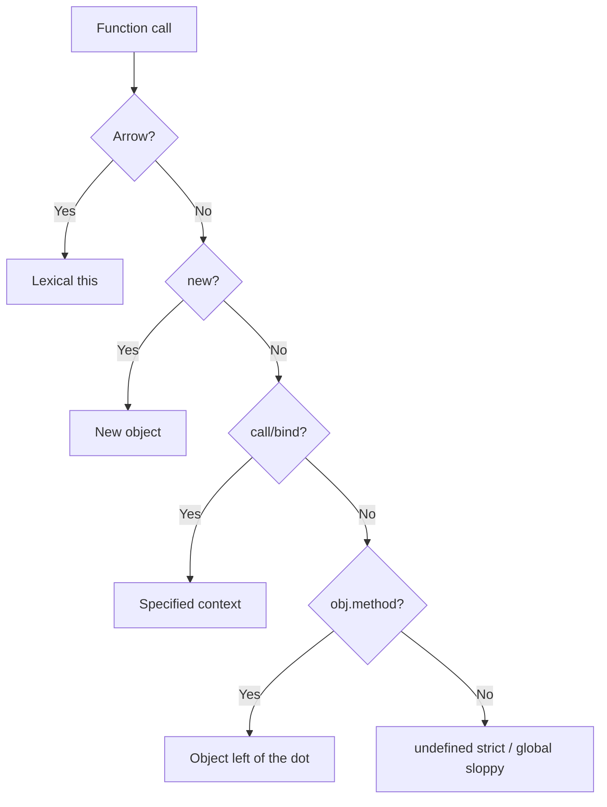

# 14. `this`, call, apply, bind

## Intro: "the Save button can't see the form"

In an admin panel backed by Django ([deploy/django](../../deploy/django/README.md)) you're writing a plain-JS client. An object `formSaver` with a `save()` method reads `this.fields` and sends a PATCH. In the template: `button.addEventListener("click", formSaver.save)`. Network shows an empty body, and the console says `Cannot read properties of undefined (reading 'fields')`. The method is **detached** from the object: when called as a callback, `this` is no longer `formSaver`. Meanwhile a teammate on the same PR writes an arrow instead, `save: () => { this.fields… }` — now `this` comes from the module (`undefined` in strict mode). **`this` in JavaScript is not a reference to "the current object in the code"** and it isn't a closure ([12](12-closures.md)); its value is determined by **how the function was called**. This chapter clears up the biggest source of bugs before you get to React hooks and classes.

## What you'll learn

- The rules for computing `this` across different call styles.
- **Losing context** when a method is passed as a callback.
- `call`, `apply`, `bind` — when and why to use them.
- Arrow functions and **lexical** `this`.
- `this` in classes, and the historical context of React class components.
- Optional chaining on a call: `obj.method?.()`.

## What `this` actually is

`this` is **not** a function argument and **not** a variable from scope. It's an internal reference the engine sets on **every** call of a regular function.

| Call style | `this` (sloppy / browser) | `this` (strict / ES module) |
|---------------|---------------------------|-----------------------------|
| `fn()` | `globalThis` (`window`) | `undefined` |
| `obj.method()` | `obj` | `obj` |
| `new Fn()` | a new object | a new object |
| `fn.call(ctx, …)` | `ctx` | `ctx` |
| `fn.apply(ctx, …)` | `ctx` | `ctx` |
| `boundFn()` | fixed | fixed |
| Arrow | from the enclosing scope | from the enclosing scope |

In **ES modules** and under `"use strict"`, a "bare" call gives `undefined` — that cuts down on accidental writes to `window`.

## Step by step: `user.greet()` vs `const g = user.greet; g()`

```javascript
const user = {
  name: "Ann",
  greet() {
    console.log(`Hi, ${this.name}`);
  },
};

user.greet(); // Hi, Ann — step 1: called as a method

const g = user.greet;
g(); // Hi, undefined — step 2: called as a plain function
```

### Step 1 — calling through the dot

1. The expression to the left of `.` is the object `user`.
2. The engine calls `greet` with `this = user`.
3. `this.name` → `"Ann"`.

### Step 2 — a bare function reference

1. `g` is the same function, but `g()` is called with no base object.
2. In strict mode, `this = undefined`.
3. `undefined.name` → an error, or `undefined` in the template string.

**Why:** `this` is bound to the **call**, not to where the method was declared on the object.

## Losing context in async code

```javascript
setTimeout(user.greet, 100);        // this isn't user
setTimeout(() => user.greet(), 100); // OK — explicit method call
setTimeout(user.greet.bind(user), 100); // OK — this is fixed
```

The same bug shows up in:

- `array.map(obj.transform)` — you need `(x) => obj.transform(x)` or `bind`;
- DOM event handlers;
- callbacks like `fs.readFile`, `then` (when the callback is an object method).

Practice this in [15-lab-this](15-lab-this.md).

## `call`, `apply`, `bind`

All three live on `Function.prototype` and let you set `this` explicitly.

```javascript
function introduce(greeting, punct) {
  console.log(`${greeting}, ${this.name}${punct}`);
}

const ann = { name: "Ann" };
const bob = { name: "Bob" };

introduce.call(ann, "Hello", "!");   // Hello, Ann!
introduce.apply(bob, ["Hi", "."]);   // Hi, Bob.

const greetAnn = introduce.bind(ann, "Hey");
greetAnn("?"); // Hey, Ann?
```

| Method | Action | Function arguments |
|-------|----------|-------------------|
| `call` | calls immediately | comma-separated list |
| `apply` | calls immediately | an array (handy for `Math.max`) |
| `bind` | returns a **new** function | partial application + fixed `this` |

### Step by step: `bind`

```javascript
const bound = introduce.bind(ann, "Hello");
bound("!");
```

1. A new function is created with no `this` of its own.
2. On every call, its `this` will be `ann`.
3. The first argument, `"Hello"`, is already baked in; only `punct` needs to be passed.

**Why `bind` matters historically:** in React class components, handlers got passed into JSX — without `bind`, `this` would get lost. Function components with hooks don't have a `this` on their handlers at all.

```javascript
// React 16 class (legacy style)
class Form extends React.Component {
  constructor(props) {
    super(props);
    this.handleSubmit = this.handleSubmit.bind(this);
  }
  handleSubmit(e) {
    e.preventDefault();
    this.setState({ sent: true });
  }
}
```

## Arrow functions and lexical `this`

An arrow function **doesn't** have its own `this`; it takes it from the nearest **regular** function (or from the module/global scope).

```javascript
const timer = {
  seconds: 0,
  start() {
    setInterval(() => {
      this.seconds += 1; // this = timer (from start)
      console.log(this.seconds);
    }, 1000);
  },
};
```

### Step by step: why the arrow inside `start` works

1. `start` is called as `timer.start()` → `this = timer`.
2. The arrow inside `setInterval` doesn't redefine `this`.
3. Lexically, `this` is whatever `start`'s was at the moment the arrow was created.

### Anti-pattern: an arrow as a method

```javascript
const bad = {
  name: "Shop",
  greet: () => {
    console.log(this.name); // this isn't bad — it's the module/undefined
  },
};
bad.greet();
```

**Rule of thumb:** object methods that need the object's `this` should be written as `method() {}` or `function`, not as an arrow ([10](10-functions.md)).

## `this` in classes

```javascript
class Counter {
  value = 0;

  inc() {
    this.value += 1;
    return this.value;
  }
}

const c = new Counter();
c.inc(); // 1

const inc = c.inc;
inc(); // TypeError in strict mode, or a silent write to global in sloppy mode
```

The field `value = 0` lives on the instance; `inc` lives on the prototype. An extracted method loses its link to the instance — the same mechanism as with an object literal.

**Why class fields plus methods work this way:** methods live on the prototype (one copy per class), fields live on the instance. More on this in [21](21-classes.md).

## `new` and `this`

```javascript
function User(name) {
  this.name = name;
}

const u = new User("Ann");
```

With `new`:

1. An empty object is created.
2. Inside `User`, `this` points to it.
3. If the function doesn't return its own object, the result is this `this`.

Arrow functions with `new` throw a SyntaxError.

## Optional chaining on a call

```javascript
const api = {
  fetchUser(id) {
    return { id, name: "Ann" };
  },
};

api.fetchUser?.(42);     // OK
api.fetchAdmin?.(1);     // undefined, no TypeError
null?.method?.();       // undefined
```

`?.` stops the chain at `null`/`undefined` — see [19](19-optional-nullish.md).

## Diagram: how `this` is resolved



## How this connects to the course

| Lesson | Connection |
|------|-------|
| [10. Functions](10-functions.md) | Arrow vs function |
| [12. Closures](12-closures.md) | Closure ≠ this |
| [15. Lab](15-lab-this.md) | calculator, timer, emitter |
| [20–21. Prototypes and classes](20-prototypes.md) | `new`, methods on the prototype |
| [29. fetch](29-fetch.md) | Callbacks with less context loss — arrows |
| react-basic | Hooks have no `this`; class components need bind |

In **browser-platform** — `this` for DOM handlers (`button` as `this` in legacy sloppy inline handlers).

## Common mistakes

| Mistake | Root cause | Fix |
|--------|------------------|-------------|
| `onClick={obj.save}` | Method passed without calling it | `() => obj.save()` or bind |
| An arrow used as a method in a literal | Lexical this | `save() {}` |
| `const f = obj.m; f()` | Called with no base object | `f.call(obj)` |
| Double bind | bind returns a new fn | Keep a single bound reference |
| Expecting `this` at top-level module scope | Bare call → undefined | Don't rely on this at the top level |
| `JSON.parse` reviver and this | Separate rules apply | Use a regular function for the reviver |

## In production

- Prefer **arrows for callbacks** inside methods that need the object's `this` — less need for bind.
- In **TypeScript**, `this` parameters in function types document the expected context.
- **Linting**: `no-invalid-this`, `@typescript-eslint/unbound-method`.
- A library's public API shouldn't require "call this only as a method" without documenting it — explicit arguments are better.

## Summary

**`this`** is determined by **how a function is called**, not where it's declared. Passing a method as a callback **loses** the object. **`call`/`apply`** invoke a function with an explicit `this`; **`bind`** creates a function with a fixed context. **Arrows** don't have their own `this` — great inside methods, **bad** as methods themselves. In strict modules, a "bare" call → `undefined`. Understanding `this` is essential before you get to classes and event-driven code.

## Checklist

- What's the result of `const f = obj.m; f()` in strict mode?
- Three ways to fix `setTimeout(obj.m, 0)`?
- How does `call` differ from `bind`?
- Why is `greet: () => this.name` inside an object a bug?
- What happens when you call `new` on a regular function?
- Why did React class components need bound handlers?

Next lesson: [15. Lab: `this`](15-lab-this.md).
