# 17. Destructuring, spread, rest

## Intro: "the config overwrote production"

A Node BFF ([javascript-path](../javascript-path.md)) merges defaults with environment variables: `Object.assign(config, process.env)` — and suddenly in production there's `debug: "true"` (a string from env) and a mutated `base` shared by all workers. Another developer unpacks a FastAPI response: `const title = response.data.items[0].name` — and on an empty `items` the whole render crashes. Modern JS solves this with **destructuring**, **spread**, and **rest**: readable parameters, immutable state updates, and safe copies without a manual `Object.assign`. This chapter is the everyday syntax of React and configs; later it's complemented by `?.` and `??` ([19](19-optional-nullish.md)).

## What you'll learn

- Destructuring of **arrays** and **objects**, including in function parameters.
- **Spread** `...` for copies and merging (shallow).
- **Rest** `...` in parameters and in destructuring.
- Nested destructuring and its risks.
- Patterns: `mergeConfig`, immutable `setState`, `pick`/`omit`.
- The difference between a shallow copy and deep cloning ([07](07-objects.md)).

## Array destructuring

```javascript
const [first, second, ...rest] = [1, 2, 3, 4];
// first=1, second=2, rest=[3, 4]

const [, , third] = [10, 20, 30]; // skipping positions
```

### Swap without a temporary variable

```javascript
let a = 1;
let b = 2;
[a, b] = [b, a];
```

**Why it works:** the right side evaluates to a tuple of values, the left is a positional assignment.

### Default values

```javascript
const [x = 0, y = 0] = [5];
// x=5, y=0
```

The default kicks in only for `undefined` (like function parameters — [10](10-functions.md)).

## Object destructuring

```javascript
const user = { id: 1, name: "Ann", role: "admin" };

const { name, role } = user;
const { name: userName, age = 18 } = user; // rename + default
const { id, ...profile } = user; // rest: profile = { name, role }
```

| Syntax | Result |
|-----------|-----------|
| `{ name }` | `name === user.name` |
| `{ name: userName }` | a variable `userName` |
| `{ age = 18 }` | 18 if `age` is missing or `undefined` |
| `{ id, ...rest }` | `rest` without `id` |

### In function parameters

```javascript
function printUser({ name, role = "guest" }) {
  console.log(name, role);
}

printUser({ name: "Ann" }); // Ann guest
```

**Why it's handy:** the signature documents the object's shape; a default for the whole object:

```javascript
function connect({ host = "localhost", port = 3000, tls = false } = {}) {
  return { host, port, tls };
}
connect(); // no argument — not a TypeError
```

The empty `= {}` protects against calling `connect()` without an object.

## Spread `...` — expanding

### Array copy (shallow)

```javascript
const original = [1, 2];
const extended = [...original, 3];
original.push(99);
console.log(extended); // [1, 2, 3] — unaffected
```

### Object copy (shallow)

```javascript
const defaults = { host: "localhost", port: 3000, retries: 3 };
const config = { ...defaults, port: 8080 };
// { host: "localhost", port: 8080, retries: 3 }
```

**Order matters:** fields on the right override those on the left.

```javascript
const override = { port: 9000, host: "api.prod" };
const merged = { ...defaults, ...override };
```

**Why not mutate `defaults`:** one object in memory for the whole application — the classic worker bug.

### Spread in a function call

```javascript
const nums = [3, 1, 4, 1, 5];
Math.max(...nums);
```

Equivalent to `Math.max(3, 1, 4, 1, 5)`.

## Rest `...` — collecting the remainder

### In parameters

```javascript
function log(level, ...messages) {
  console.log(level, messages.join(" "));
}

log("ERROR", "auth", "failed", "user=42");
```

Replaces `arguments` ([10](10-functions.md)) — a real array, works with an arrow if rest is in the declaration of the enclosing function.

### In destructuring

```javascript
const { id, createdAt, ...updatable } = payload;
// send only updatable in a PATCH
```

**Rule:** rest is **last** in the pattern:

```javascript
// const { ...rest, id } = obj; // SyntaxError
```

## Step by step: a shallow config merge

```javascript
function mergeConfig(base, override) {
  return { ...base, ...override };
}

const base = { host: "localhost", port: 3000, meta: { v: 1 } };
const result = mergeConfig(base, { port: 8080 });
```

1. `{ ...base }` — a new object, top-level keys copied.
2. `{ ...override }` — `port` overwritten.
3. `base.meta` and `result.meta` — the **same reference** (shallow).

For nested fields — a separate spread per level or `structuredClone` ([07](07-objects.md)).

## Nested destructuring

```javascript
const response = {
  data: {
    items: [{ id: 1, name: "Tea" }],
  },
};

const {
  data: {
    items: [firstItem],
  },
} = response;

console.log(firstItem.name); // Tea
```

**Risk:** if `data` or `items` is `undefined`, TypeError. Combine with `?.` and defaults ([19](19-optional-nullish.md)):

```javascript
const first = response?.data?.items?.[0];
const name = first?.name ?? "Unknown";
```

### Step by step: safe extraction

1. `response?.data` — undefined if there's no response.
2. `?.items?.[0]` — we don't crash on an empty array/missing field.
3. `?? "Unknown"` — a default only for null/undefined.

## Immutable state update

The React pattern (a preview for react-basic):

```javascript
function reducer(state, action) {
  switch (action.type) {
    case "increment":
      return { ...state, count: state.count + 1 };
    case "setUser":
      return { ...state, user: { ...state.user, ...action.payload } };
    default:
      return state;
  }
}
```

**Why spread:** a new object reference — React compares shallowly and re-renders. Mutating `state.count++` without a new object is a bug.

## `pick` and `omit` via rest

```javascript
function pick(obj, keys) {
  return Object.fromEntries(keys.map((k) => [k, obj[k]]));
}

function omit(obj, keys) {
  const exclude = new Set(keys);
  return Object.fromEntries(
    Object.entries(obj).filter(([k]) => !exclude.has(k))
  );
}
```

An alternative to omit — rest after destructuring known keys (lab [18](18-lab-modern-syntax.md)).

## Spread and async

```javascript
const urls = ["/api/a", "/api/b"];
const results = await Promise.all(urls.map((u) => fetch(u)));
```

**A mistake:**

```javascript
const promises = urls.map((u) => fetch(u));
await promises; // meaningless — not a Promise
```

Spreading an array of Promises **doesn't wait** — you need `Promise.all` ([27](27-async-await.md)).

## Cloning: what spread doesn't do

```javascript
const a = { nested: { x: 1 } };
const b = { ...a };
b.nested.x = 99;
console.log(a.nested.x); // 99
```

| Method | Depth |
|-------|---------|
| `{ ...obj }` | shallow |
| `Object.assign({}, obj)` | shallow |
| `structuredClone(obj)` | deep (with limitations) |
| `JSON.parse(JSON.stringify(obj))` | deep without Date, undefined, fn |

## Diagram: rest vs spread

```mermaid
flowchart LR
  subgraph spread [Spread — expand]
    A["[...arr]"] --> B[elements out]
    C["{...obj}"] --> D[keys out]
  end
  subgraph rest [Rest — collect]
    E["...tail"] --> F[array/object remainder]
  end
```



One symbol `...`, different positions: **on the right / in a call** — spread; **on the left in a pattern / the last parameter** — rest.

## How this connects to the course

| Lesson | Connection |
|------|-------|
| [07. Objects](07-objects.md) | Shallow vs deep copy |
| [08. Arrays](08-arrays.md) | map + spread |
| [10. Functions](10-functions.md) | Rest parameters, defaults |
| [16. Loops](16-control-flow.md) | `for (const [k,v] of Object.entries())` |
| [18. Lab](18-lab-modern-syntax.md) | mergeConfig, pick, parseLog |
| [19. `?.` / `??`](19-optional-nullish.md) | Safe nested destructuring |
| react-basic | `setState`, props spread |

## Common mistakes

| Mistake | Root cause | Fix |
|--------|------------------|-------------|
| `const { ...r, id } = o` | rest not last | Key order |
| Thinking spread is deep | Shallow copy | Nested spread or clone |
| `const { user } = null` | Destructuring null | Guard or default `= {}` |
| Mutating `base` after merge | assign instead of spread | `{ ...base, ...over }` |
| `...obj` on null/undefined | Not iterable | `{ ...(obj ?? {}) }` |
| Forgetting `= {}` in parameters | undefined can't be destructured | `({ a } = {})` |

## In production

- **Env merge:** `{ ...defaults, ...pickEnv(process.env) }` — don't mutate shared defaults.
- **API DTO:** destructuring in a handler + explicit fields for the response — fewer leaks.
- **ESLint** `prefer-const` + destructuring reduces `let` noise.
- TypeScript: types for rest (`Omit<T, "id">`) — typescript-basic.

## Summary

**Destructuring** extracts fields and elements into variables; **spread** copies and merges (shallow); **rest** collects the remainder. In function parameters — self-documenting options. Order in a merge: base first, then override. A nested form without `?.` is fragile. Spread doesn't replace deep cloning. The `{ ...prev, field: new }` pattern is the basis of immutable updates in the UI.

## Checklist

- Result of `const { a, ...b } = { a: 1, c: 2 }`?
- How does rest in parameters differ from `arguments`?
- Why `{ ...defaults, port: 8080 }` instead of a separate assignment `defaults.port`?
- Why can `mergeConfig` accidentally change a nested object in `base`?
- How do you safely call `connect()` without arguments?
- When do you need `Promise.all` rather than spreading Promises?

Next lesson: [18. Lab: modern syntax](18-lab-modern-syntax.md).
