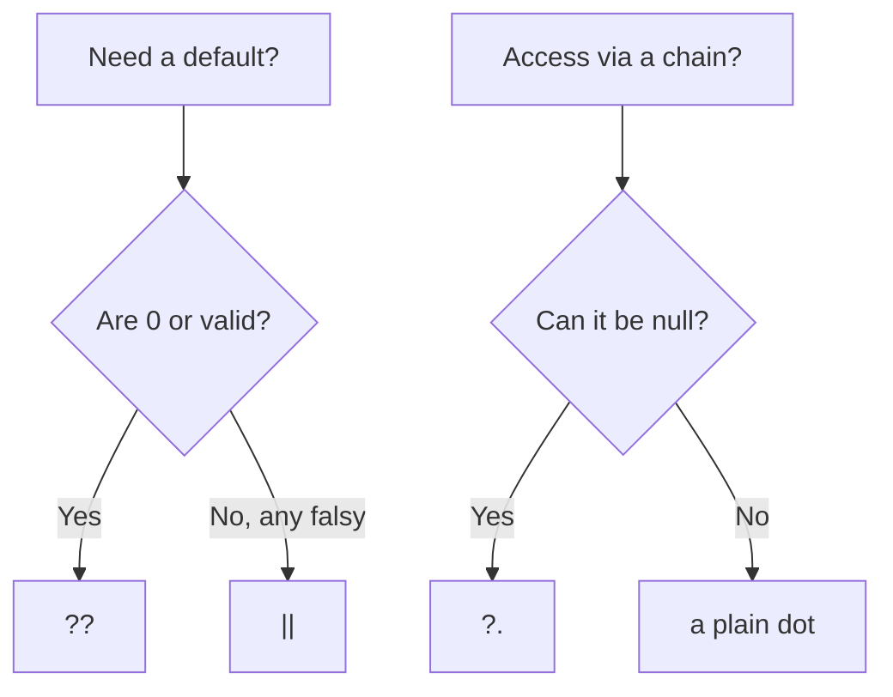

# 19. Optional chaining (`?.`) and nullish coalescing (`??`)

## Intro: "Cannot read properties of undefined (reading 'city')"

A user card in a SPA renders before the `fetch` to FastAPI completes. The code `user.address.city` crashes on staging, even though the data is always complete in dev. One developer wraps everything in `if (user && user.address && user.address.city)` — 40 lines of nesting. Another writes `const port = config.port || 3000` — and in production the port **0** (dynamic assignment in Docker) is replaced with 3000, so the service is unreachable. ES2020 added **`?.`** and **`??`**: short safe access and defaults **only** for `null`/`undefined`. Together with destructuring ([17](17-destructuring-spread.md)) this is the standard for reading API responses and configs.

## What you'll learn

- **Optional chaining** `?.` for properties, calls, indexes.
- What `?.` does **not** check (empty string, 0).
- **Nullish coalescing** `??` vs the logical `||`.
- Combinations of `?.` + `??` in real expressions.
- Logical assignment `??=`, `||=`, `&&=`.
- Syntax limitations and compatibility.

## Optional chaining: safe access

```javascript
const city = user?.address?.city;
```

If at any step the left side is `null` or `undefined`, the whole expression is **`undefined`**, with no TypeError.

| Expression | If `user` is null | If `address` is missing |
|-----------|------------------|----------------------------|
| `user.address.city` | TypeError | TypeError |
| `user?.address?.city` | `undefined` | `undefined` |

**Why not "just try/catch":** shorter, predictable for rendering, doesn't mask other errors.

## Call, indexing, optional call

```javascript
callback?.();
obj.method?.(arg1, arg2);
arr?.[0];
const key = "id";
obj?.[key];
```

If `callback` is `null`, the call is not made and the result is `undefined`.

```javascript
delete user?.temp; // no-op if user is null
```

## Step by step: parsing `response?.data?.items?.[0]?.name ?? "Unknown"`

1. Is `response` nullish? → the whole result is `undefined`, move on to `??`.
2. Otherwise `response.data` — if nullish, stop, `undefined`.
3. `items` — if nullish or not an array, `?.[0]` gives `undefined` (not an error when items is missing).
4. `[0]` — if the array is empty, `undefined`.
5. `name` — if the element is missing, `undefined`.
6. `?? "Unknown"` — substitutes the string only if the left side is `null` or `undefined`.

```javascript
const title = response?.data?.title ?? "Untitled";
```

Reads as: "take title, don't crash on empty data, otherwise Untitled".

## What `?.` does not do

```javascript
const len = items?.length; // 0 if items=[] — that's 0, not undefined
const name = user?.name;   // "" stays "" — an empty name is valid
```

For a default of an empty string you need `??`:

```javascript
const displayName = user?.name ?? "Guest";
```

If `name === ""`, it stays `""` — a deliberate product decision.

## Nullish coalescing `??`

A default **only** on `null` or `undefined`:

```javascript
const port = config.port ?? 3000;

0 ?? 3000;        // 0
"" ?? "default";  // ""
false ?? true;    // false
null ?? "x";      // "x"
undefined ?? "x"; // "x"
```

### Comparison with `||`

```javascript
0 || 3000;   // 3000 — 0 is falsy
0 ?? 3000;   // 0

"" || "default";  // "default"
"" ?? "default";  // ""

null || "x";  // "x"
null ?? "x";  // "x"
```

| Value | `\|\|` (falsy → right) | `??` (nullish → right) |
|----------|------------------------|-------------------------|
| `0` | right | `0` |
| `""` | right | `""` |
| `false` | right | `false` |
| `null` | right | right |
| `undefined` | right | right |

**Why `??` for configs:** `0`, `false`, `""` are often **valid** values (port 0 in tests, a `false` flag, an empty slug).

More on falsy — [05](05-coercion-comparison.md), [16](16-control-flow.md).

## Combinations in loops and rendering

```javascript
for (const item of order?.items ?? []) {
  process(item);
}
```

If `order` or `items` is missing — we iterate over an empty array and the loop doesn't run.

```javascript
function UserCard({ user }) {
  const city = user?.address?.city ?? "—";
  return `<p>${city}</p>`;
}
```

## Logical assignment

```javascript
const opts = {};

opts.timeout ??= 5000;   // assign if null/undefined
opts.retries ||= 3;      // assign if falsy
opts.enabled &&= true;   // assign if current value is truthy
```

| Operator | Write condition |
|----------|----------------|
| `??=` | left is null/undefined |
| `\|=` | left is falsy |
| `&&=` | left is truthy |

**Why `??=` in a config:** it won't overwrite an explicit `0` or `false`.

```javascript
function initConfig(partial) {
  const config = { ...partial };
  config.port ??= 3000;
  config.host ??= "localhost";
  return config;
}
```

## Syntax: parentheses with `&&` / `||`

```javascript
// a ?? b || c; // SyntaxError without parentheses
(a ?? b) || c;
a ?? (b || c);
```

Rule: **do not mix** `??` with `&&`/`||` without explicit parentheses — the grammar requires it.

## With TypeScript and type narrowing

```typescript
function len(s: string | null) {
  return s?.length ?? 0; // number
}
```

In TypeScript `?.` and `??` narrow the union — a topic for typescript-basic.

## Compatibility

ES2020. Node.js 14+, modern browsers, Vite by default. For older environments — a Babel plugin (not required in this course).

## Step by step: parsing a `fetch` response

A typical pattern after [29. fetch](29-fetch.md):

```javascript
async function loadProduct(slug) {
  const res = await fetch(`/api/products/${slug}`);
  if (!res.ok) {
    throw new Error(`HTTP ${res.status}`);
  }
  const data = await res.json();
  return {
    title: data?.title ?? "Untitled",
    price: data?.price ?? 0,
    tags: data?.tags ?? [],
  };
}
```

1. `res.ok` — a check of the HTTP status; `?.` here does not replace checking for 404/500.
2. `data` can be `null` when the body is empty — optional on the fields keeps the render from crashing.
3. `?? []` guarantees an iterable array for `map` in the UI, even if `tags` is missing from the JSON.
4. `price ?? 0` preserves a free product (`0`), unlike `price || 0` (same for zero, but `||` breaks other falsy values).

If the API guarantees an OpenAPI contract, validation at the boundary (Zod in typescript-basic) complements, rather than replaces, defensive rendering.

## Diagram: choosing an operator



## How this relates to the course

| Lesson | Relationship |
|------|-------|
| [05. Coercion](05-coercion-comparison.md) | Falsy vs nullish |
| [14. `this`](14-this.md) | `obj.method?.()` |
| [16. Loops](16-control-flow.md) | `order?.items ?? []` |
| [17. Destructuring](17-destructuring-spread.md) | Safe extraction |
| [18. Lab](18-lab-modern-syntax.md) | parseLog, merge |
| [29. fetch](29-fetch.md) | `res.json()` + optional chain |
| [32. Errors](32-error-handling.md) | `?.` does not replace handling 500 |

In **OpenAPI clients** (react-intermediate) optional fields in the schema correspond to `| null` and `?.` on the client.

## Common mistakes

| Mistake | Root cause | Fix |
|--------|------------------|-------------|
| `port \|\| 3000` with a valid 0 | 0 is falsy | `port ?? 3000` |
| Thinking `?.` catches an empty array | Only null/undefined | `items?.length` + a check |
| `a ?? b \|\| c` without parentheses | SyntaxError | Parentheses |
| A chain of 20 `?.` | Unreadable | Intermediate variable or a helper |
| `??` for "there is no empty string" | `""` is not nullish | `\|\|` or `.trim()` + a check |
| `optional?.mutate()` hides a bug | Silent skip | An explicit guard if the mutation is required |

## In production

- **Configs:** `Number(process.env.PORT) ?? 3000` — remember, `Number("")` → `0`, not NaN; validate env (nodejs-basic).
- **Logging:** don't log `user?.password` — optional doesn't make the field safe.
- **Metrics:** count the share of `undefined` after a chain — a signal that the API contract has changed.
- **Tests:** separate cases for `null`, `undefined`, `0`, `""` for defaults.

## Summary

**`?.`** stops the chain on `null`/`undefined` and returns `undefined` instead of a TypeError. **`??`** substitutes a default only for nullish, preserving `0` and `""`. Together they replace deep `&&` and the dangerous `||` in configs. **`??=`** initializes fields without overwriting valid falsy values. Don't mix `??` with `||` without parentheses. Optional chaining does not replace validating business rules at the API boundary.

## Checklist

- The result of `null?.foo` and `undefined?.foo`?
- `0 ?? 1` vs `0 || 1`?
- Why `??=` in a configuration object?
- Why does `items?.length === 0` not mean "items is missing"?
- How to iterate `order?.items` safely?
- When do you still need an explicit `if (x === null)`?

Next lesson: [20. Prototypes](20-prototypes.md).
