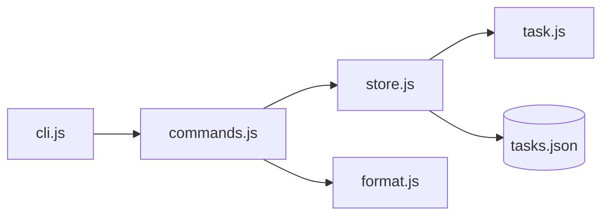

# 39. Capstone: Task Tracker CLI (4–6 hours)

## Intro: why a capstone

Up to this chapter you learned **fragments** of the language: types in lesson 04, closures in 12, Promises in 26. The capstone forces you to **assemble** them into one program that you can show a colleague or put in your portfolio. The analog in the backend track is [fastapi/42-capstone](../fastapi/42-capstone.md): there it's a six-hour API; here — a four-to-six-hour CLI, without frameworks, just Node and your code.

If you get stuck — that's normal. Go back to the lessons in the "When to look" table below rather than copying a ready-made solution from the internet.

**Time estimate:** 4–6 hours of focused work (2–3 sessions of 2 hours).

---

## The task

A console **task tracking** application with persistence to a JSON file. The same "tasks" domain as in the FastAPI capstone, but for now **without HTTP** — just a file database and a CLI.

Later in `nodejs-basic` you'll replace `TaskStore` with an HTTP client to `http://localhost:8090/api/v1/...`; in `react-basic` — with a UI. What matters now: **modules**, **model**, **errors**, **persistence**.

---

## Functional requirements

### The `Task` model

| Field | Type | Rules |
|------|-----|---------|
| `id` | string (uuid or incremental) | unique |
| `title` | string | 1–200 characters, not empty |
| `status` | `"todo"` \| `"done"` | defaults to `todo` |
| `createdAt` | string ISO 8601 | at creation |
| `tags` | string[] | optional, defaults to `[]` |
| `dueDate` | string ISO \| null | optional (extension C) |

### `TaskStore`

- `add(title, options?)` → Task
- `list({ status?, tag?, search? })` → Task[]
- `markDone(id)` → Task
- `remove(id)` → void
- `load()` / `save()` — read/write `data/tasks.json`
- At startup — `load()`; after each mutation — `save()` (or an explicit `flush` — document it)

### The CLI interface

At minimum via arguments:

```bash
node capstone/cli.js add "Buy milk" --tags home,food
node capstone/cli.js list
node capstone/cli.js list --status todo
node capstone/cli.js done <id>
node capstone/cli.js remove <id>
node capstone/cli.js search milk
```

**Alternative:** an interactive menu with `readline` — acceptable if arguments are also supported.

### Output

- `list` — `console.table` or aligned columns: id (short), title, status, tags.
- Success — exit code `0`; a validation error / "task not found" — `1` and a message to **stderr**.

---

## Non-functional requirements

| Requirement | Why |
|------------|-------|
| ES modules, split into files | lessons 30–31 |
| `const`/`let`, no `var` | lesson 02 |
| Validation with `throw` or a custom `ValidationError` | lesson 32 |
| Don't mutate arrays returned from `list()` from outside without a copy | lessons 07–08 |
| `main().catch(...)` and a meaningful exit code | lesson 33 |
| A README in `capstone/` with command examples | for the reviewer |

---

## Target structure

```text
examples/capstone/
├── README.md
├── cli.js                 # entry point, argv parsing
├── data/
│   └── tasks.json         # created on the first save
└── src/
    ├── task.js            # createTask, validate
    ├── store.js           # TaskStore class or factory
    ├── commands.js        # add, list, done, remove, search
    ├── errors.js          # ValidationError, NotFoundError
    ├── parse-args.js      # a simple --tags parser
    └── format.js          # table output, truncate id
```



---

## A step-by-step plan (recommended)

### Session 1 (~2 h): the model and an in-memory store

1. Create `src/task.js`: `createTask(title, { tags })` with validations.
2. `src/store.js`: an array or a `Map` in memory, methods without a file.
3. In `cli.js` temporarily call `add` + `list` from code — check the logic.
4. **Criterion:** an empty title throws a clear error.

**Lessons:** [07-objects](07-objects.md), [21-classes](21-classes.md), [32-error-handling](32-error-handling.md).

### Session 2 (~2 h): persistence and modules

1. `load()`: if there's no file — an empty list; if the JSON is broken — `stderr` + exit 1 (optionally a `.bak` backup).
2. `save()`: `JSON.stringify(data, null, 2)` + `writeFile` from `node:fs/promises`.
3. Split out the imports; `cli.js` is orchestration only.
4. **Criterion:** re-running `node cli.js list` shows the same tasks.

**Lessons:** [30-es-modules](30-es-modules.md), [35-regex-json-date](35-regex-json-date.md).

### Session 3 (~1–2 h): the CLI and polish

1. `parse-args.js`: positional commands + `--status`, `--tags` (split by comma).
2. `commands.js`: one function per command, returns an exit code or throws.
3. `format.js`: a short id in the table (the first 8 characters of the uuid).
4. A README with examples and limitations.

**Lessons:** [16-control-flow](16-control-flow.md), [17-destructuring-spread](17-destructuring-spread.md).

---

## Implementation hints

### Generating an id

```javascript
import { randomUUID } from "node:crypto";
// or incremental: max existing + 1
```

### Parsing `--tags home,food`

```javascript
function parseTags(raw) {
  if (!raw) return [];
  return raw.split(",").map((t) => t.trim()).filter(Boolean);
}
```

### Search

```javascript
function matchesSearch(task, keyword) {
  const k = keyword.toLowerCase();
  return (
    task.title.toLowerCase().includes(k) ||
    task.tags.some((t) => t.toLowerCase().includes(k))
  );
}
```

### Protecting the JSON

```javascript
import { readFile, writeFile, rename } from "node:fs/promises";

async function saveAtomic(path, data) {
  const tmp = `${path}.tmp`;
  await writeFile(tmp, JSON.stringify(data, null, 2), "utf-8");
  await rename(tmp, path);
}
```

---

## Extensions (optional)

| Level | Task | Hours |
|---------|--------|------|
| B | At startup `fetch('http://localhost:8090/health')` — if OK, print "API reachable" | +0.5 |
| C | A `dueDate` field, sort `list` by due date | +1 |
| D | Export `list --format csv` | +1 |
| E | Simple tests: `node --test src/task.test.js` (Node's built-in test runner) | +1 |

The FastAPI stand: [`deploy/fastapi`](../../deploy/fastapi/README.md) — `docker compose up -d --build`.

---

## Success criteria (self-check)

- [ ] `add` → `list` → restart Node → the task is still there
- [ ] `done <id>` changes the status; a repeated `done` — an error or idempotency (describe it in the README)
- [ ] `remove` of a nonexistent id — exit 1, a message to stderr
- [ ] No single 400-line file — modules by responsibility
- [ ] There's a `capstone/README.md` in the repository

---

## Common mistakes

1. **The path to `tasks.json` relative to cwd** — running from another directory breaks the path. Use `import.meta.url` + `fileURLToPath` for a path relative to the module.

2. **Mutating `list()` from outside** — `store.list().push(fake)` corrupts the store. Return a copy `[...tasks]` or `structuredClone`.

3. **Forgetting `await save()`** — the data is only in RAM.

4. **Swallowing errors in the cli** — always `main().catch(e => { console.error(e); process.exit(1); })`.

---

## When to look at lessons

| Problem | Lesson |
|---------|------|
| import/export | 30, 31 |
| async save | 27, 32 |
| Map for storage by id | 34 |
| parse argv | 16, 17 |
| debugging | 36 |

---

## After the capstone

1. Go through [interview-cheatsheet.md](interview-cheatsheet.md) once more.
2. Mark the next course in [javascript-path.md](../javascript-path.md): [**typescript-basic**](../typescript-basic/README.md) (recommended) or **nodejs-basic**.
3. Optionally: publish `capstone/` in a separate GitHub branch — an artifact for your resume.

Congratulations — **javascript-basic** is complete.
