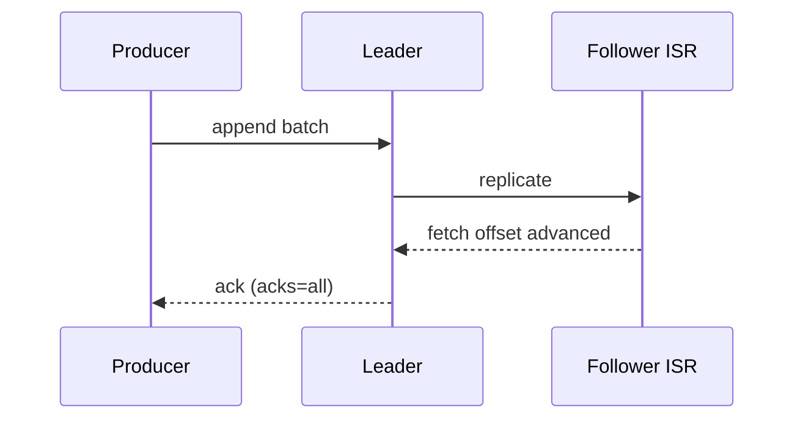

# 01. Broker internals: log, segment, fetch, replication

## Intro: "the disk is full, but retention hasn't expired yet"

On-call: broker `kafka-7` is in **offline replicas**, disk at 98%. Retention per policy is 7 days, but the **segments** aren't closed yet, **compaction** is falling behind, and **replica fetch** can't keep up — ISR shrinks. Without understanding **how Kafka writes to disk** and **how a replica pulls data**, you'll just keep increasing retention "at random". This chapter is the foundation for KRaft, tiered storage, and troubleshooting.

## What you'll learn

- The structure of a **partition log** on disk: directory, segment files, index.
- **Append-only** writes, segment rotation, `log.segment.bytes` / `log.segment.ms`.
- **Zero-copy** `sendfile` on fetch (conceptually).
- **Replication protocol**: high-watermark, LEOS, follower fetch.
- What to watch in **JMX / metrics** (overview).

**Prerequisites:** [`kafka-basic: architecture`](../kafka-basic/02-architecture.md), [`kafka-intermediate`](../kafka-intermediate/README.md) (RF, ISR).

**Sandbox:** [`deploy/kafka`](../../deploy/kafka/README.md) — a single broker for `ls` inside the container; cluster overlay — for describe with replicas.

---

## Partition log on disk

Each partition is a **directory** on the leader broker (and copies on followers):

```text
/var/kafka/data/
  orders-0/
    00000000000000000000.log
    00000000000000000000.index
    00000000000000000000.timeindex
    00000000000000000042.log
    ...
```

| File | Purpose |
|------|------------|
| `*.log` | raw records (batch format) |
| `*.index` | offset → position in `.log` (sparse) |
| `*.timeindex` | timestamp → offset (for time-based retention) |

**Offset** — the logical record number in the partition; physically — the offset within the chain of segments.

On the sandbox (paths may differ in the image):

```bash
docker exec mock-kafka bash -c \
  'find /var/lib/kafka/data -name "*.log" 2>/dev/null | head -5'
```

---

## Append and batch

The producer sends a **RecordBatch** (compression: lz4, zstd, snappy). The broker **does not update** old bytes — only appends to the active segment.

After `log.segment.bytes` or `log.segment.ms`, the segment is **closed** and a new one is opened. A closed segment is safer to delete by retention.

**In the interview:** "Kafka is a commit log, not a queue". Deletion = retention policy or compaction, not an `ACK` from the consumer.

---

## Fetch path

The consumer (or follower) issues a **Fetch request** with an `offset`.

1. The leader finds the segment via the index.
2. Data is served from the page cache (hot topics) → less disk I/O.
3. **Zero-copy**: `sendfile` from kernel to socket (the details depend on SSL — in that case copying does happen).

**Max partition fetch size**, **max poll records** on the consumer side limit the response size — important with "fat messages".

---

## Replication

For partition P on broker B1 (leader):

- Followers B2, B3 send **Fetch** as "special consumers" with the current LEOS.
- **High watermark (HW)** — the offset up to which **all ISR** have replicated (simplified: "safe to serve to the consumer" with `acks=all` and `min.insync.replicas`).
- A record is considered **committed** for a client with `acks=all` after the ISR ack.



**Under-replicated partition (URP):** a follower is lagging or dropped out of ISR — see [15-troubleshooting](15-troubleshooting.md).

---

## Controller (KRaft preview)

The **controller** — a broker (or a dedicated controller in the KRaft quorum) that assigns **leaders** and tracks **ISR**. Metadata events go into the internal topic `__cluster_metadata` (KRaft) or ZK (legacy). Details: [02-kraft](02-kraft.md), [04-zookeeper-legacy](04-zookeeper-legacy.md).

---

## Compaction vs delete retention

| Policy | Behavior |
|--------|-----------|
| `delete` | delete segments older than `retention.ms` / `retention.bytes` |
| `compact` | keep the last value per key (changelog topic) |
| `compact,delete` | both constraints |

A compacted topic (`__consumer_offsets`, configs) — has a different segment lifecycle.

---

## Metrics (what they'll ask about)

| Metric | Meaning |
|---------|--------|
| `BytesInPerSec` / `BytesOutPerSec` | load |
| `UnderReplicatedPartitions` | ISR < RF |
| `OfflinePartitionsCount` | no leader — critical |
| `RequestHandlerAvgIdlePercent` | CPU / disk overload |
| `LogFlushRateAndTimeMs` | fsync pressure |

On the Docker sandbox JMX is often not enabled — in prod look at the Prometheus JMX exporter or managed dashboards (MSK / Confluent).

---

## Common mistakes

| Mistake | Consequence |
|--------|-------------|
| RF=1 in prod | losing a broker = losing a partition |
| Giant messages | consumer OOM, reject `message.max.bytes` |
| Too many partitions | file descriptors, metadata overhead |
| `unclean.leader.election.enable=true` | data loss for the sake of availability |

---

## In production

- **Rack awareness** (`broker.rack`) — spread RF across AZ.
- Separate **disks** (NVMe) for data; don't share with the OS without cgroup/I/O tuning.
- **Compression** on the producer (`zstd`) — less disk and network.
- Limits: `num.network.threads`, `num.io.threads`, `log.dirs` across several mounts.

---

## Summary

Kafka stores a partition as a **chain of segments**, replicates it **as a stream** via follower fetch, and serves the consumer from the **leader** taking HW into account. The controller manages **leader election**. This explains lag, URP, and the choice of `acks` / `min.insync.replicas`.

## Checklist

- [ ] Name the three segment files and their roles.
- [ ] Explain the difference between LEOS and HW in one phrase.
- [ ] Why a follower is a fetch, not a push.
- [ ] When compaction, when delete retention.

**Next:** [02-kraft](02-kraft.md).
