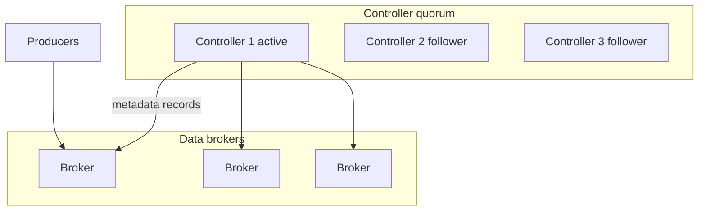

# 02. KRaft: quorum, metadata log, migration from ZooKeeper

## Intro: "removing ZooKeeper by the 4.x release"

A company on Kafka 3.5 with a five-node **ZooKeeper ensemble**. The platform team plans **KRaft** (Kafka Raft): a single metadata cluster, fewer moving parts, faster **partition reassignment**. In the interview they expect: how a **controller quorum** differs from ZK, what the **dual-write** risks are during migration, and what changes in **operations**.

## What you'll learn

- **KRaft** roles: broker + **controller** (combined or dedicated).
- **Metadata log** (`__cluster_metadata`) vs data topics.
- **Quorum voters**, fault tolerance (2N+1 controllers).
- The `process.roles`, `node.id`, `controller.quorum.voters` parameters.
- The ZK → KRaft migration path (overview).

**Sandbox:** default [`deploy/kafka/docker-compose.yml`](../../deploy/kafka/docker-compose.yml) — KRaft single node.

---

## Why ZooKeeper was removed

| ZK mode | KRaft |
|---------|-------|
| Separate ZK ensemble | Metadata in the Kafka quorum |
| Two monitoring stacks | A single cluster |
| Controller bottleneck on the ZK session | Event-driven metadata |
| Operational complexity | Fewer components |

Since Kafka 3.3+ KRaft is **production-ready**; in 4.x ZK is **removed**.

---

## KRaft architecture



- **Active controller** — the leader of the metadata log, publishes **Records** (CreateTopic, PartitionChange, …).
- **Brokers** apply the metadata snapshot + tail log.
- **Combined mode** (training sandbox): one process = `broker,controller`.

Example configuration fragment (illustrative):

```properties
process.roles=broker,controller
node.id=1
controller.quorum.voters=1@kafka:9093
listeners=PLAINTEXT://:9092,CONTROLLER://:9093
advertised.listeners=PLAINTEXT://localhost:9094
controller.listener.names=CONTROLLER
```

---

## Metadata vs data plane

| Plane | Contents |
|-------|------------|
| Metadata | topics, partitions, ISR, configs, ACLs (in newer versions) |
| Data | user records in partition logs |

Previously the controller wrote to **ZooKeeper znodes**; in KRaft — an **append-only metadata log** with a snapshot on disk (`metadata.log`).

**In the interview:** "ZK stored metadata, KRaft stores metadata in a Kafka topic with Raft consensus".

---

## Quorum and fault tolerance

For **K** controller nodes, the loss of **(K-1)/2** (floor) is tolerated.

| Controllers | Tolerates failures |
|-------------|---------------------|
| 1 | 0 (dev only) |
| 3 | 1 |
| 5 | 2 |

In prod — an **odd** number; **3** controllers are often enough; **5** — for large orgs with a strict SLO on metadata.

---

## Broker IDs and cluster UUID

- `node.id` is unique across the cluster.
- When formatting storage: `kafka-storage.sh format -t <cluster-uuid> -c ...`
- Mixing directories from another cluster → **refuse to start**.

---

## ZK → KRaft migration (overview)

The official path (check versions in the docs for your branch):

1. Rolling upgrade of brokers to a version with the **migration tool**.
2. Bring up a **KRaft quorum** in parallel.
3. **Migrate metadata** (a downtime window is planned).
4. Shut down ZK.

Risks: incompatible **ACL format**, old **inter-broker protocol**, rollback is hard. In the interview: "migration is a quarter-long project, not a button".

See [04-zookeeper-legacy](04-zookeeper-legacy.md), [05-lab-zookeeper](05-lab-zookeeper.md).

---

## KRaft and Kubernetes

Strimzi / operators set:

- **Pod names** are stable (`kafka-0`) — analogous to [`StatefulSet`](../kuber-intermediate/01-statefulset.md).
- **PersistentVolume** for `log.dirs`.
- **Rolling update** by ordinal; the controller quorum is a **separate** StatefulSet in dedicated mode.

---

## Common mistakes

| Mistake | Symptom |
|--------|---------|
| Even number of controllers | split-brain risk on partition |
| A single controller in prod | metadata SPOF |
| Loss of `meta.properties` | broker won't start |
| Incorrect `advertised.listeners` | clients see the wrong broker |

---

## In the interview

1. **Why KRaft?** — simplify ops, speed up metadata, remove ZK.
2. **Where is leader election for a partition stored?** — the metadata log, the active controller decides.
3. **Can you have only controllers without brokers?** — a dedicated controller role in large clusters.

---

## Summary

KRaft moves **consensus metadata** inside Kafka. A quorum of controllers + a metadata log replace ZK. The training `deploy/kafka` is already on KRaft — use it as a reference configuration.

**Next:** [03-lab-kraft](03-lab-kraft.md).
