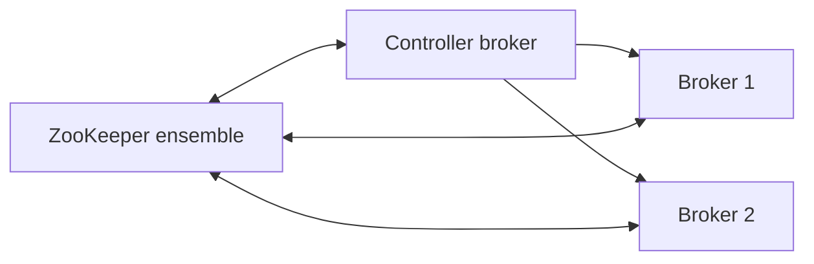

# 04. ZooKeeper mode (legacy): znodes, controller, why know it in 2026

## Intro: "a bank's legacy — Kafka 2.8 on ZK"

New clusters run **KRaft**, but in enterprises **ZK-backed** Kafka 2.x/3.x lives on for years. An engineer needs to read the "ZK session expired" runbook, understand **/controller** election, and not confuse **broker id** with **znode**. This chapter is for interviews and migrations, not for greenfield.

## What you'll learn

- The role of **ZooKeeper** in classic Kafka.
- Key **znodes** (conceptually).
- The **controller** broker and the ZK lock.
- Ops differences: rolling restart, session timeout.
- The connection with [`docker-compose.zk.yml`](../../deploy/kafka/docker-compose.zk.yml).

**On to KRaft:** [02-kraft](02-kraft.md). **Lab:** [05-lab-zookeeper](05-lab-zookeeper.md).

---

## What ZooKeeper did

| Function | In ZK |
|---------|------|
| Broker registration | ephemeral znode `/brokers/ids/N` |
| Topic / partition state | `/brokers/topics/...` |
| Controller election | `/controller` |
| ACLs (older versions) | `/kafka-acl/...` |
| Consumer offsets (before 0.9) | deprecated |

Brokers are **ZK clients**. Loss of the session → the broker is considered dead → **rebalance leaders**.

---

## Controller in ZK mode

1. Brokers compete for the **ephemeral znode** `/controller`.
2. The winner becomes the **active controller**.
3. The controller handles: create/delete topic, partition reassignment, preferred leader election, ISR changes.

**Important:** the controller is **one of the brokers**, with CPU load when there are thousands of partitions.

---

## ZK ensemble sizing

| Nodes | Fault tolerance |
|-------|-----------------|
| 3 | 1 |
| 5 | 2 |

**You can't** use 2 nodes (no quorum). ZK is **not** Kafka — separate disks, JVM heap tuning, not on the same disks as `log.dirs` under heavy load.

---

## Typical incidents

| Symptom | Cause |
|---------|---------|
| `Session expired` | GC pause, network, ZK overload |
| `Broker not registering` | ACL on ZK, wrong `zookeeper.connect` |
| Controller flapping | ZK latency, small session timeout |
| Stale metadata | split-brain is rare with a correct ZK |

Remediation: increase `zookeeper.session.timeout.ms`, stabilize ZK, rolling restart of **ZK observers first**, then brokers (per the vendor's runbook).

---

## KRaft vs ZK (table for the interview)

| Question | ZK | KRaft |
|--------|----|-------|
| Components | Kafka + ZK | Kafka only |
| Metadata storage | znodes | `__cluster_metadata` |
| Ops skill | ZK + Kafka | Kafka |
| Kafka 4.x | no | yes |

---

## Migration

See [02-kraft](02-kraft.md). In the interview: "we plan a window, test on staging, rollback = keep ZK until cutover".

---

## In production (legacy)

- Monitor **ZK latency**, **outstanding requests**.
- A separate **staging** ZK for testing ACLs.
- Document **max partitions** — controller limits.

---

## Summary

ZK mode = metadata and coordination **outside** the log. A controller broker + ephemeral locks. The knowledge is needed for **legacy** and **interviews**; new systems use **KRaft**.

**Next:** [05-lab-zookeeper](05-lab-zookeeper.md).
