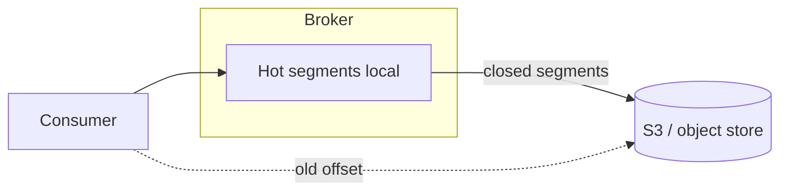

# 06. Tiered storage: remote log, cost, latency trade-offs

## Intro: "7 TB per broker, the CFO is cutting disks"

Retention of 90 days × high ingress → **expensive NVMe** on every broker. **Tiered storage** (KIP-405 and its development in 3.6+) offloads **closed segments** to **object storage** (S3, GCS, Azure Blob), leaving the **hot tail** on the broker. In the interview: how this affects **fetch latency**, **SLA**, and **disaster recovery**.

## What you'll learn

- The **local hot + remote cold** tier model.
- When it pays off / when it doesn't.
- Its impact on **replication** and **fetch**.
- Managed offerings (Confluent, Aiven) vs self-hosted.
- Constraints for **compact** topics.

**Docker lab:** full tiered storage in `deploy/kafka` is usually **not** enabled — this chapter is theoretical + questions in [17-interview-qa](17-interview-qa.md).

---

## The problem

| Factor | Pressure |
|--------|----------|
| Long retention | more disk |
| Replay / audit | reading old data |
| RF=3 | ×3 copies across brokers |

Tiered storage ≠ "replacing Kafka with S3". It's an **extension of the log** with transparent fetch for the consumer (with latency on cold data).

---

## How it works (concept)

1. The active segment is **local** (as today).
2. A closed segment is **offloaded** to remote (async).
3. The segment's metadata knows the **remote reference**.
4. A consumer fetch of an old offset → **read-through** remote (cache optional).



---

## Configuration (illustration)

Parameter names depend on the version; the typical idea:

```properties
remote.storage.enable=true
remote.log.storage.manager.class=...
remote.log.metadata.manager.class=...
rsm.config.storage.bucket=...
```

In **Confluent Platform** / **MSK**, tiered storage can be a **managed toggle** with billing per GB-month.

---

## Trade-offs

| Pro | Con |
|------|-------|
| Less local disk | Latency on historical fetch |
| Long retention is cheaper | Dependency on object store SLA |
| Less rebalance I/O on expand | Troubleshooting complexity |

**Compaction + tiering:** the policies can conflict — check the version's compatibility matrix.

---

## Replication

Followers historically copied **segment bytes**. With tiering, replication may **not pull** cold bytes to every broker — a **leader-only remote copy** model (simplified). In the interview: "less cross-AZ traffic, but a more complex mental model".

---

## Ops checklist

- A lifecycle policy on the bucket (versioning, encryption **SSE-KMS**).
- Monitor the **remote read error rate**, **offload lag**.
- Test **restore**: losing the bucket = losing history.
- **RPO/RTO** for compliance retention.

---

## MSK / Confluent

| Platform | Approach |
|-----------|--------|
| Confluent | Tiered Storage product, S3 integration |
| MSK | check the regional roadmap / MSK Express |
| Self OSS | configuring Remote Log Metadata (advanced ops) |

See [11-managed-kafka](11-managed-kafka.md).

---

## In the interview

1. **Why tiered storage?** — cost + long retention without bloating NVMe.
2. **Consumer lag on old offsets?** — higher latency is possible.
3. **A replacement for backup?** — no, you need a separate DR plan.

---

## Summary

Tiered storage separates the **hot local tail** from **cold remote segments**. It's a financial and capacity tool with a latency trade-off.

**Next:** [07-kafka-streams](07-kafka-streams.md).
