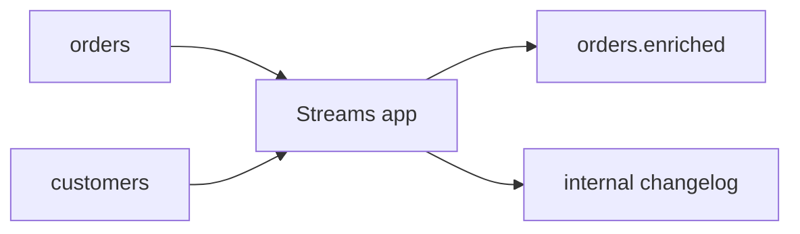

# 07. Kafka Streams: topology, state stores, exactly-once

## Intro: "computing aggregates in a microservice — we ran out of memory"

A team stores **session windows** in the service's JVM memory. A restart means losing state. **Kafka Streams** moves state into **changelog topics** + **RocksDB** locally, and redistribution happens through a **rebalance** of stream threads. In a senior interview: the difference from **consumer + DB**, what a **KTable** vs a **GlobalKTable** is, and **EOS**.

## What you'll learn

- **Stream / table duality**, KStream, KTable, GlobalKTable.
- **Topology**: source → processor → sink.
- **State store**, changelog, standby replicas.
- **Windowing**, grace period, suppression.
- **processing.guarantee=exactly_once_v2** (overview).
- Boundaries: when Streams, when Flink.

**Lab:** [08-lab-streams](08-lab-streams.md).

---

## Mental model

| Abstraction | Analog |
|------------|--------|
| KStream | a stream of events (insert only) |
| KTable | a changelog by key (last value) |
| GlobalKTable | broadcast join — a full copy on each instance |
| State store | local RocksDB + backup topic |

Kafka Streams is a **library** in your JVM process, not a separate cluster (unlike the Flink JobManager).

---

## Topology

```java
StreamsBuilder builder = new StreamsBuilder();
KStream<String, Order> orders = builder.stream("orders");
KTable<String, Customer> customers = builder.table("customers");

orders
  .join(customers, (order, cust) -> enrich(order, cust))
  .to("orders.enriched");
```

Under the hood — a **sub-topology**, **internal topics** (`application-id-repartition`, changelog).



---

## Rebalance and tasks

- A **StreamThread** = one or more **Tasks** (partition assignment).
- Scaling app instances → rebalance of tasks (like a consumer group, but with **state migration**).
- **Standby tasks** — a warm copy of state (config `num.standby.replicas`).

**In the interview:** "why you can't just scale without planning" — restoring from the changelog takes time.

---

## Windowing

| Type | Usage |
|-----|----------------|
| Tumbling | fixed 5-min windows |
| Hopping | overlapping |
| Session | gap-based for user sessions |

**Grace period** — accept late events after the window closes.

---

## Exactly-once (EOS)

`processing.guarantee=exactly_once_v2`:

- a transactional producer;
- consumer read committed;
- **transactional offsets** + idempotent produce.

Requires:

- `transaction.state.log.replication.factor` ≥ 3 in prod;
- a compatible broker version;
- **not** all sinks are transactional (JDBC can be at-least-once + idempotent write).

---

## Streams limitations

| Suitable | Not suitable |
|----------|-------------|
| Event enrichment, aggregations per key | Complex CEP across many rules |
| A light topology in a JVM team | ML pipelines, batch ETL at TB-scale |
| Co-location with Spring | Hard real-time sub-10ms |

Comparison: [09-ksql-flink](09-ksql-flink.md).

---

## Ops

- Monitor **consumer lag** on internal topics.
- **application.id** — changing it = a new consumer group + state.
- **RocksDB** tuning: memory, compaction.
- K8s: **one pod = one instance** or a fixed partition count — be careful with HPA.

---

## Summary

Kafka Streams = **stateful stream processing** with a changelog backup. KTable/GlobalKTable for joins. EOS is possible within a Kafka transaction.

**Next:** [08-lab-streams](08-lab-streams.md).
