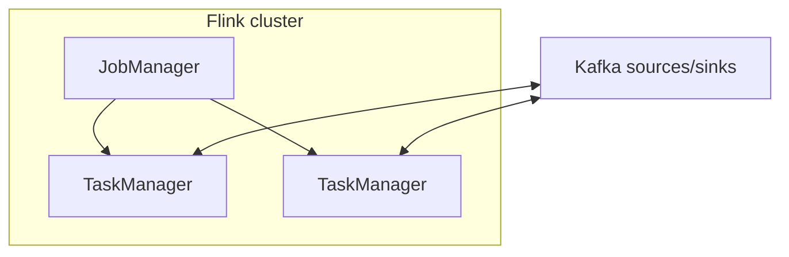

# 09. ksqlDB vs Apache Flink: when to use which in the interview

## Intro: "we need SQL on top of Kafka"

Product wants **ad-hoc queries** over streams. The team is choosing between **ksqlDB** (Confluent), **Flink SQL**, and **Kafka Streams** in Java. The wrong choice → **operational tax** or **latency**. This chapter is comparative theory for system design and interviews.

## What you'll learn

- The positioning of **ksqlDB**, **Flink**, **Kafka Streams**.
- **Push vs pull**, **materialized views**.
- **Event time**, watermarks (Flink).
- Deployment model and state backend.
- Common interview questions.

---

## Comparison table

| Criterion | ksqlDB | Kafka Streams | Apache Flink |
|----------|--------|---------------|--------------|
| API | SQL + streams/tables | Java/Kotlin DSL | DataStream / SQL / Table API |
| Cluster | ksqlDB server cluster | your JVM pods | JobManager + TaskManagers |
| State | RocksDB + Kafka changelog | same | RocksDB / heap + checkpoint to FS/S3 |
| Scale | medium | medium | very large |
| Join window | SQL windows | API | rich CEP |
| Ops | Confluent stack | on you | Flink ops (K8s operator) |
| Latency | ms–s | ms–s | ms (with tuning) |

---

## ksqlDB

- **Stream** = unbounded, **Table** = changelog aggregate.
- **Persistent queries** write to Kafka topics.
- **Pull queries** (point lookup) on a **materialized table** (interactive).
- Tight integration with the **Schema Registry**.

**When:** the team knows SQL, is already on Confluent Platform, dashboards, light aggregations.

**When not:** you need batch over files + a stream union at petabyte scale without Kafka as the hub.

---

## Apache Flink

- A **true stream processor** with **checkpointing** (Chandy-Lamport).
- **Event time**, **watermarks**, **late data** — first-class.
- **CEP**, **iterative** batch, **Flink CDC** connectors.
- State **> the memory of a single broker**.

**When:** high scale, complex windows, mixed batch/stream, an ML feature pipeline.

**When not:** a couple of simple aggregations and no ops capacity for Flink.

---

## Kafka Streams (reminder)

A library **inside** your service — minimal infrastructure, maximal coupling of the release cycle of app + streams version.

---

## Event time vs processing time

| Time | Definition |
|-------|-------------|
| Processing | wall-clock at processing time |
| Event | a field in the payload (`eventTime`) |
| Ingestion | the time of writing into Kafka |

Flink: watermarks `max(eventTime) - skew`. ksqlDB: `TIMESTAMP` + `GRACE PERIOD`. In the interview: "without event time, windows lie under lag".

---

## Delivery semantics

| Engine | Typically |
|--------|---------|
| Flink + Kafka sink | at-least-once or exactly-once (two-phase commit) |
| ksqlDB | depends on the query + sink |
| Streams | EOS v2 in Kafka |

Always: an **idempotent sink** or **dedup** on the write side.

---

## In the interview — reference answers

1. **"SQL over Kafka"** → ksqlDB if the Confluent ecosystem; otherwise Flink SQL.
2. **"Complex joins of 5 streams"** → Flink.
3. **"The logic is already in Spring"** → Kafka Streams embedded.
4. **"A single source of truth — the Kafka log"** → all three; batch from a data lake — Flink reads both Kafka and S3.

---

## Relation to the course

- Connect pipeline: [`kafka-intermediate`](../kafka-intermediate/README.md).
- Multi-DC: [10-multi-dc](10-multi-dc.md).
- DLQ: [21-poison-dlq-replay](21-poison-dlq-replay.md).

---

## Summary

ksqlDB is a **SQL product** on Kafka. Streams is a **library**. Flink is **distributed compute** for heavy scenarios. The choice = scale + ops + skill matrix.

**Next:** [10-multi-dc](10-multi-dc.md).
