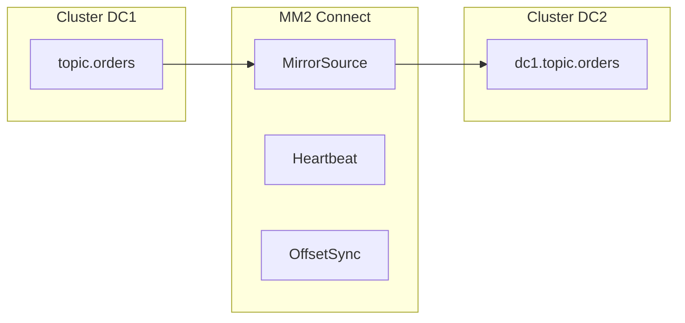

# 10. Multi-DC: MirrorMaker 2, active-active, ordering traps

## Intro: "two regions, one product catalog"

EU and US Kafka clusters. The product team wants **active-active**: write locally, read globally. A week later — **duplicates**, **reordered** SKU versions, conflict resolution in the DB. Multi-DC Kafka isn't "turn on replication", it's a **product model** + **MM2**.

## What you'll learn

- **MirrorMaker 2** (MM2): topology, flows, offset sync.
- **Active-passive** vs **active-active**.
- Loss of **global order**, **circular replication**.
- **Heartbeats** and **offset translation** for consumer failover.
- Alternatives: Cluster Linking (Confluent), MSK Replicator.

---

## Why a separate cluster per region

| Reason | Comment |
|---------|-------------|
| Produce latency | write to the local DC |
| Regulatory | data does not leave the region |
| Blast radius | an AZ failure doesn't kill everyone |
| DR | a second warm cluster |

**There is no shared partition log between clusters** — only asynchronous replication.

---

## MirrorMaker 2 architecture

MM2 = Kafka Connect **source/sink** + the internal MM2 framework.

| Flow | Purpose |
|-------|------------|
| `MirrorSourceConnector` | copies records into `alias.topic` |
| `MirrorCheckpointConnector` | sync of consumer offsets |
| `MirrorHeartbeatConnector` | lag monitoring, failover hints |

**Topic naming:** `sourceCluster.topic` — avoid name collisions.

---

## Active-passive (DR)

- The primary DC accepts **writes**.
- The secondary — a read-only replica via MM2.
- Failover: promote the secondary, switch DNS / bootstrap, **consumer offset** via synced offsets.

**RPO** = replication lag. **RTO** = runbook + automation.

---

## Active-active

Two MM2 directions:

- `DC1 → DC2` and `DC2 → DC1`.
- Risk of an **infinite loop** — MM2 filters `heartbeats` and `replication flows`.

**Ordering problem:** events for the same `productId` in DC1 and DC2 — end up in **different order** in the target topics.

**Application-level solutions:**

- **version** / **vector clock** in the payload;
- **last-write-wins** with caution;
- **single writer per entity** (shard by region);
- **CRDT** for rare domains.

---

## Offset translation

A consumer in DC2 reads `dc1.orders`. On failover to DC1, an **offset mapping** is needed — the MM2 `OffsetSync` topic stores tuples (group, partition, offset).

In the interview: "consumer failover between clusters is non-trivial, it needs tooling".

---

## Conflict with compaction

A compacted topic with MM2 — **tombstones** and the compaction order may differ. Test on staging.

---

## Confluent Cluster Linking / MSK

| Solution | Feature |
|---------|-------------|
| Cluster Linking | managed, bi-directional, policy |
| MSK Replicator | managed MM2-like |
| Self MM2 | flexibility, you operate Connect |

---

## Design review checklist

- [ ] Who is the **source of truth** for the entity?
- [ ] Is **global order** needed (most likely not)?
- [ ] Schema Registry **per DC** or central?
- [ ] **ACL** and TLS between DCs
- [ ] Monitoring of **replication latency**

---

## In the interview

**Question:** "make Kafka a stretch cluster across two regions" — a **red flag**: FSYNC latency, a single cluster across two DCs is not recommended. The right answer: **two clusters + MM2**.

---

## Summary

Multi-DC = an **asynchronous copy** + application-level idempotency. MM2 is the OSS standard. Active-active requires a **conflict strategy**.

**Next:** [11-managed-kafka](11-managed-kafka.md).
