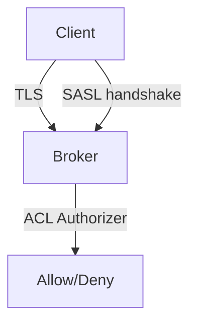

# 13. Security advanced: SASL, mTLS, ACL, audit

## Intro: "a test producer ended up in the prod payments topic"

One **shared API key** for all services, ACLs not configured, plaintext 9092 in staging "temporarily". A pen-test finds a **produce** into `payments.settled`. Advanced security = **defense in depth**: transport, authN, authZ, audit.

## What you'll learn

- **Listeners** and `security.protocol.map`.
- **SASL** (SCRAM, OAUTHBEARER) and **mTLS**.
- **ACL**: principal, operation, resource, deny.
- **Super users** and least privilege.
- Audit logs (authorizer).

**Lab:** [14-lab-acl-deny](14-lab-acl-deny.md).

---

## Layers



| Layer | Mechanism |
|------|----------|
| Wire | SSL/TLS |
| Identity | SASL or mutual TLS CN |
| Authorization | Kafka ACL or RBAC (Confluent) |
| Audit | authorizer logs |

---

## Listeners (example)

```properties
listeners=SASL_SSL://0.0.0.0:9093,INTERNAL://0.0.0.0:9092
listener.security.protocol.map=SASL_SSL:SASL_SSL,INTERNAL:PLAINTEXT
advertised.listeners=SASL_SSL://broker1.example.com:9093
sasl.enabled.mechanisms=SCRAM-SHA-512
ssl.client.auth=required
```

**INTERNAL** plaintext — only if the network is **isolated** (mesh mTLS sidecar pattern).

---

## SASL/SCRAM

- Users via `kafka-configs.sh --alter --add-config SCRAM-SHA-512=...`.
- Passwords in **Vault**, with rotation.
- MSK: **IAM** auth for Java clients without a SCRAM password in the app.

---

## mTLS

- Client cert CN = the **Kafka principal** `User:CN=payments-producer`.
- A CA rotation plan.
- Heavier ops, stronger identity than SCRAM alone.

---

## ACL model

Resource: **Topic**, **Group**, **Cluster**, **TransactionalId**.

Operations: **Read**, **Write**, **Create**, **Describe**, **Delete**, **Alter**, …

```text
Principal: User:payments-svc
Operation: Write
Resource: Topic:payments.events
Host: *
```

**Deny** beats allow (explicit deny for break-glass).

**Default in KRaft:** `allow.everyone.if.no.acl.found=false` (a closed cluster).

---

## Super users

```properties
super.users=User:admin;User:CN=admin
```

They bypass ACLs — keep the number of people minimal, break-glass audit.

---

## RBAC (Confluent)

| OSS ACL | Confluent RBAC |
|---------|----------------|
| per-resource Kafka ACL | Role bindings, SR, Connect |
| kafka-acls.sh | Confluent IAM |

In an interview at a Confluent shop — mention RBAC.

---

## Audit

`authorizer.logger` → SIEM. Look for **Denied** spikes after a deploy.

---

## Client checklist

- [ ] A separate principal per service
- [ ] Only the needed topics (prefix)
- [ ] `acks=all` does not replace ACL
- [ ] Registry ACL separately

---

## Summary

Prod Kafka: **TLS + SASL/mTLS + ACL deny-by-default + audit**. The training `deploy/kafka` is PLAINTEXT; lab 14 is a concept of ACL on a single node if the authorizer is enabled, otherwise tabletop.

**Next:** [14-lab-acl-deny](14-lab-acl-deny.md).
