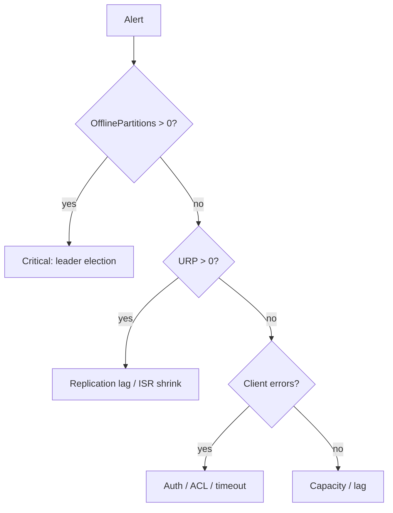

# 15. Troubleshooting: URP, offline partitions, controller, disk

## Intro: "the UnderReplicatedPartitions alert = 47"

PagerDuty at 03:00. Grafana: **URP**, **OfflinePartitionsCount** 0, but **RequestHandlerAvgIdlePercent** is low. Without a decision tree it's easy to **restart everything** and waste time. This chapter is a runbook mindset for a senior / on-call interview.

## What you'll learn

- **Under-replicated partition (URP)** — causes and remediation.
- **Offline partition** — no leader.
- **Controller** issues.
- **Disk**, **network**, **GC**.
- **Consumer** vs **broker** problems (separating them).

**Lab:** [16-lab-urp-recovery](16-lab-urp-recovery.md).

---

## Triage tree



---

## Under-replicated partitions

**Definition:** a follower is not in ISR or lags beyond `replica.lag.time.max.ms`.

| Cause | Action |
|---------|----------|
| Broker down | restore broker, check logs |
| Slow disk on follower | replace disk, move leader |
| Network partition | fix switch/AZ, rack awareness |
| One huge message | increase limits or fix producer |
| Reassignment in progress | wait, monitor `kafka-reassign-partitions` |

Commands:

```bash
kafka-topics.sh --describe --under-replicated-partitions
kafka-topics.sh --describe --unavailable-partitions
```

---

## Offline partitions

No **active leader** — producers/consumers fail.

| Cause | Action |
|---------|----------|
| All replicas offline | bring up brokers with log.dirs |
| Unclean election disabled + lost ISR | **data loss risk** — executive decision |
| ZooKeeper session (legacy) | fix ZK first |

**Never** enable `unclean.leader.election.enable` without understanding the data loss.

---

## Controller problems

- A flapping controller → metadata instability.
- Symptom: constant leader movement.
- Check: controller logs, ZK latency (legacy), KRaft quorum health.

```bash
kafka-metadata.sh --snapshot ...   # KRaft advanced
kafka-cluster.sh describe
```

---

## Disk full

1. Expand the volume or add `log.dirs`.
2. Reduce retention **temporarily** (topic config).
3. Delete topics (if policy allows).
4. A **log segment** is stuck — check compaction.

---

## Broker overload

| Metric | Interpretation |
|---------|----------------|
| Request queue time | need more threads / brokers |
| Network processor idle low | too many connections |
| Produce latency p99 | acks=all + slow followers |

---

## Not the broker: consumer lag

- Scale consumers ≤ partitions.
- Optimize processing.
- **Rebalance storm** — static membership, cooperative assignor.

See [`kafka-basic: failures`](../kafka-basic/14-failures.md).

---

## Log analysis snippets

Look for in the broker log:

- `ERROR Error while reading or writing to ...`
- `WARN [ReplicaFetcher ...]`
- `INFO [Controller ...]`

---

## Post-incident

- Timeline, blast radius.
- **min.insync.replicas** adequacy.
- Runbook update: [16-lab-urp-recovery](16-lab-urp-recovery.md).

---

## Summary

URP is more often **capacity/replication**, offline is a **leader crisis**. Separate broker vs client. Document the unclean election policy in advance.

**Next:** [16-lab-urp-recovery](16-lab-urp-recovery.md).
