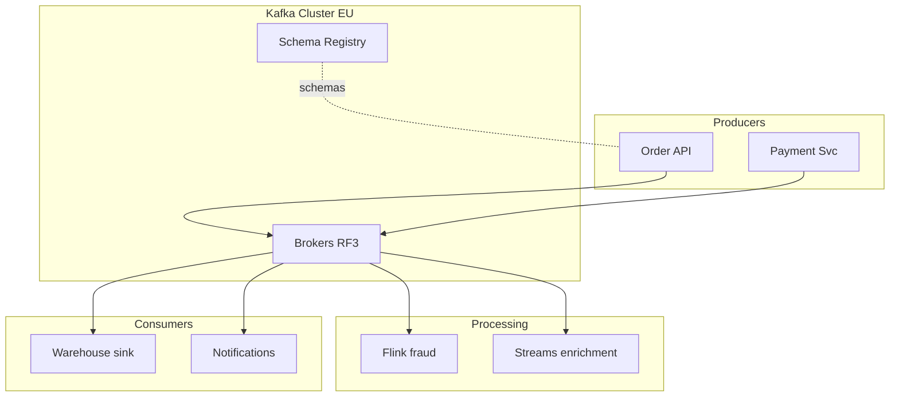

# 19. System design: event backbone in the interview

## Intro

A senior-level task: **"Design an event platform for e-commerce, 100k orders/day, x10 spikes"**. The interviewer evaluates not "installed Kafka", but **trade-offs**, **failure modes**, **evolution**.

## Answer framework (45 min)

1. **Requirements** (5 min) — functional, NFR, constraints.
2. **Estimates** (5 min) — RPS, payload, retention storage.
3. **API & data model** (5 min) — topics, keys, schemas.
4. **High-level** (10 min) — a diagram of producers, cluster, consumers.
5. **Deep dives** (15 min) — ordering, DR, security, ops.
6. **Bottlenecks** (5 min) — hot keys, ops burden.

---

## Clarifying questions (template)

- How many **downstream** teams and SLAs?
- **Ordering** per order / per customer / none?
- **Retention** legal vs technical?
- **Multi-region** write or read replica?
- **Cloud** and managed vs self?
- Are **duplicate** events acceptable?

---

## Back-of-envelope

Example:

| Parameter | Value |
|----------|----------|
| Orders/day | 100k |
| Events per order | 5 |
| Events/day | 500k |
| Avg RPS | ~6 |
| Peak x10 | ~60 RPS |
| Avg payload | 2 KB |
| Ingress peak | ~120 KB/s (easy for Kafka) |

Even ×1000 for hypergrowth — Kafka is often not the first bottleneck; **consumers** and the **DB** are.

**Storage (rough):**

```text
500k events × 2 KB × 30 days × RF3 ≈ 90 GB/day raw × retention ...
```

Account for compression (zstd ~3-5×).

---

## Topic design

| Topic | Key | Partitions | Retention |
|-------|-----|------------|-----------|
| `orders.events` | orderId | 24–48 | 14d |
| `payments.events` | paymentId | 24 | 90d (compliance) |
| `catalog.changes` | productId | 12 | compacted |

**Not** one giant "everything" topic — different retention and ACL.

---

## Reference architecture



---

## Non-functional

| NFR | Solution |
|-----|---------|
| Durability | `acks=all`, `min.insync.replicas=2`, RF=3 |
| Availability | Multi-AZ brokers, rack awareness |
| Latency p99 produce | batch.size, linger.ms tuning |
| Security | mTLS + ACL per service |
| Observability | lag, URP, bytes in/out |

---

## Multi-region (if asked)

Active-passive: primary EU, MM2 → EU-DR. **Not** dual-write without a conflict model ([10](10-multi-dc.md)).

---

## Anti-patterns (name them yourself)

- A single consumer group for everything.
- JSON without a schema in prod.
- RF=1 "just for dev" in prod.
- Giant messages with a PDF inside.
- "We'll do idempotency later".

---

## Evolution

- Phase 1: single cluster, Schema Registry.
- Phase 2: Connect to the DWH.
- Phase 3: tiered storage / a second region.
- Phase 4: governance (data mesh contracts).

---

## Related courses

- Deploy: [`deploy/kafka`](../../deploy/kafka/README.md)
- K8s: [`kuber-intermediate: StatefulSet`](../kuber-intermediate/01-statefulset.md)
- Poison/DLQ: [21](21-poison-dlq-replay.md)

**Next:** [20-lab-system-design](20-lab-system-design.md).
