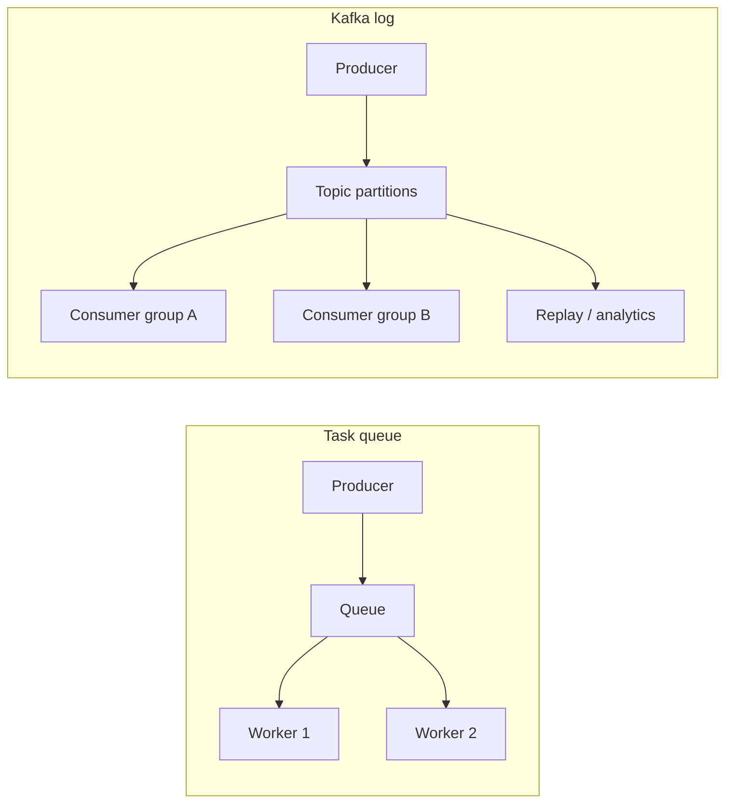

# 01. Why Kafka: log, queue, and database

## Intro: “the queue is overflowing” and orders are lost

The **Checkout** microservice puts an order into RabbitMQ, **Billing** charges money, **Warehouse** reserves stock. At Black Friday peak the queue grows, messages are **deleted by TTL**, and analytics wants to recalculate yesterday’s revenue — but history is already gone. Another team uses **PostgreSQL** as a “bus”: an `outbox` table, three services reading the same rows — locks, migrations, load on OLTP.

**Apache Kafka** is not “just another queue”. It is a **distributed commit log**: events are **appended** to a topic and **retained** (per retention policy). Many consumers read **independently**, at different speeds, from different offsets. This chapter is the mental model before broker and partition.

## What you'll learn

- How an **event log** differs from a **task queue** and from an **OLTP DB**.
- When Kafka fits, and when RabbitMQ, SQS, or Postgres does.
- Basic terms: **event**, **broker**, **topic**, **consumer group**.
- Phrasing for **interview** questions.

## Three message-storage models

| Model | Metaphor | Who reads | History | Typical use case |
|-------|----------|-----------|---------|------------------|
| **Task queue** | Inbox: take it — gone for others | One worker per message | Usually none (ACK + delete) | Background job, email |
| **Pub/Sub (fan-out)** | Newspaper: all subscribers see the issue | Many subscribers for **one** message | Depends on broker | Notifications, websockets |
| **Commit log (Kafka)** | News feed with bookmarks | Many **independent** readers, each with its own offset | Yes, per retention | Event sourcing, streaming, integration |

Kafka is closer to a **feed with bookmarks** than to a mailbox with one recipient.



## Queue vs log — using an order

**Queue (RabbitMQ, SQS):**

- Message `order.created` processed by **Billing** → for the queue the task is done (ACK).
- **Analytics**, connecting later, **won’t see** that message unless there was a separate copy.

**Kafka:**

- Event is **append**ed to topic `orders.events` with an offset, e.g. `42`.
- **Billing** (consumer group `billing`) reads and commits the offset.
- **Analytics** (group `analytics`) reads **from the beginning** or from the needed offset — the **same** record in the log.
- **Warehouse** can lag by hours — the log waits (until retention expires).

## Why not “just a database”

PostgreSQL is great at storing **current state** (`orders` WHERE id=…). Kafka stores a **stream of changes** (what happened and when). Mixing roles is risky:

| | OLTP (Postgres) | Kafka |
|---|-----------------|-------|
| Query | `SELECT` by key | reading a **stream** by partition |
| Update | `UPDATE` a row | **append only** (immutable log) |
| Transactions | ACID on a row | idempotent consumer + exactly-once — separate topic |
| History volume | expensive to keep for years | segments on disk, retention |

In practice: **Kafka is transport and an event buffer**, **the DB is the source of truth** for reads by id.

## Key Kafka properties (simplified)

- **Write scaling:** a topic is split into **partitions** — parallel writers/readers.
- **Ordering:** within **one partition** order is guaranteed; across partitions — not.
- **Long retention:** days/weeks/years (**retention** policy).
- **Consumer groups:** horizontal read scaling; one partition — one consumer in the group.

Details — in [02. Architecture](02-architecture.md).

## On the stand: first touch

Bring up [`deploy/kafka`](../../deploy/kafka/README.md):

```bash
cd deploy/kafka
docker compose up -d
docker compose ps
```

From the host (if **kcat** is installed):

```bash
kcat -b localhost:9094 -L
```

Inside the container:

```bash
docker exec mock-kafka /opt/kafka/bin/kafka-topics.sh \
  --bootstrap-server localhost:9092 --list
```

An empty list on a fresh stand is normal. Topics appear in the labs.

## Common mistakes

| Thinking mistake | Why it’s bad | How to do it right |
|------------------|--------------|--------------------|
| “Kafka = queue, one message — once” | confused with competing consumers in a queue | in a group a partition is assigned to one consumer; **another group** reads again |
| “Put everything in Kafka instead of a DB” | no convenient ad-hoc queries | events in Kafka, **state** in DB/cache |
| “More partitions is always better” | overhead, idle consumers | as many partitions as you need for parallelism |
| “Deleted the consumer — messages gone” | confused with a queue | data stays in the topic until **retention** |

## In production

Kafka is the **central bus** in event-driven architectures: orders, payments, app logs, CDC from Debezium. Almost always nearby: **Schema Registry**, **Kafka Connect**, **lag** monitoring, alerts on **under-replicated partitions** (intermediate/advanced).

Neighboring systems don’t disappear: **SQS** for simple fan-out in AWS, **RabbitMQ** for routing and RPC-style ([rabbitmq-basic](../rabbitmq-basic/README.md)), **Redis Streams** for light cases — more in [redis-basic](../redis-basic/README.md) and the comparison [redis-basic/16](../redis-basic/16-vs-memcached-kafka.md).

## Interview notes

- **Kafka is a distributed commit log**, not a classic message queue.
- **Consumer group** = read scaling + partition balancing.
- **Offset** = reader position in a partition.
- **At-least-once** by default when committing after processing; **exactly-once** — transactions/producer id (intermediate).
- Comparison with RabbitMQ/SQS — [18. Kafka vs queues](18-vs-queues.md).

## Summary

Kafka solves **long-lived event streams** with many subscribers and replay. A queue — **deliver a task to one worker**. A DB — **store current state**. Tool choice starts with: do you need **history** and **independent** reads by multiple systems?

## Checklist

- How does a log differ from a queue with ACK?
- Why should analytics read the same topic as billing?
- Why doesn’t Kafka replace PostgreSQL for `SELECT by id`?
- What is a consumer group in one sentence?

Next lesson: [02. Architecture](02-architecture.md).
