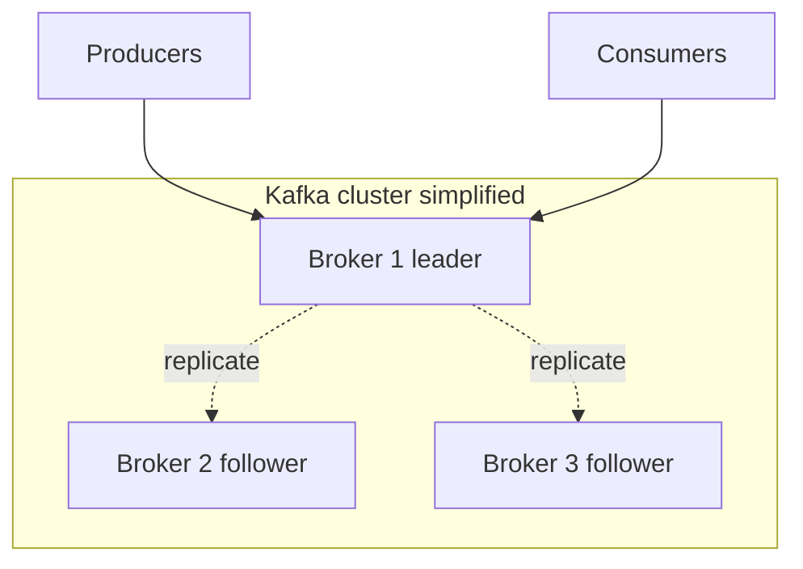

# 02. Architecture: broker, topic, partition, offset

## Intro: “messages arrived out of order”

Two events for one order: `order.created`, then `order.paid`. **Inventory** sees payment before creation — a bug in the code? Not always. If events landed in **different partitions**, there is no global order. If both are in **one partition** with the same **key** (`orderId`) — order is preserved. Kafka architecture = understanding **where** a record is stored and **who** owns it.

## What you'll learn

- Roles of **broker**, **controller** (KRaft), **topic**, **partition**, **replica**.
- What **offset**, **leader**, **ISR** are (preview).
- How **key** affects partition.
- How to read `kafka-topics.sh --describe` output.

## Broker and cluster

A **broker** is a Kafka process that accepts produce/consume and stores data on disk. On the training stand [`deploy/kafka`](../../deploy/kafka/README.md) — **one** broker `mock-kafka` (**KRaft** mode, no ZooKeeper).

From the host: `localhost:9094`. Inside the Docker network: `kafka:9092`.

In production — **several** brokers; losing one should not lose data when **replication factor** > 1 (intermediate course).



## Topic and partition

A **topic** is a named stream of records (like a log “table”).

A **partition** is an ordered immutable sequence of records. A topic = a **set of partitions**.

| Concept | Analogy |
|---------|---------|
| Topic | Book |
| Partition | Chapter (order within the chapter) |
| Offset | Paragraph number in the chapter (0, 1, 2, …) |
| Key | Bookmark “all paragraphs about order X — in one chapter” |

A record in a topic always lands in **one** partition (by key or round-robin).

## Offset

An **offset** is a monotonic record id **within a partition** (not global across the topic).

The consumer stores the offset in **`__consumer_offsets`** (internal topic) on **commit**.

- `earliest` — read from the start of the log (while not deleted by retention).
- `latest` — only new records after subscription.

## Leader and replicas (preview)

Each partition in the cluster has a **leader** — the broker written to and read from by default.

**Follower** replicas copy data. The set of synchronous replicas is **ISR** (in-sync replicas). If the leader fails — a new one is elected from the ISR.

On a **single-broker** stand RF=1: leader and the only copy on one node — enough for learning, not for prod.

## Producer: where the record goes

1. If a **key** is set → `hash(key) % numPartitions` (stable: one key → one partition).
2. If no key → round-robin / sticky partition (depends on client version).

**Why key:** all events for one `orderId` — in one order in one partition.

## Consumer group

A **consumer group** is a logical name (`group.id`). Kafka assigns each partition to **at most one** consumer in the group.

| Consumers in group | Partitions | Behavior |
|--------------------|------------|----------|
| 1 | 3 | one consumer reads all 3 |
| 3 | 3 | one partition per consumer |
| 5 | 3 | two sit idle |

**Different groups** read the **same** data independently (different offsets).

## On the stand: describe topic

```bash
docker exec mock-kafka /opt/kafka/bin/kafka-topics.sh \
  --bootstrap-server localhost:9092 \
  --create --topic arch-demo --partitions 3 --replication-factor 1

docker exec mock-kafka /opt/kafka/bin/kafka-topics.sh \
  --bootstrap-server localhost:9092 \
  --describe --topic arch-demo
```

Sample output fragment:

```text
Topic: arch-demo  PartitionCount: 3  ReplicationFactor: 1
  Topic: arch-demo  Partition: 0  Leader: 1  Replicas: 1  Isr: 1
  Topic: arch-demo  Partition: 1  Leader: 1  Replicas: 1  Isr: 1
  Topic: arch-demo  Partition: 2  Leader: 1  Replicas: 1  Isr: 1
```

`Leader: 1` — broker id (on one node always 1).

Delete after the experiment:

```bash
docker exec mock-kafka /opt/kafka/bin/kafka-topics.sh \
  --bootstrap-server localhost:9092 --delete --topic arch-demo
```

## Common mistakes

| Symptom | Cause | Solution |
|---------|-------|----------|
| Events for one order out of order | different keys or no key | one key = `orderId` |
| Consumer “doesn’t see” old msg | `auto.offset.reset=latest` | `earliest` or reset offsets |
| 5 consumers, throughput doesn’t grow | 3 partitions | increase partitions (carefully) |
| NotLeaderForPartitionException | stale metadata | retry; check describe |

## In production

- Naming: `domain.entity.action` (`orders.events`, `payments.commands`).
- Partition count is planned **ahead** (increase possible, decrease — not).
- Monitoring: **bytes in/out**, **request rate**, **offline partitions**, **URP**.
- Kafka UI / AKHQ / Confluent Control Center — map of topics and lag.

## Summary

A **topic** logically groups a stream; a **partition** is the unit of parallelism and order. An **offset** is the reader’s position. A **key** ties related events to one partition. A **consumer group** scales reads within the partition count.

## Checklist

- How many partitions does topic `orders` have with 6 consumers in one group — how many consumers actively read?
- Is order guaranteed between partition 0 and 1?
- Where is the consumer’s “bookmark” stored?
- What does `Leader` show in `--describe`?

Next lesson: [03. Lab: first topic](03-lab-first-topic.md).
