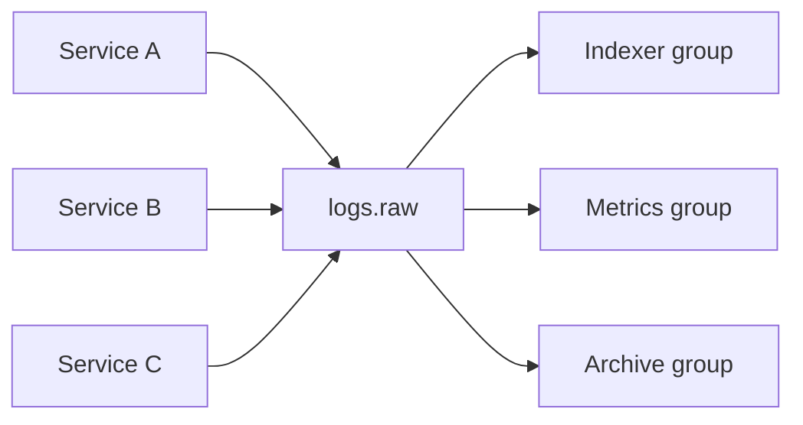

# 12. Patterns: event notification and log aggregation

## Intro: “one service — ten subscribers”

**Order** created an order. Need to: deduct loyalty points, send email, update the read model, put a row in the **data lake**. Point-to-point HTTP from Order to every service — a fragile web. Kafka gives two common patterns: **event notification** (loose coupling) and **log aggregation** (central log/metrics feed).

## What you'll learn

- **Event notification** vs **event-carried state transfer**.
- **Log aggregation** and fan-out via consumer groups.
- **Pipeline** topic → processing → another topic (preview of lab 13).
- Anti-patterns: **big broker-as-DB**, chatty topics.

## Event notification

Producer writes a **thin** event:

```json
{ "eventType": "order.created", "orderId": "ord-10042" }
```

The consumer **itself** pulls details from API/DB by `orderId`.

| Pro | Con |
|-----|-----|
| small messages | N+1 requests, load on source |
| loose schema coupling | consumer depends on API availability |

Fits when details are large and change often.

## Event-carried state transfer

The event carries **all fields** the consumer needs (like [`order-created.json`](examples/events/order-created.json)):

| Pro | Con |
|-----|-----|
| autonomous consumer | large messages, data duplication |
| easier replay | schema evolution harder |

Fits **integration** and **analytics** without sync calls.

## Log aggregation

Many sources → one (or a hierarchy of) topic(s):

```text
app-logs-{service}  →  aggregate.raw  →  Flink/Logstash  →  OpenSearch
```

Kafka handles **high ingress**; consumer groups scale processing.



Three groups — **three independent** progresses on one feed.

## Pipeline (stream processing lite)

```text
orders.events  →  [Enricher]  →  orders.enriched  →  [Analytics]
```

Enricher — a regular consumer + producer (or Kafka Streams / Flink in advanced).

Rules:

- **Idempotency** at every step.
- Separate topics for **raw** and **enriched** streams.
- Poison message → **DLQ** `orders.events.dlq`.

## CQRS / read models (overview)

Command side writes to the DB and **publishes** an event; query side (consumer) builds a **projection** in OpenSearch/Redis.

Kafka is transport; the **source of truth** often stays in OLTP. Log indexing and search — [opensearch-basic](../opensearch-basic/README.md) ([`deploy/opensearch`](../../deploy/opensearch/README.md)).

## On the stand: two consumers — one feed

```bash
docker exec mock-kafka /opt/kafka/bin/kafka-topics.sh \
  --bootstrap-server localhost:9092 \
  --create --topic notifications.orders \
  --partitions 3 --replication-factor 1 --if-not-exists

echo '{"eventType":"order.created","orderId":"ord-99"}' | \
  docker exec -i mock-kafka /opt/kafka/bin/kafka-console-producer.sh \
  --bootstrap-server localhost:9092 --topic notifications.orders
```

Groups `email-sender` and `loyalty` — both read the same message (different `--group`).

## Common mistakes

| Anti-pattern | Why it’s bad |
|--------------|--------------|
| Kafka as the only DB | no flexible queries, hard transactions |
| One topic for everything | no retention/ACL isolation |
| Sync request-reply via Kafka without correlation id | confusion with queues |
| “Microtopic” per field | operational hell |
| Ignoring key order | race in inventory |

## In production

- **Outbox pattern**: Postgres transaction + outbox row → Connect/Debezium → Kafka.
- **Saga** / orchestration — separate topics for commands and replies.
- Observability: **OpenTelemetry** → Kafka → backend.
- **Bounded context** boundaries = topic boundaries.

## Summary

**Event notification** — a signal; **event-carried** — data in the message. **Log aggregation** — many writers, many readers via groups. Pipeline links topics; contracts and idempotency are required.

## Checklist

- When to choose a thin event vs full payload?
- How many consumer groups for email + warehouse + metrics?
- Why a separate `*.dlq` topic?
- How does a pipeline differ from simple pub/sub?

Next lesson: [13. Lab: mini pipeline](13-lab-pipeline.md).
