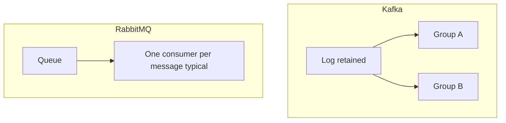

# 18. Kafka vs RabbitMQ vs SQS (interview)

> **Full track:** [messaging-deep](../messaging-deep/README.md) — Redis Streams, EventBridge, outbox, DLQ, system design.

## Intro: “why not Rabbit — it’s simpler?”

On a system design interview you’re asked to pick a **broker** for orders, notifications, or ETL. Answering “Kafka everywhere” fails. Answering “Rabbit is simpler” without context fails too. You need a **trade-off matrix** for the scenario: task queue, fan-out, replay, AWS cloud.

## What you'll learn

- Comparison of **data model** and **delivery guarantees**.
- When **RabbitMQ**, when **SQS**, when **Kafka**.
- Typical interview questions and answer phrasing.

## Summary table

| Criterion | **Apache Kafka** | **RabbitMQ** | **Amazon SQS** |
|-----------|------------------|--------------|----------------|
| Model | Commit **log** | **Queue** + exchanges | Managed **queue** |
| History / replay | yes (retention) | usually no | no (14 days max in FIFO/std) |
| Many subscribers per event | yes (different groups) | fan-out via exchanges | several consumers **share** a queue |
| Order | within a partition | within one queue | FIFO queue — yes |
| Throughput scale | very high | medium/high | high (managed) |
| Operations | own cluster | own cluster | serverless AWS |
| Semantics | at-least-once (+ EOS) | ack + nack, DLX | at-least-once, visibility timeout |
| Typical use case | event streaming, CDC | tasks, RPC-style, routing | decouple in AWS, Lambda |

## Kafka — when yes

- Need **replay** and **several** independent consumers (billing + analytics + search).
- High event **volume**, retention of **days/weeks**.
- **Stream processing** (Flink, Streams).
- **Log aggregation** (microservices → central feed).

## Kafka — when no

- Simple **task queue** with delete after processing.
- Team **without** ops expertise (small product) — SQS is simpler.
- Strict **request-reply** with timeout on one message — Rabbit/HTTP is often easier.

## RabbitMQ — when yes

- Complex **routing** (topic/direct headers exchanges).
- **Priority queue**, TTL per message, **dead letter exchange**.
- Medium throughput, mature AMQP team.
- **RPC** pattern (reply-to queue).

## RabbitMQ — when no

- Need **long history** for new consumers.
- Peak throughput of **millions/sec** on one logical stream without sharding.

## Amazon SQS — when yes

- Already **in AWS**, need managed, pay-per-use.
- Lambda **triggers**, simple worker pool.
- No need for replay; **visibility timeout** semantics are fine.

## Amazon SQS — limits

- No “read from the start of the month” for a new service.
- **Standard** — best-effort ordering; **FIFO** — 300 msg/s limit without batching.
- Long processing — extend visibility or DLQ.

## Interview Q&A pairs

**Q: Is Kafka a message queue?**  
A: No, it’s a **distributed log**; the consumer stores an **offset**, messages are not deleted on read.

**Q: How do you scale consumption in Kafka?**  
A: Increase **partitions** and consumers in **one group** (up to the partition count).

**Q: Kafka vs SQS for orders in AWS?**  
A: If you need replay, several subscribers on full history, Flink integration — **Kafka** (MSK). If one worker pool and simplicity — **SQS**.

**Q: Duplicates?**  
A: Kafka at-least-once + idempotent consumer; SQS — **exactly-once** is not guaranteed; visibility timeout can return a message.

## On the stand

Kafka is already up for you ([`deploy/kafka`](../../deploy/kafka/README.md)). Rabbit/SQS aren’t in basic — it’s enough to **state** which service would send an order to SQS Standard vs topic `orders.events`.

## Common interview mistakes

| Bad answer | Better |
|------------|--------|
| “Kafka is always better” | criteria: replay, throughput, ops |
| “SQS doesn’t scale” | it scales; no log semantics |
| “Rabbit isn’t reliable” | depends on cluster and ack |
| Confusing **partition** and **queue** | partition = log shard |

## Related courses in the repo

- AWS queues and events: [aws-intermediate — SQS/DLQ](../aws-intermediate/07-sqs-dlq.md), [EventBridge](../aws-intermediate/09-eventbridge.md).
- Cache and Redis Streams: [redis-basic](../redis-basic/README.md), comparison [redis-basic/16](../redis-basic/16-vs-memcached-kafka.md).
- RabbitMQ practice (routing, DLX, quorum): [rabbitmq-basic](../rabbitmq-basic/README.md) → [intermediate](../rabbitmq-intermediate/README.md) ([`deploy/rabbitmq`](../../deploy/rabbitmq/README.md)).
- Next Kafka level: [kafka-intermediate](../kafka-intermediate/README.md).

## In production

- **Hybrid**: Kafka as the bus, SQS as an adapter to a legacy worker.
- **MSK** + **SQS** in one company — normal.
- **Rabbit** inside a monolith/legacy; gradual migration via **outbox → Kafka**.

## Summary

**Kafka** — log and streaming. **Rabbit** — flexible queue and routing. **SQS** — managed queue in AWS without replay. Choose by **replay**, **fan-out**, **ops**, and **cloud**.

## Checklist

- One sentence: how does a log differ from a queue?
- Use case for SQS in AWS?
- Use case for Rabbit priority + DLX?
- Why do 10 SQS standard consumers share work, but 10 Kafka groups don’t?

Next lesson: [19. Final project](19-final-project.md).
